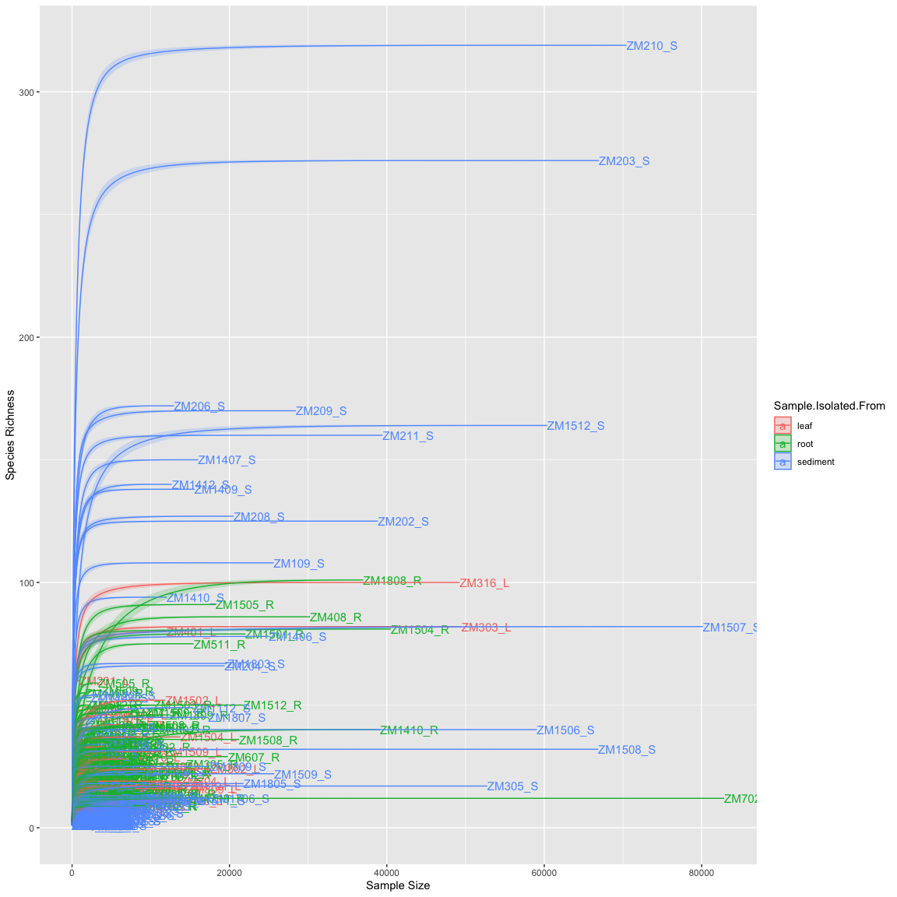
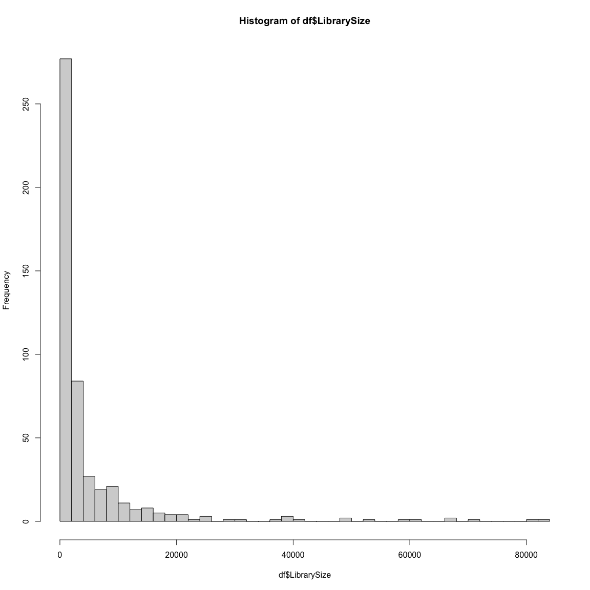
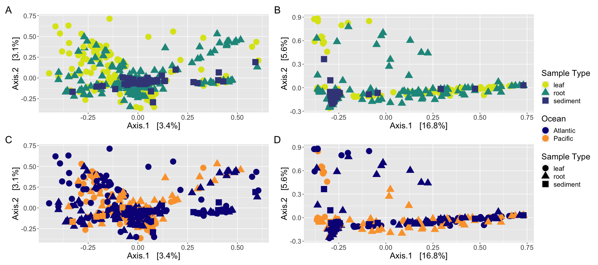
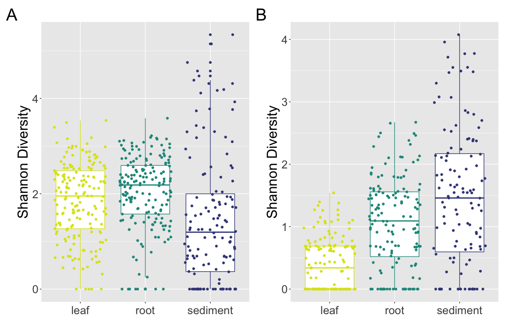
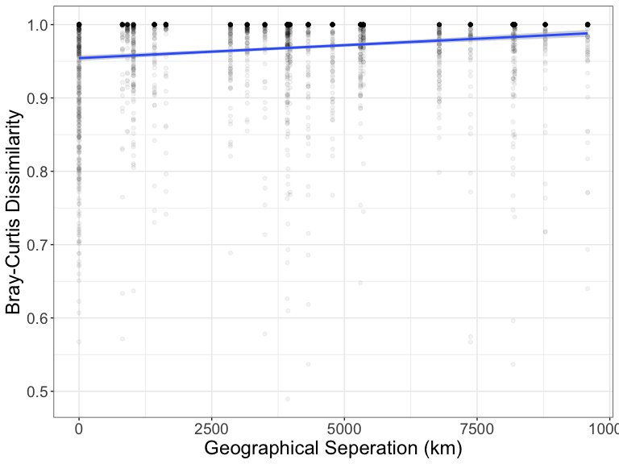
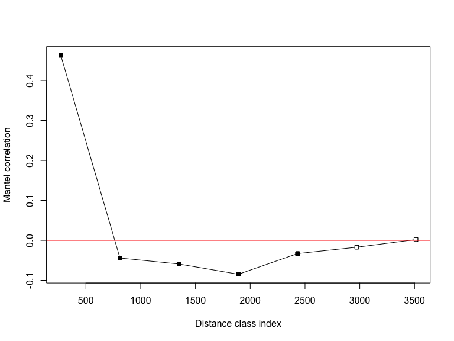
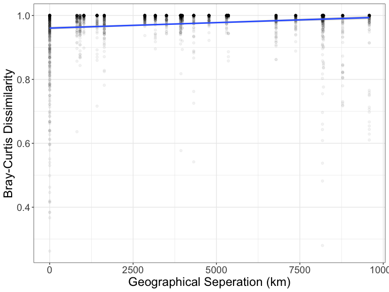
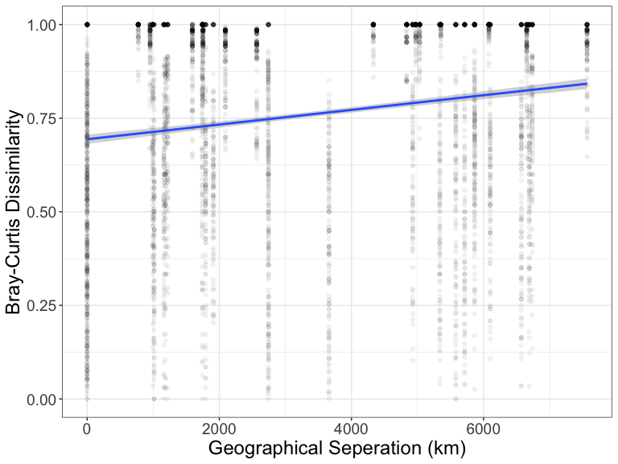
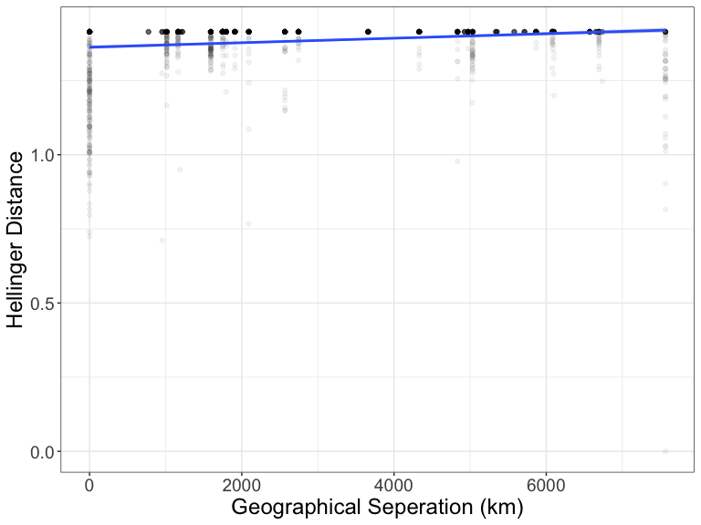
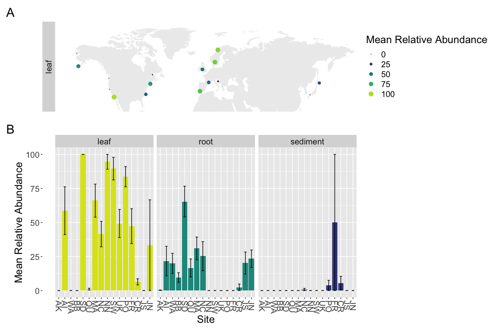

R code used to analyze fungal ITS and 18S amplicons from a global survey
of Zostera marina
================
Cassie Ettinger

### Loading packages and setting up the analysis

First, load in the R packages that will be used and make note of their
versions.

``` r
library(ggplot2)
library(vegan)
library(phyloseq)
library(RColorBrewer)
library(coin)
library(knitr)
library(rmarkdown)
library(FSA)
library(reshape)
library(betapart)
library(dada2)
library(tidyverse)
library(magrittr)
library(ShortRead)
library(ade4)
library(geosphere)
library(ecodist)
library(DESeq2)
library(VennDiagram)
library(limma)
library(maps)
library(viridis)
library(microbiome)
library(patchwork)
library(EcolUtils)
library(biobroom)
library(scales)
library(ggplotify)
library(reltools)
library(Hmisc)
library(minpack.lm)
# show_col(viridis_pal(option = 'C')(20)) #get hex codes

# Get R package references sink('test.bib') out <-
# sapply(names(sessionInfo()$otherPkgs),function(x)
# print(citation(x), style = 'Bibtex'))

# print the session info - includes computer version, R
# version and package versions
sessionInfo()
```

    ## R version 4.0.2 (2020-06-22)
    ## Platform: x86_64-apple-darwin17.0 (64-bit)
    ## Running under: macOS Catalina 10.15.7
    ## 
    ## Matrix products: default
    ## BLAS:   /Library/Frameworks/R.framework/Versions/4.0/Resources/lib/libRblas.dylib
    ## LAPACK: /Library/Frameworks/R.framework/Versions/4.0/Resources/lib/libRlapack.dylib
    ## 
    ## locale:
    ## [1] en_US.UTF-8/en_US.UTF-8/en_US.UTF-8/C/en_US.UTF-8/en_US.UTF-8
    ## 
    ## attached base packages:
    ##  [1] grid      stats4    parallel  stats     graphics  grDevices utils    
    ##  [8] datasets  methods   base     
    ## 
    ## other attached packages:
    ##  [1] minpack.lm_1.2-1            Hmisc_4.4-0                
    ##  [3] Formula_1.2-3               reltools_0.1.0             
    ##  [5] ggplotify_0.0.5             scales_1.1.1               
    ##  [7] biobroom_1.20.0             broom_0.5.6                
    ##  [9] EcolUtils_0.1               patchwork_1.0.1            
    ## [11] microbiome_1.10.0           viridis_0.5.1              
    ## [13] viridisLite_0.3.0           maps_3.3.0                 
    ## [15] limma_3.44.3                VennDiagram_1.6.20         
    ## [17] futile.logger_1.4.3         DESeq2_1.28.1              
    ## [19] ecodist_2.0.5               geosphere_1.5-10           
    ## [21] ade4_1.7-15                 ShortRead_1.46.0           
    ## [23] GenomicAlignments_1.24.0    SummarizedExperiment_1.18.1
    ## [25] DelayedArray_0.14.0         matrixStats_0.56.0         
    ## [27] Biobase_2.48.0              Rsamtools_2.4.0            
    ## [29] GenomicRanges_1.40.0        GenomeInfoDb_1.24.2        
    ## [31] Biostrings_2.56.0           XVector_0.28.0             
    ## [33] IRanges_2.22.2              S4Vectors_0.26.1           
    ## [35] BiocParallel_1.22.0         BiocGenerics_0.34.0        
    ## [37] magrittr_1.5                forcats_0.5.0              
    ## [39] stringr_1.4.0               dplyr_1.0.0                
    ## [41] purrr_0.3.4                 readr_1.3.1                
    ## [43] tidyr_1.1.0                 tibble_3.0.3               
    ## [45] tidyverse_1.3.0             dada2_1.16.0               
    ## [47] Rcpp_1.0.5                  betapart_1.5.1             
    ## [49] reshape_0.8.8               FSA_0.8.30                 
    ## [51] rmarkdown_2.3               coin_1.3-1                 
    ## [53] survival_3.2-3              RColorBrewer_1.1-2         
    ## [55] phyloseq_1.32.0             vegan_2.5-6                
    ## [57] lattice_0.20-41             permute_0.9-5              
    ## [59] ggplot2_3.3.2               knitr_1.29                 
    ## 
    ## loaded via a namespace (and not attached):
    ##   [1] readxl_1.3.1           backports_1.1.8        fastmatch_1.1-0       
    ##   [4] plyr_1.8.6             igraph_1.2.5           sp_1.4-2              
    ##   [7] splines_4.0.2          TH.data_1.0-10         digest_0.6.25         
    ##  [10] foreach_1.5.0          htmltools_0.5.0        fansi_0.4.1           
    ##  [13] checkmate_2.0.0        memoise_1.1.0          cluster_2.1.0         
    ##  [16] annotate_1.66.0        modelr_0.1.8           RcppParallel_5.0.2    
    ##  [19] sandwich_2.5-1         jpeg_0.1-8.1           colorspace_1.4-1      
    ##  [22] blob_1.2.1             rvest_0.3.5            haven_2.3.1           
    ##  [25] xfun_0.15              crayon_1.3.4           RCurl_1.98-1.2        
    ##  [28] jsonlite_1.7.0         libcoin_1.0-5          genefilter_1.70.0     
    ##  [31] zoo_1.8-8              iterators_1.0.12       ape_5.4               
    ##  [34] glue_1.4.1             gtable_0.3.0           zlibbioc_1.34.0       
    ##  [37] Rhdf5lib_1.10.0        abind_1.4-5            futile.options_1.0.1  
    ##  [40] mvtnorm_1.1-1          DBI_1.1.0              htmlTable_2.0.1       
    ##  [43] xtable_1.8-4           magic_1.5-9            gridGraphics_0.5-0    
    ##  [46] foreign_0.8-80         bit_1.1-15.2           htmlwidgets_1.5.1     
    ##  [49] httr_1.4.1             acepack_1.4.1          modeltools_0.2-23     
    ##  [52] ellipsis_0.3.1         pkgconfig_2.0.3        XML_3.99-0.3          
    ##  [55] nnet_7.3-14            dbplyr_1.4.4           locfit_1.5-9.4        
    ##  [58] tidyselect_1.1.0       rlang_0.4.7            reshape2_1.4.4        
    ##  [61] AnnotationDbi_1.50.0   munsell_0.5.0          cellranger_1.1.0      
    ##  [64] tools_4.0.2            cli_2.0.2              generics_0.0.2        
    ##  [67] RSQLite_2.2.0          evaluate_0.14          geometry_0.4.5        
    ##  [70] biomformat_1.16.0      yaml_2.2.1             bit64_0.9-7           
    ##  [73] fs_1.4.1               nlme_3.1-148           formatR_1.7           
    ##  [76] xml2_1.3.2             compiler_4.0.2         rstudioapi_0.11       
    ##  [79] png_0.1-7              reprex_0.3.0           geneplotter_1.66.0    
    ##  [82] stringi_1.4.6          Matrix_1.2-18          multtest_2.44.0       
    ##  [85] vctrs_0.3.2            pillar_1.4.6           lifecycle_0.2.0       
    ##  [88] BiocManager_1.30.10    data.table_1.12.8      bitops_1.0-6          
    ##  [91] R6_2.4.1               latticeExtra_0.6-29    hwriter_1.3.2         
    ##  [94] gridExtra_2.3          codetools_0.2-16       lambda.r_1.2.4        
    ##  [97] rcdd_1.2-2             MASS_7.3-51.6          assertthat_0.2.1      
    ## [100] picante_1.8.2          rhdf5_2.32.1           withr_2.2.0           
    ## [103] multcomp_1.4-13        GenomeInfoDbData_1.2.3 mgcv_1.8-31           
    ## [106] hms_0.5.3              rpart_4.1-15           rvcheck_0.1.8         
    ## [109] Rtsne_0.15             base64enc_0.1-3        lubridate_1.7.9

### Define standard error function

``` r
se <- function(x) sqrt(var(x)/length(x))
```

Going to set the “seed”, this ensures any randomization always happens
the same way if this analysis needs to be re-run

``` r
set.seed(5311)
```

# Primers used from JGI iTag protocol

### Fungal primers:

ITS9F: GAACGCAGCRAAIIGYGA ITS4R: TCCTCCGCTTATTGATATGC

Menkis A, Burokienė D, Gaitnieks T, Uotila A, Johannesson H, Rosling A,
et al.(2012). Occurrence and impact of the root-rot biocontrol agent
Phlebiopsis gigantea on soil fungal communities in Picea abies forests
of northern Europe. FEMS Microbiol Ecol81:438–45.

White TJ, Bruns T, Lee S, Taylor JW, others. (1990). Amplification and
direct sequencing of fungal ribosomal RNA genes for phylogenetics.
In:PCR protocols: a guide to methods and applications, Vol. 18, San
Diego, pp. 315–322.

### Eukaryotic primers:

565F: CCAGCASCYGCGGTAATTCC 948R: ACTTTCGTTCTTGATYRA

Stoeck T, Bass D, Nebel M, Christen R, Jones MDM, Breiner H-W, et
al.(2010). Multiple marker parallel tag environmental DNA sequencing
reveals a highly complex eukaryotic community in marine anoxic water.
Mol Ecol19 Suppl 1:21–31

### Before using dada2 I removed primers as follows:

``` bash
#SG_Read_ID includes one column with each line being the prefix ID of each read file

#Fungal primer set
#real F primer GAACGCAGCRAAIIGYGA
#but I's not an acceptable to cutadapt so changing to N's here

for read in $(cat SG_Read_ID.txt);
do cutadapt -g GAACGCAGCRAANNGYGA -G TCCTCCGCTTATTGATATGC -o $read'_ITS2_R1.noprimers.fastq' -p $read'_ITS2_R2.noprimers.fastq' $read'.ITS2.R1.fastq.gz' $read'.ITS2.R2.fastq.gz';
done


#Eukaryotic primer set
for read in $(cat SG_Read_ID.txt);
do cutadapt -g CCAGCASCYGCGGTAATTCC -G ACTTTCGTTCTTGATYRA -o $read'_18S_R1.noprimers.fastq' -p $read'_18S_R2.noprimers.fastq' $read'.18S.R1.fastq.gz' $read'.18S.R2.fastq.gz';
done
```

# Using DADA2 to create amplicon sequence variant (ASV) tables for ITS & 18S amplicon datasets

Had to run the DADA2 steps on the UC Davis Genome Center computing
cluster, copying code over here for reproducibility

## ITS2 DADA2 pipeline on cluster

Using both F and R reads to merge in dada2. Investigated using F only
reads and saw same broad patterns / taxa.

``` r
# Path to data
raw_data <- "/share/eisenlab/casett/sg_jgi_amplicon/jgi_its/"
list.files(raw_data)

# Sort and get sample names
fnFs <- sort(list.files(raw_data, pattern = "R1.noprimers.fastq.gz"))
fnRs <- sort(list.files(raw_data, pattern = "R2.noprimers.fastq.gz"))
sample.names <- sapply(strsplit(fnFs, "_ITS2"), `[`, 1)

# specify full paths to the data
fnFs <- file.path(raw_data, fnFs)
fnRs <- file.path(raw_data, fnRs)

# Inspecting quality of data
plotQualityProfile(fnFs[1:6])  #fwd reads for first 6 samples
plotQualityProfile(fnRs[1:6])  #reverse reads for first 6 samples

# specify where to save filtered data that we will generate
# and what to name the files we will mostly filter to remove
# any 'N's which dada2 cannot handle
filt_path <- file.path("/share/eisenlab/casett/sg_jgi_amplicon/jgi_its/dada2_filtered_Fs/")
filtFs <- file.path(filt_path, paste0(sample.names, "_F_filtered.fastq.gz"))
filtRs <- file.path(filt_path, paste0(sample.names, "_R_filtered.fastq.gz"))

# Using a maxEE of 2 and truncating when read quality falls
# below 2
out <- filterAndTrim(fnFs, filtFs, fnRs, filtRs, maxN = 0, maxEE = c(2, 
    2), truncQ = 2, matchIDs = TRUE, rm.phix = TRUE, compress = TRUE, 
    multithread = TRUE, verbose = TRUE)
head(out)

# get error rates
errF <- learnErrors(filtFs, multithread = TRUE)
errR <- learnErrors(filtRs, multithread = TRUE)

# graph error rate estimates
plotErrors(errF, nominalQ = TRUE)
plotErrors(errR, nominalQ = TRUE)

# checking if there is an output file (e.g. no missing files)
exists <- file.exists(filtFs) & file.exists(filtRs)
filtFs <- filtFs[exists]
filtRs <- filtRs[exists]


# get file names
sample.names <- sapply(strsplit(basename(filtFs), "_F_filtered.fastq.gz"), 
    `[`, 1)  # Assumes filename = samplename_XXX.fastq.gz
sample.namesR <- sapply(strsplit(basename(filtRs), "_R_filtered.fastq.gz"), 
    `[`, 1)  # Assumes filename = samplename_XXX.fastq.gz
if (!identical(sample.names, sample.namesR)) stop("Forward and reverse files do not match.")
names(filtFs) <- sample.names
names(filtRs) <- sample.names

# Dereplication & Sample inference
mergers <- vector("list", length(sample.names))
names(mergers) <- sample.names

for (sam in sample.names) {
    cat("Processing:", sam, "\n")
    derepF <- derepFastq(filtFs[[sam]])
    ddF <- dada(derepF, err = errF, multithread = TRUE)
    derepR <- derepFastq(filtRs[[sam]])
    ddR <- dada(derepR, err = errR, multithread = TRUE)
    merger <- mergePairs(ddF, derepF, ddR, derepR)
    mergers[[sam]] <- merger
}
rm(derepF)
rm(derepR)

# Make a sequence table
seqtab <- makeSequenceTable(mergers)

# save table
saveRDS(seqtab, "/share/eisenlab/casett/sg_jgi_amplicon/jgi_its/seqtab.dd2.merged.rds")

# get dimensions of table
dim(seqtab)

# Remove chimeras
seqtab2 <- removeBimeraDenovo(seqtab, method = "consensus", multithread = TRUE)

# get new dimensions
dim(seqtab2)

# Inspect distribution of sequence lengths
table(nchar(getSequences(seqtab2)))

# percent seqs passed
sum(seqtab2)/sum(seqtab)  #0.8737834

# remove seqs less than 50 nucleotides
seqtab3 <- seqtab2[, nchar(colnames(seqtab2)) %in% seq(50, 588)]

# Inspect distribution of sequence lengths
table(nchar(getSequences(seqtab3)))

# write to disk as R file
saveRDS(seqtab3, "/share/eisenlab/casett/sg_jgi_amplicon/jgi_its/seqtab.dd2.merged_nochimera.rds")

# write ASV table as csv file
write.csv(seqtab3, "/share/eisenlab/casett/sg_jgi_amplicon/jgi_its/seqtab.dd2.merged_nochimera.csv")

# assign taxonomy using UNITE database with ZM ITS added
tax_v8.2fun <- assignTaxonomy(seqtab3, "/share/eisenlab/casett/database/sh_general_release_dynamic_s_04.02.2020_w_ZM.fasta", 
    multithread = TRUE, tryRC = TRUE)

# save taxonomy as R file

saveRDS(tax_v8.2fun, "/share/eisenlab/casett/sg_jgi_amplicon/jgi_its/seqtab.dd2.merged_nochimera_tax_unite_s_04.02.2020_w_ZM.rds")

# save taxonomy as csv file
write.csv(tax_v8.2fun, "/share/eisenlab/casett/sg_jgi_amplicon/jgi_its/seqtab.dd2.merged_nochimera_tax_unite_s_04.02.2020_w_ZM.csv")
```

## 18S DADA2 pipeline on cluster

Using both F and R reads and merging with DADA2

``` r
# path to data
raw_data <- "/share/eisenlab/casett/sg_jgi_amplicon/jgi_18s/"
list.files(raw_data)

# Sort and get sample names
fnFs <- sort(list.files(raw_data, pattern = "R1.noprimers.fastq.gz"))
fnRs <- sort(list.files(raw_data, pattern = "R2.noprimers.fastq.gz"))

sample.names <- sapply(strsplit(fnFs, "_18S"), `[`, 1)

# specify full paths to the data
fnFs <- file.path(raw_data, fnFs)
fnRs <- file.path(raw_data, fnRs)

# Inspecting quality of data
plotQualityProfile(fnFs[1:6])  #fwd reads for first 6 samples
plotQualityProfile(fnRs[1:6])  #reverse reads for first 6 samples

# specify where to save filtered data that we will generate
# and what to name the files we will mostly filter to remove
# any 'N's which dada2 cannot handle
filt_path <- file.path("/share/eisenlab/casett/sg_jgi_amplicon/jgi_18s/dada2_filtered_merged/")
filtFs <- file.path(filt_path, paste0(sample.names, "_F_filtered.fastq.gz"))
filtRs <- file.path(filt_path, paste0(sample.names, "_R_filtered.fastq.gz"))

# maxEE = 2
out <- filterAndTrim(fnFs, filtFs, fnRs, filtRs, maxN = 0, maxEE = c(2, 
    2), truncQ = 2, matchIDs = TRUE, rm.phix = TRUE, compress = TRUE, 
    multithread = TRUE, verbose = TRUE)
head(out)


# get error rates
errF <- learnErrors(filtFs, multithread = TRUE)
errR <- learnErrors(filtRs, multithread = TRUE)

# graph error rate estimates
plotErrors(errF, nominalQ = TRUE)
plotErrors(errR, nominalQ = TRUE)

# Sample inference and merger of paired-end reads using big
# data method
# https://benjjneb.github.io/dada2/bigdata_paired.html

# file parsing
sample.names <- sapply(strsplit(basename(filtFs), "_F_filtered.fastq.gz"), 
    `[`, 1)  # Assumes filename = samplename_XXX.fastq.gz
sample.namesR <- sapply(strsplit(basename(filtRs), "_R_filtered.fastq.gz"), 
    `[`, 1)  # Assumes filename = samplename_XXX.fastq.gz
if (!identical(sample.names, sample.namesR)) stop("Forward and reverse files do not match.")
names(filtFs) <- sample.names
names(filtRs) <- sample.names

mergers <- vector("list", length(sample.names))
names(mergers) <- sample.names

# process samples
for (sam in sample.names) {
    cat("Processing:", sam, "\n")
    derepF <- derepFastq(filtFs[[sam]])
    ddF <- dada(derepF, err = errF, multithread = TRUE)
    derepR <- derepFastq(filtRs[[sam]])
    ddR <- dada(derepR, err = errR, multithread = TRUE)
    merger <- mergePairs(ddF, derepF, ddR, derepR)
    mergers[[sam]] <- merger
}
rm(derepF)
rm(derepR)

# Construct sequence table and remove chimeras
seqtab <- makeSequenceTable(mergers)
saveRDS(seqtab, "/share/eisenlab/casett/sg_jgi_amplicon/jgi_18s/seqtab.dd2.merged.rds")

# get dimensions of table
dim(seqtab)

# Remove chimeras
seqtab2 <- removeBimeraDenovo(seqtab, method = "consensus", multithread = TRUE)

dim(seqtab2)

# Inspect distribution of sequence lengths
table(nchar(getSequences(seqtab2)))

# percent seqs passed
sum(seqtab2)/sum(seqtab)  # 0.9546734

# remove seqs less than 50 nucleotides (if there are any)
seqtab3 <- seqtab2[, nchar(colnames(seqtab2)) %in% seq(50, 588)]

table(nchar(getSequences(seqtab3)))

# write to disk
saveRDS(seqtab3, "/share/eisenlab/casett/sg_jgi_amplicon/jgi_18s/seqtab.dd2.merged_nochimera.rds")

# also save as csv
write.csv(seqtab3, "/share/eisenlab/casett/sg_jgi_amplicon/jgi_18s/seqtab.dd2.merged_nochimera.csv")


# taxonomy with silva 138
tax_silv_138 <- assignTaxonomy(seqtab3, "/share/eisenlab/casett/database/silva138/silva_nr_v138_train_set.fa", 
    multithread = TRUE, tryRC = TRUE)

# save taxonomy as R file
saveRDS(tax_silv_138, "/share/eisenlab/casett/sg_jgi_amplicon/jgi_18s/seqtab.dd2.merged_nochimera_tax_silva_v138.rds")

# save as csv
write.csv(tax_silv_138, "/share/eisenlab/casett/sg_jgi_amplicon/jgi_18s/seqtab.dd2.merged_nochimera_tax_silva_v138.csv")
```

# Pre-processing of dada2 generated ASVs for analysis

### Load ASV tables in

Since they were saved on the cluster, load them in here

``` r
# Load mapping file
mapping <- read.csv("/Users/Cassie/Dropbox/JGI_SG_Amplicon/Eisen_503251_iTag_metadata_updates_LEV_CLE.csv")

# ITS

seqtab.nochimera <- readRDS("/Users/Cassie/Dropbox/JGI_SG_Amplicon/JGI_ITS/seqtab.dd2.merged_nochimera.rds")
tax <- readRDS("/Users/Cassie/Dropbox/JGI_SG_Amplicon/JGI_ITS/seqtab.dd2.merged_nochimera_tax_unite_s_all_04.02.2020_w_ZM.rds")

# Extract sequences from chimera free SV table:
# uniquesToFasta(seqtab.nochimera,
# 'unique_ASVs_jgi_its.fasta', ids = paste0('ITS_SV',
# seq(length(getSequences(seqtab.nochimera)))))


# 18S

seqtab.nochimera.18s <- readRDS("/Users/Cassie/Dropbox/JGI_SG_Amplicon/JGI_18S/seqtab.dd2.merged_nochimera.rds")
tax.18s <- readRDS("/Users/Cassie/Dropbox/JGI_SG_Amplicon/JGI_18S/seqtab.dd2.merged_nochimera_tax_silva_v138.rds")

# Extract sequences from chimera free SV table:
# uniquesToFasta(seqtab.nochimera.18s,
# 'unique_ASVs_jgi_18s_v2.fasta', ids = paste0('18S_SV',
# seq(length(getSequences(seqtab.nochimera.18s)))))
```

### Relabel ASVs in ASV tables

``` r
# ITS

seqtab_final <- seqtab.nochimera
colnames(seqtab_final) <- paste0("ITS_SV", 1:ncol(seqtab_final))

tax_final <- tax
rownames(tax_final) <- paste0("ITS_SV", 1:nrow(tax_final))


# 18S

seqtab_final.18s <- seqtab.nochimera.18s
colnames(seqtab_final.18s) <- paste0("18S_SV", 1:ncol(seqtab_final.18s))

tax_final.18s <- tax.18s
rownames(tax_final.18s) <- paste0("18S_SV", 1:nrow(tax_final.18s))
```

### Make phyloseq object

``` r
# ITS

otu_table = otu_table(seqtab_final, taxa_are_rows = FALSE)

row.names(mapping) <- mapping$Sample_ID_dada2
mapping_file = sample_data(mapping)

taxa_table = tax_table(tax_final)

ps <- phyloseq(otu_table, mapping_file, taxa_table)
ps
```

    ## phyloseq-class experiment-level object
    ## otu_table()   OTU Table:         [ 89754 taxa and 690 samples ]
    ## sample_data() Sample Data:       [ 690 samples by 29 sample variables ]
    ## tax_table()   Taxonomy Table:    [ 89754 taxa by 7 taxonomic ranks ]

``` r
# 18S

otu_table.18s = otu_table(seqtab_final.18s, taxa_are_rows = FALSE)

taxa_table.18s = tax_table(tax_final.18s)
ps.18s <- phyloseq(otu_table.18s, mapping_file, taxa_table.18s)
ps.18s
```

    ## phyloseq-class experiment-level object
    ## otu_table()   OTU Table:         [ 53084 taxa and 714 samples ]
    ## sample_data() Sample Data:       [ 714 samples by 29 sample variables ]
    ## tax_table()   Taxonomy Table:    [ 53084 taxa by 6 taxonomic ranks ]

### Removing non-fungal ASVs

Not using ITS-x software based on the results of Pauvert et al 2019

Pauvert, C., Buée, M., Laval, V., Edel-Hermann, V., Fauchery, L.,
Gautier, A., et al. (2019). Bioinformatics matters: the accuracy of
plant and soil fungal community data is highly dependent on the
metabarcoding pipeline. Fungal Ecol. 41, 23–33. doi:
10.1016/j.funeco.2019.03.005

``` r
# ITS

ps_OF <- subset_taxa(ps, Kingdom == "k__Fungi")
ps_OF
```

    ## phyloseq-class experiment-level object
    ## otu_table()   OTU Table:         [ 7697 taxa and 690 samples ]
    ## sample_data() Sample Data:       [ 690 samples by 29 sample variables ]
    ## tax_table()   Taxonomy Table:    [ 7697 taxa by 7 taxonomic ranks ]

``` r
# 18S

# summary(as.factor(as.data.frame(tax_table(ps.18s))$Phylum))

ps.18s_OF <- subset_taxa(ps.18s, Phylum == "Blastocladiomycota" | 
    Phylum == "Chytridiomycota" | Phylum == "Glomeromycota" | 
    Phylum == "Neocallimastigomycota" | Phylum == "Ascomycota" | 
    Phylum == "Basidiomycota" | Phylum == "Mucoromycota" | Phylum == 
    "Zoopagomycota" | Phylum == "Cryptomycota" | Phylum == "Aphelidomycota" | 
    Phylum == "Aphelidea")

ps.18s_OF
```

    ## phyloseq-class experiment-level object
    ## otu_table()   OTU Table:         [ 1967 taxa and 714 samples ]
    ## sample_data() Sample Data:       [ 714 samples by 29 sample variables ]
    ## tax_table()   Taxonomy Table:    [ 1967 taxa by 6 taxonomic ranks ]

### Remove samples with 0 reads

``` r
# ITS

ps_OF_nz <- prune_samples(sample_sums(ps_OF) > 0, ps_OF)
ps_OF_nz
```

    ## phyloseq-class experiment-level object
    ## otu_table()   OTU Table:         [ 7697 taxa and 622 samples ]
    ## sample_data() Sample Data:       [ 622 samples by 29 sample variables ]
    ## tax_table()   Taxonomy Table:    [ 7697 taxa by 7 taxonomic ranks ]

``` r
# 18S

ps.18s_OF_nz <- prune_samples(sample_sums(ps.18s_OF) > 0, ps.18s_OF)
ps.18s_OF_nz
```

    ## phyloseq-class experiment-level object
    ## otu_table()   OTU Table:         [ 1967 taxa and 540 samples ]
    ## sample_data() Sample Data:       [ 540 samples by 29 sample variables ]
    ## tax_table()   Taxonomy Table:    [ 1967 taxa by 6 taxonomic ranks ]

### Remove samples not associated with ZM / this analysis

A subset of samples were included from other species of seagrass, and
also collected from clones in tanks propagated by the Stachowicz lab

``` r
# ITS

# remove samples not from Zostera marina
ps_OF_nz_ZM <- subset_samples(ps_OF_nz, Species == "Zostera marina")

# remove ZM samples not associated with global collection by
# ZEN collaborators
ps_OF_nz_ZM_ZEN <- subset_samples(ps_OF_nz_ZM, Clone == "FALSE")

# get rid of an ASVs that are 0s across whole dataset
ps_OF_nz_ZM_ZEN <- prune_taxa(taxa_sums(ps_OF_nz_ZM_ZEN) > 0, 
    ps_OF_nz_ZM_ZEN)

print(ps_OF_nz_ZM_ZEN)
```

    ## phyloseq-class experiment-level object
    ## otu_table()   OTU Table:         [ 5089 taxa and 488 samples ]
    ## sample_data() Sample Data:       [ 488 samples by 29 sample variables ]
    ## tax_table()   Taxonomy Table:    [ 5089 taxa by 7 taxonomic ranks ]

``` r
summary(as.factor(as.data.frame(phyloseq::sample_data(ps_OF_nz_ZM_ZEN))$Sample.Isolated.From))
```

    ##     leaf     root sediment 
    ##      179      173      136

``` r
# 18S


# remove samples not from Zostera marina
ps.18s_OF_nz_ZM <- subset_samples(ps.18s_OF_nz, Species == "Zostera marina")

# remove ZM samples not associated with global collection by
# ZEN collaborators
ps.18s_OF_nz_ZM_ZEN <- subset_samples(ps.18s_OF_nz_ZM, Clone == 
    "FALSE")


# get rid of an ASVs that are 0s across whole dataset
ps.18s_OF_nz_ZM_ZEN <- prune_taxa(taxa_sums(ps.18s_OF_nz_ZM_ZEN) > 
    0, ps.18s_OF_nz_ZM_ZEN)

print(ps.18s_OF_nz_ZM_ZEN)
```

    ## phyloseq-class experiment-level object
    ## otu_table()   OTU Table:         [ 1216 taxa and 409 samples ]
    ## sample_data() Sample Data:       [ 409 samples by 29 sample variables ]
    ## tax_table()   Taxonomy Table:    [ 1216 taxa by 6 taxonomic ranks ]

``` r
summary(as.factor(as.data.frame(phyloseq::sample_data(ps.18s_OF_nz_ZM_ZEN))$Sample.Isolated.From))
```

    ##     leaf     root sediment 
    ##      146      144      119

### Fixing taxonomy to rename unclasifed taxa and remove headers

``` r
# ITS

df.ITS.tax <- data.frame(tax_table(ps_OF_nz_ZM_ZEN))

df.ITS.tax %<>% mutate(Phylum = fct_explicit_na(Phylum, na_level = "p__Unclassified"), 
    Class = fct_explicit_na(Class, na_level = "c__Unclassified"), 
    Order = fct_explicit_na(Order, na_level = "o__Unclassified"), 
    Family = fct_explicit_na(Family, na_level = "f__Unclassified"), 
    Genus = fct_explicit_na(Genus, na_level = "g__Unclassified"), 
    Species = fct_explicit_na(Species, na_level = "s__Unclassified"))

tax.list <- c("Phylum", "Class", "Order", "Family", "Genus", 
    "Species")
tax.header <- c(Phylum = "p__", Class = "c__", Order = "o__", 
    Family = "f__", Genus = "g__", Species = "s__")

for (i in tax.list) {
    names <- sapply(strsplit(as.character(df.ITS.tax[[i]]), as.character(tax.header[[i]])), 
        `[`, 2)
    df.ITS.tax[[i]] <- names
}

row.names(df.ITS.tax) <- row.names(tax_table(ps_OF_nz_ZM_ZEN))
ITS.tax <- as.matrix(df.ITS.tax)

tax_table(ps_OF_nz_ZM_ZEN) <- ITS.tax

# 18S


df.18s.tax <- data.frame(tax_table(ps.18s_OF_nz_ZM_ZEN))

df.18s.tax %<>% mutate(Phylum = fct_explicit_na(Phylum, na_level = "Unclassified"), 
    Class = fct_explicit_na(Class, na_level = "Unclassified"), 
    Order = fct_explicit_na(Order, na_level = "Unclassified"), 
    Family = fct_explicit_na(Family, na_level = "Unclassified"), 
    Genus = fct_explicit_na(Genus, na_level = "Unclassified"))

row.names(df.18s.tax) <- row.names(tax_table(ps.18s_OF_nz_ZM_ZEN))
dff.18S.tax <- as.matrix(df.18s.tax)

tax_table(ps.18s_OF_nz_ZM_ZEN) <- dff.18S.tax
```

# Transforming samples for use downstream

Unrarefied data will be used for alpha diversity metrics. DESEQ2 will be
used on non-rarified data to investigate differentially abundant taxa,
some of the microbiome core analyses use compositional prescence /
absence of the unrarefied data and others require rarefied data, beta
diversity analyses will be performed using samples with \> some
threshold \# of reads (e.g. subsetting out samples with low read
counts), changing to proportions and then log transforming the data

## Investigation possible rarefaction numbers

### Custom script from phyloseq\_extended

<https://github.com/mahendra-mariadassou/phyloseq-extended/blob/master/R/richness.R>

### Assessing rarefaction curves & library size

``` r
# ITS

# plotting rarefaction curves, using step = 1000 reads
p = ggrare(ps_OF_nz_ZM_ZEN, step = 100, label = "Sample_ID_fix", 
    color = "Sample.Isolated.From")
```

<!-- -->

``` r
# drawing cut-off line at 10000 reads
p + geom_vline(xintercept = 10000, linetype = "dashed")
```

<!-- -->

``` r
# drawing cut-off line at 5000 reads
p + geom_vline(xintercept = 5000, linetype = "dashed")
```

<!-- -->

``` r
# 5000 reads might be a good middle ground based on
# rarefaction curves

# drawing cut-off line at 1000 reads
p + geom_vline(xintercept = 1000, linetype = "dashed")
```

<!-- -->

``` r
## Let's look at library size to see distribution of reads
## across samples

## Look at library size
df <- as.data.frame(sample_data(ps_OF_nz_ZM_ZEN))  # Put sample_data into a ggplot-friendly data.frame
df$LibrarySize <- sample_sums(ps_OF_nz_ZM_ZEN)
df <- df[order(df$LibrarySize), ]
df$Index <- seq(nrow(df))
ggplot(data = df, aes(x = Index, y = LibrarySize, color = Sample.Isolated.From)) + 
    geom_point() + geom_hline(yintercept = 5000, linetype = "dashed")
```

<!-- -->

``` r
summary(df$LibrarySize)
```

    ##    Min. 1st Qu.  Median    Mean 3rd Qu.    Max. 
    ##       2     400    1458    4990    4169   82870

``` r
# Given that median is 1458, might make more sense to do 1000
# reads if needed? And try to use proportions / unrarefied
# data where can

hist(df$LibrarySize, breaks = 50)  #right skewed
```

<!-- -->

``` r
# 18S

# plotting rarefaction curves, using step = 1000 reads
p = ggrare(ps.18s_OF_nz_ZM_ZEN, step = 100, label = "Sample_ID_fix", 
    color = "Sample.Isolated.From")
```

<!-- -->

``` r
# drawing cut-off line at 5000 reads
p + geom_vline(xintercept = 5000, linetype = "dashed")
```

<!-- -->

``` r
# 5000 reads might be a good middle ground based on
# rarefaction curves

# drawing cut-off line at 1000 reads
p + geom_vline(xintercept = 1000, linetype = "dashed")
```

<!-- -->

``` r
## Let's look at library size to see distribution of reads
## across samples

## Look at library size
df <- as.data.frame(sample_data(ps.18s_OF_nz_ZM_ZEN))  # Put sample_data into a ggplot-friendly data.frame
df$LibrarySize <- sample_sums(ps.18s_OF_nz_ZM_ZEN)
df <- df[order(df$LibrarySize), ]
df$Index <- seq(nrow(df))
ggplot(data = df, aes(x = Index, y = LibrarySize, color = Sample.Isolated.From)) + 
    geom_point() + geom_hline(yintercept = 1000, linetype = "dashed")
```

<!-- -->

``` r
summary(df$LibrarySize)
```

    ##    Min. 1st Qu.  Median    Mean 3rd Qu.    Max. 
    ##     2.0    25.0    68.0   327.1   236.0  8470.0

``` r
# Given that median is 68, might make more sense to do 100
# reads if absolutely needed? And try to use proportions /
# unrarefied data where can

hist(df$LibrarySize, breaks = 50)  #right skewed
```

<!-- -->

### Subsetting & log transformations, calculating relative abundance

``` r
# ITS

# Compositional / relative abundance
ps_OF_nz_ZM_ZEN.RA <- transform_sample_counts(ps_OF_nz_ZM_ZEN, 
    function(x) x/sum(x))

# CLR of counts
ps_OF_nz_ZM_ZEN.clr <- transform(ps_OF_nz_ZM_ZEN, "clr")

# Hellinger transformation of counts
ps_OF_nz_ZM_ZEN.hell <- transform(ps_OF_nz_ZM_ZEN, "hellinger")


# 18S Compositional / relative abundance
ps.18s_OF_nz_ZM_ZEN.RA <- transform_sample_counts(ps.18s_OF_nz_ZM_ZEN, 
    function(x) x/sum(x))

# CLR of counts
ps.18s_OF_nz_ZM_ZEN.clr <- transform(ps.18s_OF_nz_ZM_ZEN, "clr")

# Hellinger transformation of counts
ps.18s_OF_nz_ZM_ZEN.hell <- transform(ps.18s_OF_nz_ZM_ZEN, "hellinger")
```

# Assigning predicted functional guilds

``` r
# https://jacobrprice.github.io/2017/08/26/phyloseq-to-vegan-and-back.html
psotu2veg <- function(physeq) {
    OTU <- otu_table(physeq)
    if (taxa_are_rows(OTU)) {
        OTU <- t(OTU)
    }
    return(as(OTU, "matrix"))
}

# ITS

otu <- as.data.frame(t(psotu2veg(ps_OF_nz_ZM_ZEN)))
tax <- as.data.frame(tax_table(ps_OF_nz_ZM_ZEN))
otu$OTU_ID <- row.names(otu)

write.table(tax, "JGI_ITS/tax.txt", sep = ";")
tax.v2 <- read.csv("JGI_ITS/tax.txt")

tax.v2$taxonomy <- sapply(strsplit(as.character(tax.v2$Kingdom.Phylum.Class.Order.Family.Genus.Species), 
    "k__"), `[`, 2)
tax.v2$OTU_ID <- sapply(strsplit(as.character(tax.v2$Kingdom.Phylum.Class.Order.Family.Genus.Species), 
    ";"), `[`, 1)

tax.v2 <- subset(tax.v2, select = -c(Kingdom.Phylum.Class.Order.Family.Genus.Species))

otu.v2 <- full_join(otu, tax.v2)
```

    ## Joining, by = "OTU_ID"

``` r
row.names(otu.v2) <- otu.v2$OTU_ID
otu.v2 <- subset(otu.v2, select = -c(OTU_ID))

# double check headers and then remove all quotation marks
# (if needed) see https://github.com/UMNFuN/FUNGuild
# write.table(otu.v2,
# 'JGI_ITS/ps_OF_nz_ZM_ZEN_otus4funguild.txt', sep = '\t')

# in terminal run python3.7 Guilds_v1.1.py -otu
# ps_OF_nz_ZM_ZEN_otus4funguild.txt -db fungi -m -u
# Guilds_v1.1.py:92: DeprecationWarning: 'U' mode is
# deprecated with open(otu_file, 'rU') as f1: FunGuild v1.0
# Beta Connecting with FUNGuild database ...  Reading in the
# OTU table: 'ps_OF_nz_ZM_ZEN_otus4funguild.txt' Searching
# the FUNGuild database...  10% 20% 30% 40% 50% 60% 70% 80%
# 90% 100% Found 7011 matching taxonomy records in the
# database.  Dereplicating and sorting the result...
# FunGuild tried to assign function to 5089 OTUs in
# 'ps_OF_nz_ZM_ZEN_otus4funguild.txt'.  FUNGuild made
# assignments on 4001 OTUs.  Result saved to
# 'ps_OF_nz_ZM_ZEN_otus4funguild.guilds.txt' Additional
# output: FUNGuild made assignments on 4001 OTUs, these have
# been saved to
# ps_OF_nz_ZM_ZEN_otus4funguild.guilds_matched.txt.  1088
# OTUs were unassigned, these are saved to
# ps_OF_nz_ZM_ZEN_otus4funguild.guilds_unmatched.txt.  Total
# calculating time: 27.87 seconds.


# manual suggests only accepting guild assignments that are
# probable or highly probable also funguild works at a
# 'genus' level of classification

its.funguild.res <- read.table("JGI_ITS/ps_OF_nz_ZM_ZEN_otus4funguild.guilds.txt", 
    sep = "\t", header = TRUE)

its.funguild.res.v2 <- subset(its.funguild.res, select = c(OTU_ID, 
    Taxon, Taxon.Level, Trophic.Mode, Guild, Growth.Morphology, 
    Trait, Confidence.Ranking, Notes, Citation.Source))

summary(as.factor(its.funguild.res.v2$Confidence.Ranking))
```

    ##               - Highly Probable        Possible        Probable 
    ##            1088             515            1171            2315

``` r
# proportion of entire data set with no prediction
(1088/5089) * 100  #21.37945
```

    ## [1] 21.37945

``` r
# proportion of entire data set with 'highly probable'
(515/5089) * 100  #10.11987
```

    ## [1] 10.11987

``` r
its.funguild.res.v2.hp <- filter(its.funguild.res.v2, Confidence.Ranking == 
    "Highly Probable")

# Plot of diversity of all 'highly probable' hits?

its.funguild.res.v2.hp.v2 <- its.funguild.res.v2.hp %>% mutate(Guild = ifelse(Guild == 
    "-", "Unassigned", as.character(Guild)), Trophic.Mode = ifelse(Trophic.Mode == 
    "-", "Unassigned", as.character(Trophic.Mode)))


its.funguild.res.v2.hp.v2.count <- its.funguild.res.v2.hp.v2 %>% 
    dplyr::count(Trophic.Mode, Guild)


its.funguild.res.v2.hp.v2.count.v2 <- its.funguild.res.v2.hp.v2.count %>% 
    mutate(Guild = ifelse(n < 20, "Other", as.character(Guild)))


its_hp = ggplot(its.funguild.res.v2.hp.v2.count.v2, aes(x = Trophic.Mode, 
    y = n, fill = Guild)) + geom_bar(stat = "identity", position = position_dodge())

its_hp = its_hp + theme(axis.text.x = element_text(angle = -70, 
    hjust = 0, vjust = 0.5), text = element_text(size = 18)) + 
    ylab("Assigned trophic modes") + scale_fill_viridis_d(option = "C", 
    begin = 0.85, end = 0) + ylab("Count of predicted trophic modes") + 
    xlab("")

its_hp
```

<!-- -->

``` r
# get only guilds for most abundant ASVs
its_avg_asv_filt = filter_taxa(ps_OF_nz_ZM_ZEN.RA, function(x) mean(x) > 
    0.001, TRUE)
abudnant_asvs <- row.names(tax_table(its_avg_asv_filt))


its.funguild.res.v2.abundantasvs <- filter(its.funguild.res.v2, 
    OTU_ID %in% abudnant_asvs)


its.funguild.res.v2.abundantasvs <- its.funguild.res.v2.abundantasvs %>% 
    mutate(Guild = ifelse(Guild == "-", "Unassigned", as.character(Guild)), 
        Trophic.Mode = ifelse(Trophic.Mode == "-", "Unassigned", 
            as.character(Trophic.Mode)), Confidence.Ranking = ifelse(Confidence.Ranking == 
            "-", "Unassigned", as.character(Confidence.Ranking)))


its.funguild.res.v2.abundantasvs.count <- its.funguild.res.v2.abundantasvs %>% 
    dplyr::count(Trophic.Mode, Confidence.Ranking)

# percent of functions = unassigned in top ASVs
(76/sum(its.funguild.res.v2.abundantasvs.count$n)) * 100  #38.38384
```

    ## [1] 38.38384

``` r
its_all = ggplot(its.funguild.res.v2.abundantasvs.count, aes(x = Trophic.Mode, 
    y = n, fill = Confidence.Ranking)) + geom_bar(stat = "identity", 
    position = position_dodge())

its_all = its_all + theme(axis.text.x = element_text(angle = -70, 
    hjust = 0, vjust = 0.5), text = element_text(size = 18)) + 
    ylab("Count of predicted trophic modes") + xlab("") + labs(fill = "Confidence ranking")

its_all
```

<!-- -->

``` r
its_hp + its_all + plot_annotation(tag_levels = "A")
```

<!-- -->

``` r
ggsave(filename = "JGI_ITS/Funguild.ITS.pdf", plot = last_plot(), 
    device = "pdf", width = 14, height = 8, dpi = 300)


# 18S

otu.18s <- as.data.frame(t(psotu2veg(ps.18s_OF_nz_ZM_ZEN)))
tax.18s.fg <- as.data.frame(tax_table(ps.18s_OF_nz_ZM_ZEN))
otu.18s$OTU_ID <- row.names(otu.18s)

write.table(tax.18s.fg, "JGI_18S/tax.txt", sep = ";")
tax.v2.18s <- read.csv("JGI_18S/tax.txt")

tax.v2.18s$taxonomy <- sapply(strsplit(as.character(tax.v2.18s$Kingdom.Phylum.Class.Order.Family.Genus), 
    "Eukaryota;"), `[`, 2)
tax.v2.18s$OTU_ID <- sapply(strsplit(as.character(tax.v2.18s$Kingdom.Phylum.Class.Order.Family.Genus), 
    ";"), `[`, 1)

tax.v2.18s <- subset(tax.v2.18s, select = -c(Kingdom.Phylum.Class.Order.Family.Genus))

otu.v2.18s <- full_join(otu.18s, tax.v2.18s)
```

    ## Joining, by = "OTU_ID"

``` r
row.names(otu.v2.18s) <- otu.v2.18s$OTU_ID
otu.v2.18s <- subset(otu.v2.18s, select = -c(OTU_ID))

# double check headers and then remove all quotation marks
# (if needed) see https://github.com/UMNFuN/FUNGuild
# write.table(otu.v2.18s,
# 'JGI_18S/ps_OF_nz_ZM_ZEN_18s_otus4funguild.txt', sep =
# '\t')

# in terminal run python3.7 JGI_ITS/Guilds_v1.1.py -otu
# JGI_18S/ps_OF_nz_ZM_ZEN_18s_otus4funguild.txt -db fungi -m
# -u JGI_ITS/Guilds_v1.1.py:92: DeprecationWarning: 'U' mode
# is deprecated with open(otu_file, 'rU') as f1: FunGuild
# v1.0 Beta Connecting with FUNGuild database ...  Reading in
# the OTU table:
# 'JGI_18S/ps_OF_nz_ZM_ZEN_18s_otus4funguild.txt' Searching
# the FUNGuild database...  10% 20% 30% 40% 50% 60% 70% 80%
# 90% 100% Found 669 matching taxonomy records in the
# database.  Dereplicating and sorting the result...
# FunGuild tried to assign function to 1178 OTUs in
# 'JGI_18S/ps_OF_nz_ZM_ZEN_18s_otus4funguild.txt'.  FUNGuild
# made assignments on 416 OTUs.  Result saved to
# 'JGI_18S/ps_OF_nz_ZM_ZEN_18s_otus4funguild.guilds.txt'
# Additional output: FUNGuild made assignments on 416 OTUs,
# these have been saved to
# JGI_18S/ps_OF_nz_ZM_ZEN_18s_otus4funguild.guilds_matched.txt.
# 762 OTUs were unassigned, these are saved to
# JGI_18S/ps_OF_nz_ZM_ZEN_18s_otus4funguild.guilds_unmatched.txt.
# Total calculating time: 6.08 seconds.


# manual suggests only accepting guild assignments that are
# probable or highly probable also funguild works at a
# 'genus' level of classification

funguild.res.18s <- read.table("JGI_18S/ps_OF_nz_ZM_ZEN_18s_otus4funguild.guilds.txt", 
    sep = "\t", header = TRUE)

funguild.res.18s.v2 <- subset(funguild.res.18s, select = c(OTU_ID, 
    Taxon, Taxon.Level, Trophic.Mode, Guild, Growth.Morphology, 
    Trait, Confidence.Ranking, Notes, Citation.Source))


summary(as.factor(funguild.res.18s.v2$Confidence.Ranking))
```

    ##               - Highly Probable        Possible        Probable 
    ##             762              40             184             192

``` r
# proportion of entire data set with no prediction
(762/1178) * 100  #64.68591
```

    ## [1] 64.68591

``` r
# proportion of entire data set with 'highly probable'
(40/1178) * 100  #3.395586
```

    ## [1] 3.395586

``` r
funguild.res.18s.v2.hp <- filter(funguild.res.18s.v2, Confidence.Ranking == 
    "Highly Probable")

# Plot of diversity of all 'highly probable' hits?

funguild.res.18s.v2.hp.v2 <- funguild.res.18s.v2.hp %>% mutate(Guild = ifelse(Guild == 
    "-", "Unassigned", as.character(Guild)), Trophic.Mode = ifelse(Trophic.Mode == 
    "-", "Unassigned", as.character(Trophic.Mode)))


funguild.res.18s.v2.hp.v2.count <- funguild.res.18s.v2.hp.v2 %>% 
    dplyr::count(Trophic.Mode, Guild)


hp_18s = ggplot(funguild.res.18s.v2.hp.v2.count, aes(x = Trophic.Mode, 
    y = n, fill = Guild)) + geom_bar(stat = "identity", position = position_dodge())

hp_18s = hp_18s + theme(axis.text.x = element_text(angle = -70, 
    hjust = 0, vjust = 0.5), text = element_text(size = 18)) + 
    ylab("Assigned trophic modes") + scale_fill_viridis_d(option = "C", 
    begin = 0.85, end = 0) + ylab("Count of predicted trophic modes") + 
    xlab("")

hp_18s
```

<!-- -->

``` r
# get only guilds for most abundant ASVs
avg_asv_filt.18s = filter_taxa(ps.18s_OF_nz_ZM_ZEN.RA, function(x) mean(x) > 
    0.001, TRUE)
abudnant_asvs.18s <- row.names(tax_table(avg_asv_filt.18s))


funguild.res.18s.v2.abundantasvs <- filter(funguild.res.18s.v2, 
    OTU_ID %in% abudnant_asvs.18s)


funguild.res.18s.v2.abundantasvs <- funguild.res.18s.v2.abundantasvs %>% 
    mutate(Guild = ifelse(Guild == "-", "Unassigned", as.character(Guild)), 
        Trophic.Mode = ifelse(Trophic.Mode == "-", "Unassigned", 
            as.character(Trophic.Mode)), Confidence.Ranking = ifelse(Confidence.Ranking == 
            "-", "Unassigned", as.character(Confidence.Ranking)))


funguild.res.18s.v2.abundantasvs.count <- funguild.res.18s.v2.abundantasvs %>% 
    dplyr::count(Trophic.Mode, Confidence.Ranking)


# percent of functions = unassigned in top ASVs
(87/sum(funguild.res.18s.v2.abundantasvs.count$n)) * 100  #63.50365s
```

    ## [1] 63.50365

``` r
all_18s_fun = ggplot(funguild.res.18s.v2.abundantasvs.count, 
    aes(x = Trophic.Mode, y = n, fill = Confidence.Ranking)) + 
    geom_bar(stat = "identity", position = position_dodge())

all_18s_fun = all_18s_fun + theme(axis.text.x = element_text(angle = -70, 
    hjust = 0, vjust = 0.5), text = element_text(size = 18)) + 
    ylab("Count of predicted trophic modes") + xlab("") + labs(fill = "Confidence ranking")

all_18s_fun
```

<!-- -->

``` r
hp_18s + all_18s_fun + plot_annotation(tag_levels = "A")
```

<!-- -->

``` r
ggsave(filename = "JGI_18S/Funguild.18S.pdf", plot = last_plot(), 
    device = "pdf", width = 14, height = 8, dpi = 300)
```

# Investigate fungal beta diversity

``` r
# ITS

# Bray curtis on counts
its_bray <- ordinate(physeq = ps_OF_nz_ZM_ZEN, method = "PCoA", 
    distance = "bray")


# CLR of counts (euclidean dist of CLR = Aitchison distance)
its_clr <- ordinate(physeq = ps_OF_nz_ZM_ZEN.clr, method = "PCoA", 
    distance = "euclidean")


# Hellinger transformation of counts
its_hell <- ordinate(physeq = ps_OF_nz_ZM_ZEN.hell, method = "PCoA", 
    distance = "euclidean")


# 18S

# Bray curtis on counts
bray_18s <- ordinate(physeq = ps.18s_OF_nz_ZM_ZEN, method = "PCoA", 
    distance = "bray")

# CLR of counts (euclidean dist of CLR = Aitchison distance)
clr_18s <- ordinate(physeq = ps.18s_OF_nz_ZM_ZEN.clr, method = "PCoA", 
    distance = "euclidean")

# Hellinger transformation of counts
hell_18s <- ordinate(physeq = ps.18s_OF_nz_ZM_ZEN.hell, method = "PCoA", 
    distance = "euclidean")
```

``` r
# ITS By sample type

# Bray curtis on counts
its_bray_plot_st = plot_ordination(physeq = ps_OF_nz_ZM_ZEN, 
    ordination = its_bray, shape = "Sample.Isolated.From", color = "Sample.Isolated.From")
its_bray_plot_st = its_bray_plot_st + geom_point(size = 6) + 
    theme(text = element_text(size = 18)) + labs(color = "Sample Type", 
    shape = "Sample Type") + scale_color_manual(values = c("#DCE318FF", 
    "#1F968BFF", "#3F4788FF"))

# CLR of counts (euclidean dist of CLR = Aitchison distance)
its_clr_plot_st = plot_ordination(physeq = ps_OF_nz_ZM_ZEN.clr, 
    ordination = its_clr, shape = "Sample.Isolated.From", color = "Sample.Isolated.From")
its_clr_plot_st = its_clr_plot_st + geom_point(size = 6) + theme(text = element_text(size = 18)) + 
    labs(color = "Sample Type", shape = "Sample Type") + scale_color_manual(values = c("#DCE318FF", 
    "#1F968BFF", "#3F4788FF"))

# Hellinger transformation of counts
its_hell_plot_st = plot_ordination(physeq = ps_OF_nz_ZM_ZEN.hell, 
    ordination = its_hell, shape = "Sample.Isolated.From", color = "Sample.Isolated.From")
its_hell_plot_st = its_hell_plot_st + geom_point(size = 6) + 
    theme(text = element_text(size = 18)) + labs(color = "Sample Type", 
    shape = "Sample Type") + scale_color_manual(values = c("#DCE318FF", 
    "#1F968BFF", "#3F4788FF"))

# all plots
its_bray_plot_st + its_clr_plot_st + its_hell_plot_st + plot_annotation(tag_levels = "A") + 
    plot_layout(guides = "collect")
```

<!-- -->

``` r
ggsave(filename = "JGI_ITS/Ordinations.ITS.pdf", plot = last_plot(), 
    device = "pdf", width = 16, height = 8, dpi = 300)


# 18S By sample type

# Bray curtis on counts
bray_plot_18s_st = plot_ordination(physeq = ps.18s_OF_nz_ZM_ZEN, 
    ordination = bray_18s, shape = "Sample.Isolated.From", color = "Sample.Isolated.From")
bray_plot_18s_st = bray_plot_18s_st + geom_point(size = 6) + 
    theme(text = element_text(size = 18)) + labs(color = "Sample Type", 
    shape = "Sample Type") + scale_color_manual(values = c("#DCE318FF", 
    "#1F968BFF", "#3F4788FF"))

# CLR of counts (euclidean dist of CLR = Aitchison distance)
clr_plot_18s_st = plot_ordination(physeq = ps.18s_OF_nz_ZM_ZEN.clr, 
    ordination = clr_18s, shape = "Sample.Isolated.From", color = "Sample.Isolated.From")
clr_plot_18s_st = clr_plot_18s_st + geom_point(size = 6) + theme(text = element_text(size = 18)) + 
    labs(color = "Sample Type", shape = "Sample Type") + scale_color_manual(values = c("#DCE318FF", 
    "#1F968BFF", "#3F4788FF"))

# Hellinger transformation of counts
hell_plot_18s_st = plot_ordination(physeq = ps.18s_OF_nz_ZM_ZEN.hell, 
    ordination = hell_18s, shape = "Sample.Isolated.From", color = "Sample.Isolated.From")
hell_plot_18s_st = hell_plot_18s_st + geom_point(size = 6) + 
    theme(text = element_text(size = 18)) + labs(color = "Sample Type", 
    shape = "Sample Type") + scale_color_manual(values = c("#DCE318FF", 
    "#1F968BFF", "#3F4788FF"))

# all plots
bray_plot_18s_st + clr_plot_18s_st + hell_plot_18s_st + plot_annotation(tag_levels = "A") + 
    plot_layout(guides = "collect")
```

<!-- -->

``` r
ggsave(filename = "JGI_18S/Ordination.18s.pdf", plot = last_plot(), 
    device = "pdf", width = 16, height = 8, dpi = 300)


# 18s and ITS plot combined
its_hell_plot_st + hell_plot_18s_st + plot_annotation(tag_levels = "A") + 
    plot_layout(guides = "collect")
```

<!-- -->

``` r
ggsave(filename = "Ordination.Hell.Both.pdf", plot = last_plot(), 
    device = "pdf", width = 12, height = 6, dpi = 300)
```

### ordination by site

``` r
# ITS By site

# Hellinger transformation of counts
its_hell_plot_site = plot_ordination(physeq = ps_OF_nz_ZM_ZEN.hell, 
    ordination = its_hell, shape = "Sample.Isolated.From", color = "Site")
its_hell_plot_site = its_hell_plot_site + geom_point(size = 6) + 
    theme(text = element_text(size = 18)) + labs(shape = "Sample Type") + 
    scale_colour_viridis_d(option = "plasma", labels = c(`Alaska - North` = "AK", 
        `Alaska - South` = "AI", Washington = "WA", `California - North` = "BB", 
        `California - South` = "SD", Canada = "QU", Massachusetts = "MA", 
        `North Carolina` = "NC", Norway = "NN", Sweden = "SW", 
        Wales = "UK", Portugal = "PO", `French Mediterranean` = "FR", 
        Croatia = "CR", `Japan - South` = "JS", `Japan - North` = "JN"))

# 18S

# Hellinger transformation of counts
hell_plot_18s_site = plot_ordination(physeq = ps.18s_OF_nz_ZM_ZEN.hell, 
    ordination = hell_18s, shape = "Sample.Isolated.From", color = "Site")
hell_plot_18s_site = hell_plot_18s_site + geom_point(size = 6) + 
    theme(text = element_text(size = 18)) + labs(color = "Site", 
    shape = "Sample Type") + scale_colour_viridis_d(option = "plasma", 
    labels = c(`Alaska - North` = "AK", `Alaska - South` = "AI", 
        Washington = "WA", `California - North` = "BB", `California - South` = "SD", 
        Canada = "QU", Massachusetts = "MA", `North Carolina` = "NC", 
        Norway = "NN", Sweden = "SW", Wales = "UK", Portugal = "PO", 
        `French Mediterranean` = "FR", Croatia = "CR", `Japan - South` = "JS", 
        `Japan - North` = "JN"))


# 18s and ITS plot combined
its_hell_plot_site + hell_plot_18s_site + plot_annotation(tag_levels = "A") + 
    plot_layout(guides = "collect")
```

<!-- -->

``` r
ggsave(filename = "Ordination.Hell.Both.Site.pdf", plot = last_plot(), 
    device = "pdf", width = 12, height = 6, dpi = 300)
```

### ordination by ocean

``` r
# ITS By ocean

# Hellinger transformation of counts
its_hell_plot_oc = plot_ordination(physeq = ps_OF_nz_ZM_ZEN.hell, 
    ordination = its_hell, shape = "Sample.Isolated.From", color = "Ocean")
its_hell_plot_oc = its_hell_plot_oc + geom_point(size = 6) + 
    theme(text = element_text(size = 18)) + labs(shape = "Sample Type") + 
    scale_color_manual(values = c("#0D0887FF", "#FBA238FF"))

# 18S

# Hellinger transformation of counts
hell_plot_18s_oc = plot_ordination(physeq = ps.18s_OF_nz_ZM_ZEN.hell, 
    ordination = hell_18s, shape = "Sample.Isolated.From", color = "Ocean")
hell_plot_18s_oc = hell_plot_18s_oc + geom_point(size = 6) + 
    theme(text = element_text(size = 18)) + labs(color = "Ocean", 
    shape = "Sample Type") + scale_color_manual(values = c("#0D0887FF", 
    "#FBA238FF"))

# #18s and ITS plot combined
its_hell_plot_oc + hell_plot_18s_oc + plot_annotation(tag_levels = "A") + 
    plot_layout(guides = "collect")
```

<!-- -->

``` r
# ggsave(filename = 'Ordination.Hell.Both.OC.pdf', plot =
# last_plot(), device = 'pdf', width = 12, height = 6, dpi =
# 300)

# sites and ocean
its_hell_plot_site + hell_plot_18s_site + its_hell_plot_oc + 
    hell_plot_18s_oc + plot_annotation(tag_levels = "A") + plot_layout(guides = "collect")
```

<!-- -->

``` r
# ggsave(filename = 'Ordination.Hell.Both.OCandsite.pdf',
# plot = last_plot(), device = 'pdf', width = 12, height =
# 10, dpi = 300)
```

### Stats on community structure

``` r
# ITS

# Get distances
Dist.its.bc <- phyloseq::distance(ps_OF_nz_ZM_ZEN, method = "bray", 
    type = "samples")
Dist.its.clr <- phyloseq::distance(ps_OF_nz_ZM_ZEN.clr, method = "euclidean", 
    type = "samples")
Dist.its.hell <- phyloseq::distance(ps_OF_nz_ZM_ZEN.hell, method = "euclidean", 
    type = "samples")

## permanovas - difference between centroids ##

# bray curtis - adonis
DataSet = ps_OF_nz_ZM_ZEN
listofcats = c("Sample.Isolated.From", "Site", "Ocean")

pvals = NULL
Fmods = NULL
Rs = NULL

file_prefix = c("its_bc", "its_log", "its_clr", "its_hell")

for (cat in listofcats) {
    form <- as.formula(paste("Dist.its.bc", cat, sep = "~"))
    results = adonis(form, as(sample_data(DataSet), "data.frame"), 
        permutations = 9999)
    pvals = c(results$aov.tab$"Pr(>F)"[1], pvals)
    Fmods = c(results$aov.tab$F.Model[1], Fmods)
    Rs = c(results$aov.tab$R2[1], Rs)
    
}

pvals.bonf = p.adjust(pvals, method = "bonferroni")
df = data.frame(rev(listofcats), Fmods, Rs, pvals, pvals.bonf)
file <- as.character(paste(file_prefix[1], "adonis_overall.txt", 
    sep = "_"))
filepath <- as.character(paste("JGI_ITS/", file, sep = "_"))
write.table(df, filepath, sep = "\t")


# clr transformed - adonis
DataSet = ps_OF_nz_ZM_ZEN.clr

pvals = NULL
Fmods = NULL
Rs = NULL

for (cat in listofcats) {
    form <- as.formula(paste("Dist.its.clr", cat, sep = "~"))
    results = adonis(form, as(sample_data(DataSet), "data.frame"), 
        permutations = 9999)
    pvals = c(results$aov.tab$"Pr(>F)"[1], pvals)
    Fmods = c(results$aov.tab$F.Model[1], Fmods)
    Rs = c(results$aov.tab$R2[1], Rs)
    
}

pvals.bonf = p.adjust(pvals, method = "bonferroni")
df = data.frame(rev(listofcats), Fmods, Rs, pvals, pvals.bonf)
file <- as.character(paste(file_prefix[3], "adonis_overall.txt", 
    sep = "_"))
filepath <- as.character(paste("JGI_ITS/", file, sep = "_"))
write.table(df, filepath, sep = "\t")


# hell transformed - adonis
DataSet = ps_OF_nz_ZM_ZEN.hell

pvals = NULL
Fmods = NULL
Rs = NULL

for (cat in listofcats) {
    form <- as.formula(paste("Dist.its.hell", cat, sep = "~"))
    results = adonis(form, as(sample_data(DataSet), "data.frame"), 
        permutations = 9999)
    pvals = c(results$aov.tab$"Pr(>F)"[1], pvals)
    Fmods = c(results$aov.tab$F.Model[1], Fmods)
    Rs = c(results$aov.tab$R2[1], Rs)
    
}

pvals.bonf = p.adjust(pvals, method = "bonferroni")
df = data.frame(rev(listofcats), Fmods, Rs, pvals, pvals.bonf)
file <- as.character(paste(file_prefix[4], "adonis_overall.txt", 
    sep = "_"))
filepath <- as.character(paste("JGI_ITS/", file, sep = "_"))
write.table(df, filepath, sep = "\t")


# bray curtis - betadisp
DataSet = ps_OF_nz_ZM_ZEN
Distance = Dist.its.bc

pvals = NULL
Fmods = NULL
Rs = NULL
listofcats_sig = NULL

for (cat in listofcats) {
    new_cat <- as.character(cat)
    disp_dist <- betadisper(Distance, as(sample_data(DataSet), 
        "data.frame")[, cat])
    results = permutest(disp_dist, permutations = 9999)
    pvals = c(results$tab$"Pr(>F)"[1], pvals)
    Fmods = c(results$tab$F[1], Fmods)
    
    if (results$tab$"Pr(>F)"[1] <= 0.05) {
        
        listofcats_sig = c(cat, listofcats_sig)
    }
    
}

pvals.bonf = p.adjust(pvals, method = "bonferroni")
df = data.frame(rev(listofcats), Fmods, pvals, pvals.bonf)
file <- as.character(paste(file_prefix[1], "bestadisp_overall.txt", 
    sep = "_"))
filepath <- as.character(paste("JGI_ITS/", file, sep = "_"))
write.table(df, filepath, sep = "\t")


## bc - tukeyhsd

listofcats_sig
```

    ## [1] "Site"                 "Sample.Isolated.From"

``` r
res.all <- data.frame()

for (cat in listofcats_sig) {
    pair <- adonis.pair(Distance, as.factor(as(sample_data(DataSet), 
        "data.frame")[, cat]), nper = 9999, corr.method = "BH")
    
    betadisp.results <- betadisper(Distance, as(sample_data(DataSet), 
        "data.frame")[, cat])
    
    res <- TukeyHSD(betadisp.results)
    res.df <- as.data.frame(res$group)
    res.df$Comparison <- row.names(res.df)
    res.cat <- res.df %>% add_column(Category = cat)
    res.all <- bind_rows(res.cat, res.all)
    
}

file <- as.character(paste(file_prefix[1], "tukeyhsd_betadisp.txt", 
    sep = "_"))
filepath <- as.character(paste("JGI_ITS/", file, sep = "_"))
write.table(res.all, filepath, sep = "\t")


# clr transformed - betadisp
DataSet = ps_OF_nz_ZM_ZEN.clr
Distance = Dist.its.clr

pvals = NULL
Fmods = NULL
Rs = NULL
listofcats_sig = NULL

for (cat in listofcats) {
    new_cat <- as.character(cat)
    disp_dist <- betadisper(Distance, as(sample_data(DataSet), 
        "data.frame")[, cat])
    results = permutest(disp_dist, permutations = 9999)
    pvals = c(results$tab$"Pr(>F)"[1], pvals)
    Fmods = c(results$tab$F[1], Fmods)
    
    if (results$tab$"Pr(>F)"[1] <= 0.05) {
        
        listofcats_sig = c(cat, listofcats_sig)
    }
    
}

pvals.bonf = p.adjust(pvals, method = "bonferroni")
df = data.frame(rev(listofcats), Fmods, pvals, pvals.bonf)
file <- as.character(paste(file_prefix[3], "bestadisp_overall.txt", 
    sep = "_"))
filepath <- as.character(paste("JGI_ITS/", file, sep = "_"))
write.table(df, filepath, sep = "\t")


## clr - tukeyhsd

listofcats_sig
```

    ## [1] "Site"                 "Sample.Isolated.From"

``` r
res.all <- data.frame()

for (cat in listofcats_sig) {
    pair <- adonis.pair(Distance, as.factor(as(sample_data(DataSet), 
        "data.frame")[, cat]), nper = 9999, corr.method = "BH")
    
    betadisp.results <- betadisper(Distance, as(sample_data(DataSet), 
        "data.frame")[, cat])
    
    res <- TukeyHSD(betadisp.results)
    res.df <- as.data.frame(res$group)
    res.df$Comparison <- row.names(res.df)
    res.cat <- res.df %>% add_column(Category = cat)
    res.all <- bind_rows(res.cat, res.all)
    
}

file <- as.character(paste(file_prefix[3], "tukeyhsd_betadisp.txt", 
    sep = "_"))
filepath <- as.character(paste("JGI_ITS/", file, sep = "_"))
write.table(res.all, filepath, sep = "\t")


# hellinger transformed - betadisp
DataSet = ps_OF_nz_ZM_ZEN.hell
Distance = Dist.its.hell

pvals = NULL
Fmods = NULL
Rs = NULL
listofcats_sig = NULL

for (cat in listofcats) {
    new_cat <- as.character(cat)
    disp_dist <- betadisper(Distance, as(sample_data(DataSet), 
        "data.frame")[, cat])
    results = permutest(disp_dist, permutations = 9999)
    pvals = c(results$tab$"Pr(>F)"[1], pvals)
    Fmods = c(results$tab$F[1], Fmods)
    
    if (results$tab$"Pr(>F)"[1] <= 0.05) {
        
        listofcats_sig = c(cat, listofcats_sig)
    }
    
}

pvals.bonf = p.adjust(pvals, method = "bonferroni")
df = data.frame(rev(listofcats), Fmods, pvals, pvals.bonf)
file <- as.character(paste(file_prefix[4], "bestadisp_overall.txt", 
    sep = "_"))
filepath <- as.character(paste("JGI_ITS/", file, sep = "_"))
write.table(df, filepath, sep = "\t")


## hellinger - tukeyhsd

listofcats_sig
```

    ## [1] "Site"                 "Sample.Isolated.From"

``` r
res.all <- data.frame()

for (cat in listofcats_sig) {
    pair <- adonis.pair(Distance, as.factor(as(sample_data(DataSet), 
        "data.frame")[, cat]), nper = 9999, corr.method = "BH")
    
    betadisp.results <- betadisper(Distance, as(sample_data(DataSet), 
        "data.frame")[, cat])
    
    res <- TukeyHSD(betadisp.results)
    res.df <- as.data.frame(res$group)
    res.df$Comparison <- row.names(res.df)
    res.cat <- res.df %>% add_column(Category = cat)
    res.all <- bind_rows(res.cat, res.all)
    
}

file <- as.character(paste(file_prefix[4], "tukeyhsd_betadisp.txt", 
    sep = "_"))
filepath <- as.character(paste("JGI_ITS/", file, sep = "_"))
write.table(res.all, filepath, sep = "\t")


## pair-wise permanovas - difference between centroids -
## posthoc ##

# bray curtis - adonis
DataSet = ps_OF_nz_ZM_ZEN
listofcats = c("Sample.Isolated.From", "Site", "Ocean")

pair.list = list()
file_prefix = c("its_bc", "its_log", "its_clr", "its_hell")
pair.all <- data.frame()

for (cat in listofcats) {
    pair <- adonis.pair(Dist.its.bc, as.factor(as(sample_data(DataSet), 
        "data.frame")[, cat]), nper = 9999, corr.method = "BH")
    pair.cat <- pair %>% add_column(Category = cat)
    pair.all <- bind_rows(pair.cat, pair.all)
    
}

file <- as.character(paste(file_prefix[1], "adonis_pairwise.txt", 
    sep = "_"))
filepath <- as.character(paste("JGI_ITS/", file, sep = "_"))
write.table(pair.all, filepath, sep = "\t")


# clr - adonis
DataSet = ps_OF_nz_ZM_ZEN.clr
listofcats = c("Sample.Isolated.From", "Collection.Month", "Site", 
    "Ocean", "Continent")

pair.list = list()
pair.all <- data.frame()

for (cat in listofcats) {
    pair <- adonis.pair(Dist.its.clr, as.factor(as(sample_data(DataSet), 
        "data.frame")[, cat]), nper = 9999, corr.method = "BH")
    pair.cat <- pair %>% add_column(Category = cat)
    pair.all <- bind_rows(pair.cat, pair.all)
    
}

file <- as.character(paste(file_prefix[3], "adonis_pairwise.txt", 
    sep = "_"))
filepath <- as.character(paste("JGI_ITS/", file, sep = "_"))
write.table(pair.all, filepath, sep = "\t")

# clr - adonis
DataSet = ps_OF_nz_ZM_ZEN.hell
listofcats = c("Sample.Isolated.From", "Collection.Month", "Site", 
    "Ocean", "Continent")

pair.list = list()
pair.all <- data.frame()

for (cat in listofcats) {
    pair <- adonis.pair(Dist.its.hell, as.factor(as(sample_data(DataSet), 
        "data.frame")[, cat]), nper = 9999, corr.method = "BH")
    pair.cat <- pair %>% add_column(Category = cat)
    pair.all <- bind_rows(pair.cat, pair.all)
    
}

file <- as.character(paste(file_prefix[4], "adonis_pairwise.txt", 
    sep = "_"))
filepath <- as.character(paste("JGI_ITS/", file, sep = "_"))
write.table(pair.all, filepath, sep = "\t")


# investigating nested-ness & site vs. sample type
# interactions adonis2(formula = Dist.its.hell ~
# Site/Sample.Isolated.From, data =
# as(sample_data(ps_OF_nz_ZM_ZEN.hell), 'data.frame'),
# permutations = 9999, strata =
# as(sample_data(ps_OF_nz_ZM_ZEN.hell), 'data.frame')$Site)

# adonis2(formula = Dist.its.hell ~
# Sample.Isolated.From/Site, data =
# as(sample_data(ps_OF_nz_ZM_ZEN.hell), 'data.frame'),
# permutations = 9999, strata =
# as(sample_data(ps_OF_nz_ZM_ZEN.hell),
# 'data.frame')$Sample.Isolated.From)
```

``` r
# Get distances
Dist.18s.bc <- phyloseq::distance(ps.18s_OF_nz_ZM_ZEN, method = "bray", 
    type = "samples")
Dist.18s.clr <- phyloseq::distance(ps.18s_OF_nz_ZM_ZEN.clr, method = "euclidean", 
    type = "samples")
Dist.18s.hell <- phyloseq::distance(ps.18s_OF_nz_ZM_ZEN.hell, 
    method = "euclidean", type = "samples")

## permanovas - difference between centroids ##

# bray curtis - adonis
DataSet = ps.18s_OF_nz_ZM_ZEN
listofcats = c("Sample.Isolated.From", "Site", "Ocean")

pvals = NULL
Fmods = NULL
Rs = NULL

file_prefix = c("18s_bc", "18s_log", "18s_clr", "18s_hell")

for (cat in listofcats) {
    form <- as.formula(paste("Dist.18s.bc", cat, sep = "~"))
    results = adonis(form, as(sample_data(DataSet), "data.frame"), 
        permutations = 9999)
    pvals = c(results$aov.tab$"Pr(>F)"[1], pvals)
    Fmods = c(results$aov.tab$F.Model[1], Fmods)
    Rs = c(results$aov.tab$R2[1], Rs)
    
}

pvals.bonf = p.adjust(pvals, method = "bonferroni")
df = data.frame(rev(listofcats), Fmods, Rs, pvals, pvals.bonf)
file <- as.character(paste(file_prefix[1], "adonis_overall.txt", 
    sep = "_"))
filepath <- as.character(paste("JGI_18S/", file, sep = "_"))
write.table(df, filepath, sep = "\t")


# clr transformed - adonis
DataSet = ps.18s_OF_nz_ZM_ZEN.clr

pvals = NULL
Fmods = NULL
Rs = NULL

for (cat in listofcats) {
    form <- as.formula(paste("Dist.18s.clr", cat, sep = "~"))
    results = adonis(form, as(sample_data(DataSet), "data.frame"), 
        permutations = 9999)
    pvals = c(results$aov.tab$"Pr(>F)"[1], pvals)
    Fmods = c(results$aov.tab$F.Model[1], Fmods)
    Rs = c(results$aov.tab$R2[1], Rs)
    
}

pvals.bonf = p.adjust(pvals, method = "bonferroni")
df = data.frame(rev(listofcats), Fmods, Rs, pvals, pvals.bonf)
file <- as.character(paste(file_prefix[3], "adonis_overall.txt", 
    sep = "_"))
filepath <- as.character(paste("JGI_18S/", file, sep = "_"))
write.table(df, filepath, sep = "\t")


# hell transformed - adonis
DataSet = ps.18s_OF_nz_ZM_ZEN.hell

pvals = NULL
Fmods = NULL
Rs = NULL

for (cat in listofcats) {
    form <- as.formula(paste("Dist.18s.hell", cat, sep = "~"))
    results = adonis(form, as(sample_data(DataSet), "data.frame"), 
        permutations = 9999)
    pvals = c(results$aov.tab$"Pr(>F)"[1], pvals)
    Fmods = c(results$aov.tab$F.Model[1], Fmods)
    Rs = c(results$aov.tab$R2[1], Rs)
    
}

pvals.bonf = p.adjust(pvals, method = "bonferroni")
df = data.frame(rev(listofcats), Fmods, Rs, pvals, pvals.bonf)
file <- as.character(paste(file_prefix[4], "adonis_overall.txt", 
    sep = "_"))
filepath <- as.character(paste("JGI_18S/", file, sep = "_"))
write.table(df, filepath, sep = "\t")


# bray curtis - betadisp
DataSet = ps.18s_OF_nz_ZM_ZEN
Distance = Dist.18s.bc

pvals = NULL
Fmods = NULL
Rs = NULL
listofcats_sig = NULL

for (cat in listofcats) {
    new_cat <- as.character(cat)
    disp_dist <- betadisper(Distance, as(sample_data(DataSet), 
        "data.frame")[, cat])
    results = permutest(disp_dist, permutations = 9999)
    pvals = c(results$tab$"Pr(>F)"[1], pvals)
    Fmods = c(results$tab$F[1], Fmods)
    
    if (results$tab$"Pr(>F)"[1] <= 0.05) {
        
        listofcats_sig = c(cat, listofcats_sig)
    }
    
}

pvals.bonf = p.adjust(pvals, method = "bonferroni")
df = data.frame(rev(listofcats), Fmods, pvals, pvals.bonf)
file <- as.character(paste(file_prefix[1], "bestadisp_overall.txt", 
    sep = "_"))
filepath <- as.character(paste("JGI_18S/", file, sep = "_"))
write.table(df, filepath, sep = "\t")


listofcats_sig
```

    ## [1] "Ocean"                "Sample.Isolated.From"

``` r
# bray curtis - tukeyhsd

listofcats_sig
```

    ## [1] "Ocean"                "Sample.Isolated.From"

``` r
res.all <- data.frame()

for (cat in listofcats_sig) {
    pair <- adonis.pair(Distance, as.factor(as(sample_data(DataSet), 
        "data.frame")[, cat]), nper = 9999, corr.method = "BH")
    
    betadisp.results <- betadisper(Distance, as(sample_data(DataSet), 
        "data.frame")[, cat])
    
    res <- TukeyHSD(betadisp.results)
    res.df <- as.data.frame(res$group)
    res.df$Comparison <- row.names(res.df)
    res.cat <- res.df %>% add_column(Category = cat)
    res.all <- bind_rows(res.cat, res.all)
    
}

file <- as.character(paste(file_prefix[1], "tukeyhsd_betadisp.txt", 
    sep = "_"))
filepath <- as.character(paste("JGI_18S/", file, sep = "_"))
write.table(res.all, filepath, sep = "\t")


# clr transformed - betadisp
DataSet = ps.18s_OF_nz_ZM_ZEN.clr
Distance = Dist.18s.clr

pvals = NULL
Fmods = NULL
Rs = NULL
listofcats_sig = NULL

for (cat in listofcats) {
    new_cat <- as.character(cat)
    disp_dist <- betadisper(Distance, as(sample_data(DataSet), 
        "data.frame")[, cat])
    results = permutest(disp_dist, permutations = 9999)
    pvals = c(results$tab$"Pr(>F)"[1], pvals)
    Fmods = c(results$tab$F[1], Fmods)
    
    if (results$tab$"Pr(>F)"[1] <= 0.05) {
        
        listofcats_sig = c(cat, listofcats_sig)
    }
    
}

pvals.bonf = p.adjust(pvals, method = "bonferroni")
df = data.frame(rev(listofcats), Fmods, pvals, pvals.bonf)
file <- as.character(paste(file_prefix[3], "bestadisp_overall.txt", 
    sep = "_"))
filepath <- as.character(paste("JGI_18S/", file, sep = "_"))
write.table(df, filepath, sep = "\t")


## clr - tukeyhsd

listofcats_sig
```

    ## [1] "Ocean"                "Site"                 "Sample.Isolated.From"

``` r
res.all <- data.frame()

for (cat in listofcats_sig) {
    pair <- adonis.pair(Distance, as.factor(as(sample_data(DataSet), 
        "data.frame")[, cat]), nper = 9999, corr.method = "BH")
    
    betadisp.results <- betadisper(Distance, as(sample_data(DataSet), 
        "data.frame")[, cat])
    
    res <- TukeyHSD(betadisp.results)
    res.df <- as.data.frame(res$group)
    res.df$Comparison <- row.names(res.df)
    res.cat <- res.df %>% add_column(Category = cat)
    res.all <- bind_rows(res.cat, res.all)
    
}

file <- as.character(paste(file_prefix[3], "tukeyhsd_betadisp.txt", 
    sep = "_"))
filepath <- as.character(paste("JGI_18S/", file, sep = "_"))
write.table(res.all, filepath, sep = "\t")


# hellinger transformed - betadisp
DataSet = ps.18s_OF_nz_ZM_ZEN.hell
Distance = Dist.18s.hell

pvals = NULL
Fmods = NULL
Rs = NULL
listofcats_sig = NULL

for (cat in listofcats) {
    new_cat <- as.character(cat)
    disp_dist <- betadisper(Distance, as(sample_data(DataSet), 
        "data.frame")[, cat])
    results = permutest(disp_dist, permutations = 9999)
    pvals = c(results$tab$"Pr(>F)"[1], pvals)
    Fmods = c(results$tab$F[1], Fmods)
    
    if (results$tab$"Pr(>F)"[1] <= 0.05) {
        
        listofcats_sig = c(cat, listofcats_sig)
    }
    
}

pvals.bonf = p.adjust(pvals, method = "bonferroni")
df = data.frame(rev(listofcats), Fmods, pvals, pvals.bonf)
file <- as.character(paste(file_prefix[4], "bestadisp_overall.txt", 
    sep = "_"))
filepath <- as.character(paste("JGI_18S/", file, sep = "_"))
write.table(df, filepath, sep = "\t")


## hell - tukeyhsd

listofcats_sig
```

    ## [1] "Ocean"                "Sample.Isolated.From"

``` r
res.all <- data.frame()

for (cat in listofcats_sig) {
    pair <- adonis.pair(Distance, as.factor(as(sample_data(DataSet), 
        "data.frame")[, cat]), nper = 9999, corr.method = "BH")
    
    betadisp.results <- betadisper(Distance, as(sample_data(DataSet), 
        "data.frame")[, cat])
    
    res <- TukeyHSD(betadisp.results)
    res.df <- as.data.frame(res$group)
    res.df$Comparison <- row.names(res.df)
    res.cat <- res.df %>% add_column(Category = cat)
    res.all <- bind_rows(res.cat, res.all)
    
}

file <- as.character(paste(file_prefix[4], "tukeyhsd_betadisp.txt", 
    sep = "_"))
filepath <- as.character(paste("JGI_18S/", file, sep = "_"))
write.table(res.all, filepath, sep = "\t")


## pair-wise permanovas - difference between centroids -
## posthoc ##

# bray curtis - adonis
DataSet = ps.18s_OF_nz_ZM_ZEN
listofcats = c("Sample.Isolated.From", "Site", "Ocean")

pair.all <- data.frame()

for (cat in listofcats) {
    pair <- adonis.pair(Dist.18s.bc, as.factor(as(sample_data(DataSet), 
        "data.frame")[, cat]), nper = 9999, corr.method = "BH")
    pair.cat <- pair %>% add_column(Category = cat)
    pair.all <- bind_rows(pair.cat, pair.all)
    
}

file <- as.character(paste(file_prefix[1], "adonis_pairwise.txt", 
    sep = "_"))
filepath <- as.character(paste("JGI_18S/", file, sep = "_"))
write.table(pair.all, filepath, sep = "\t")


# clr - adonis
DataSet = ps.18s_OF_nz_ZM_ZEN.clr
listofcats = c("Sample.Isolated.From", "Collection.Month", "Site", 
    "Ocean", "Continent")

pair.all <- data.frame()

for (cat in listofcats) {
    pair <- adonis.pair(Dist.18s.clr, as.factor(as(sample_data(DataSet), 
        "data.frame")[, cat]), nper = 9999, corr.method = "BH")
    pair.cat <- pair %>% add_column(Category = cat)
    pair.all <- bind_rows(pair.cat, pair.all)
    
}

file <- as.character(paste(file_prefix[3], "adonis_pairwise.txt", 
    sep = "_"))
filepath <- as.character(paste("JGI_18S/", file, sep = "_"))
write.table(pair.all, filepath, sep = "\t")

# clr - adonis
DataSet = ps.18s_OF_nz_ZM_ZEN.hell
listofcats = c("Sample.Isolated.From", "Collection.Month", "Site", 
    "Ocean", "Continent")

pair.all <- data.frame()

for (cat in listofcats) {
    pair <- adonis.pair(Dist.18s.hell, as.factor(as(sample_data(DataSet), 
        "data.frame")[, cat]), nper = 9999, corr.method = "BH")
    pair.cat <- pair %>% add_column(Category = cat)
    pair.all <- bind_rows(pair.cat, pair.all)
    
}

file <- as.character(paste(file_prefix[4], "adonis_pairwise.txt", 
    sep = "_"))
filepath <- as.character(paste("JGI_18S/", file, sep = "_"))
write.table(pair.all, filepath, sep = "\t")
```

# Investigating Alpha Diversity

``` r
# ITS


sample_data(ps_OF_nz_ZM_ZEN)$Site <- factor(sample_data(ps_OF_nz_ZM_ZEN)$Site, 
    levels = c("Alaska - North", "Alaska - South", "Washington", 
        "California - North", "California - South", "Canada", 
        "Massachusetts", "North Carolina", "Norway", "Sweden", 
        "Wales", "Portugal", "French Mediterranean", "Croatia", 
        "Japan - South", "Japan - North"))


## Stats ##

alpha_its <- estimate_richness(ps_OF_nz_ZM_ZEN, measures = c("Shannon"))
alpha_its_2 <- cbind(alpha_its, sample_data(ps_OF_nz_ZM_ZEN))

alpha_its_2$Sample.Isolated.From <- as.factor(alpha_its_2$Sample.Isolated.From)
alpha_its_2$Ocean <- as.factor(alpha_its_2$Ocean)

# kruskal tests overall to look at sample type
kruskal_test(Shannon ~ Sample.Isolated.From, distribution = approximate(nresample = 9999), 
    data = alpha_its_2)
```

    ## 
    ##  Approximative Kruskal-Wallis Test
    ## 
    ## data:  Shannon by
    ##   Sample.Isolated.From (leaf, root, sediment)
    ## chi-squared = 36.61, p-value < 1e-04

``` r
alpha_its_2$Site <- as.factor(alpha_its_2$Site)

# split by tissue to look at site
alpha_its_2.leaf <- subset(alpha_its_2, Sample.Isolated.From == 
    "leaf")
alpha_its_2.root <- subset(alpha_its_2, Sample.Isolated.From == 
    "root")
alpha_its_2.sed <- subset(alpha_its_2, Sample.Isolated.From == 
    "sediment")


# within leaves to look at site
kruskal_test(Shannon ~ Site, distribution = approximate(nresample = 9999), 
    data = alpha_its_2.leaf)
```

    ## 
    ##  Approximative Kruskal-Wallis Test
    ## 
    ## data:  Shannon by
    ##   Site (Alaska - North, Alaska - South, Washington, California - North, California - South, Canada, Massachusetts, North Carolina, Norway, Sweden, Wales, Portugal, French Mediterranean, Croatia, Japan - South, Japan - North)
    ## chi-squared = 79.344, p-value < 1e-04

``` r
# within leaves to look at ocean
kruskal_test(Shannon ~ Ocean, distribution = approximate(nresample = 9999), 
    data = alpha_its_2.leaf)
```

    ## 
    ##  Approximative Kruskal-Wallis Test
    ## 
    ## data:  Shannon by Ocean (Atlantic, Pacific)
    ## chi-squared = 5.9145, p-value = 0.0142

``` r
# within roots to look at site
kruskal_test(Shannon ~ Site, distribution = approximate(nresample = 9999), 
    data = alpha_its_2.root)
```

    ## 
    ##  Approximative Kruskal-Wallis Test
    ## 
    ## data:  Shannon by
    ##   Site (Alaska - North, Alaska - South, Washington, California - North, California - South, Canada, Massachusetts, North Carolina, Norway, Sweden, Wales, Portugal, French Mediterranean, Croatia, Japan - South, Japan - North)
    ## chi-squared = 47.42, p-value < 1e-04

``` r
# within roots to look at ocean
kruskal_test(Shannon ~ Ocean, distribution = approximate(nresample = 9999), 
    data = alpha_its_2.root)
```

    ## 
    ##  Approximative Kruskal-Wallis Test
    ## 
    ## data:  Shannon by Ocean (Atlantic, Pacific)
    ## chi-squared = 0.32898, p-value = 0.5686

``` r
# with sediment to look at site
kruskal_test(Shannon ~ Site, distribution = approximate(nresample = 9999), 
    data = alpha_its_2.sed)
```

    ## 
    ##  Approximative Kruskal-Wallis Test
    ## 
    ## data:  Shannon by
    ##   Site (Alaska - North, Alaska - South, Washington, California - North, California - South, Canada, Massachusetts, North Carolina, Norway, Sweden, Wales, Portugal, French Mediterranean, Croatia, Japan - South, Japan - North)
    ## chi-squared = 62.347, p-value < 1e-04

``` r
# within sediment to look at ocean
kruskal_test(Shannon ~ Ocean, distribution = approximate(nresample = 9999), 
    data = alpha_its_2.sed)
```

    ## 
    ##  Approximative Kruskal-Wallis Test
    ## 
    ## data:  Shannon by Ocean (Atlantic, Pacific)
    ## chi-squared = 0.61318, p-value = 0.4394

``` r
# post hoc tests
alpha.res.its <- data.frame()


# shannon sample type
res <- dunnTest(Shannon ~ Sample.Isolated.From, data = alpha_its_2, 
    method = "bh")
res.df <- as.data.frame(res$res)
res.cat <- res.df %>% add_column(Category = "Sample.Isolated.From")
res.cat <- res.cat %>% add_column(AlphaDiv = "Shannon")
res.cat <- res.cat %>% add_column(DataSubset = "All")

alpha.res.its <- bind_rows(res.cat, alpha.res.its)


# leaf only - site - shannon
res <- dunnTest(Shannon ~ Site, data = alpha_its_2.leaf, method = "bh")
res.df <- as.data.frame(res$res)
res.cat <- res.df %>% add_column(Category = "Site")
res.cat <- res.cat %>% add_column(AlphaDiv = "Shannon")
res.cat <- res.cat %>% add_column(DataSubset = "Leaf")

alpha.res.its <- bind_rows(res.cat, alpha.res.its)


# root only - site - shannon
res <- dunnTest(Shannon ~ Site, data = alpha_its_2.root, method = "bh")
res.df <- as.data.frame(res$res)
res.cat <- res.df %>% add_column(Category = "Site")
res.cat <- res.cat %>% add_column(AlphaDiv = "Shannon")
res.cat <- res.cat %>% add_column(DataSubset = "Root")

alpha.res.its <- bind_rows(res.cat, alpha.res.its)


# sediment only - site - shannon
res <- dunnTest(Shannon ~ Site, data = alpha_its_2.sed, method = "bh")
res.df <- as.data.frame(res$res)
res.cat <- res.df %>% add_column(Category = "Site")
res.cat <- res.cat %>% add_column(AlphaDiv = "Shannon")
res.cat <- res.cat %>% add_column(DataSubset = "Sediment")

alpha.res.its <- bind_rows(res.cat, alpha.res.its)

write.table(alpha.res.its, "JGI_ITS/its.alphadiv.dunn.txt", sep = "\t")


# plot by site

grouped_alpha_its <- group_by(alpha_its_2, Sample.Isolated.From, 
    Site)
avgs_alpha_its <- summarise(grouped_alpha_its, mean_S = mean(Shannon), 
    sd_S = sd(Shannon), se_S = se(Shannon))
```

    ## `summarise()` regrouping output by 'Sample.Isolated.From' (override with `.groups` argument)

``` r
alpha_its_shan = ggplot(avgs_alpha_its, aes(x = Site, y = (mean_S), 
    fill = Sample.Isolated.From)) + geom_bar(stat = "identity", 
    position = position_dodge()) + geom_errorbar(aes(ymin = (mean_S - 
    se_S), ymax = (mean_S + se_S)), width = 0.4, position = position_dodge(0.9)) + 
    facet_grid(~Sample.Isolated.From) + theme(axis.text.x = element_text(angle = -90, 
    hjust = 0, vjust = 0.5)) + scale_x_discrete(labels = c(`Alaska - North` = "AK", 
    `Alaska - South` = "AI", Washington = "WA", `California - North` = "BB", 
    `California - South` = "SD", Canada = "QU", Massachusetts = "MA", 
    `North Carolina` = "NC", Norway = "NN", Sweden = "SW", Wales = "UK", 
    Portugal = "PO", `French Mediterranean` = "FR", Croatia = "CR", 
    `Japan - South` = "JS", `Japan - North` = "JN")) + scale_fill_manual(values = c("#DCE318FF", 
    "#1F968BFF", "#3F4788FF")) + ylab("Mean Shannon Diversity") + 
    theme(text = element_text(size = 24)) + theme(legend.position = "none")

alpha_its_shan
```

<!-- -->

``` r
its_alpha_boxplot <- ggplot(alpha_its_2, aes(x = Sample.Isolated.From, 
    y = Shannon, color = Sample.Isolated.From)) + theme(text = element_text(size = 24)) + 
    geom_boxplot() + geom_jitter() + labs(y = "Shannon Diversity") + 
    labs(x = "") + theme(axis.text.x = element_text(angle = 0, 
    hjust = 0.5, vjust = 0.5)) + scale_color_manual(values = c("#DCE318FF", 
    "#1F968BFF", "#3F4788FF")) + theme(legend.position = "none") + 
    theme(strip.background = element_blank(), strip.text = element_blank())


# 18S


sample_data(ps.18s_OF_nz_ZM_ZEN)$Site <- factor(sample_data(ps.18s_OF_nz_ZM_ZEN)$Site, 
    levels = c("Alaska - North", "Alaska - South", "Washington", 
        "California - North", "California - South", "Canada", 
        "Massachusetts", "North Carolina", "Norway", "Sweden", 
        "Wales", "Portugal", "French Mediterranean", "Croatia", 
        "Japan - South", "Japan - North"))

## Stats ##

alpha_18s <- estimate_richness(ps.18s_OF_nz_ZM_ZEN, measures = c("Observed", 
    "Shannon", "InvSimpson"))
alpha_18s_2 <- cbind(alpha_18s, sample_data(ps.18s_OF_nz_ZM_ZEN))

alpha_18s_2$Sample.Isolated.From <- as.factor(alpha_18s_2$Sample.Isolated.From)


# kruskal - overall by sample type

kruskal_test(Shannon ~ Sample.Isolated.From, distribution = approximate(nresample = 9999), 
    data = alpha_18s_2)
```

    ## 
    ##  Approximative Kruskal-Wallis Test
    ## 
    ## data:  Shannon by
    ##   Sample.Isolated.From (leaf, root, sediment)
    ## chi-squared = 93.571, p-value < 1e-04

``` r
# split by tissue to look at site

alpha_18s_2$Site <- as.factor(alpha_18s_2$Site)
alpha_18s_2$Ocean <- as.factor(alpha_18s_2$Ocean)

alpha_18s_2.leaf <- subset(alpha_18s_2, Sample.Isolated.From == 
    "leaf")
alpha_18s_2.root <- subset(alpha_18s_2, Sample.Isolated.From == 
    "root")
alpha_18s_2.sed <- subset(alpha_18s_2, Sample.Isolated.From == 
    "sediment")

# within leaves by site

kruskal_test(Shannon ~ Site, distribution = approximate(nresample = 9999), 
    data = alpha_18s_2.leaf)
```

    ## 
    ##  Approximative Kruskal-Wallis Test
    ## 
    ## data:  Shannon by
    ##   Site (Alaska - North, Alaska - South, Washington, California - North, California - South, Canada, Massachusetts, North Carolina, Norway, Sweden, Wales, Portugal, French Mediterranean, Croatia, Japan - South, Japan - North)
    ## chi-squared = 62.843, p-value < 1e-04

``` r
kruskal_test(Shannon ~ Ocean, distribution = approximate(nresample = 9999), 
    data = alpha_18s_2.leaf)
```

    ## 
    ##  Approximative Kruskal-Wallis Test
    ## 
    ## data:  Shannon by Ocean (Atlantic, Pacific)
    ## chi-squared = 1.3045, p-value = 0.2484

``` r
# within roots by site

kruskal_test(Shannon ~ Site, distribution = approximate(nresample = 9999), 
    data = alpha_18s_2.root)
```

    ## 
    ##  Approximative Kruskal-Wallis Test
    ## 
    ## data:  Shannon by
    ##   Site (Alaska - North, Alaska - South, Washington, California - North, California - South, Canada, Massachusetts, North Carolina, Norway, Sweden, Wales, Portugal, French Mediterranean, Croatia, Japan - South, Japan - North)
    ## chi-squared = 54.859, p-value < 1e-04

``` r
kruskal_test(Shannon ~ Ocean, distribution = approximate(nresample = 9999), 
    data = alpha_18s_2.root)
```

    ## 
    ##  Approximative Kruskal-Wallis Test
    ## 
    ## data:  Shannon by Ocean (Atlantic, Pacific)
    ## chi-squared = 1.9652, p-value = 0.1646

``` r
# within sediment by site

kruskal_test(Shannon ~ Site, distribution = approximate(nresample = 9999), 
    data = alpha_18s_2.sed)
```

    ## 
    ##  Approximative Kruskal-Wallis Test
    ## 
    ## data:  Shannon by
    ##   Site (Alaska - North, Alaska - South, Washington, California - North, California - South, Canada, Massachusetts, North Carolina, Norway, Sweden, Wales, Portugal, French Mediterranean, Croatia, Japan - South, Japan - North)
    ## chi-squared = 67.97, p-value < 1e-04

``` r
kruskal_test(Shannon ~ Ocean, distribution = approximate(nresample = 9999), 
    data = alpha_18s_2.sed)
```

    ## 
    ##  Approximative Kruskal-Wallis Test
    ## 
    ## data:  Shannon by Ocean (Atlantic, Pacific)
    ## chi-squared = 0.55504, p-value = 0.4591

``` r
# post hoc tests
alpha.res.18s <- data.frame()


# shannon sample type
res <- dunnTest(Shannon ~ Sample.Isolated.From, data = alpha_18s_2, 
    method = "bh")
res.df <- as.data.frame(res$res)
res.cat <- res.df %>% add_column(Category = "Sample.Isolated.From")
res.cat <- res.cat %>% add_column(AlphaDiv = "Shannon")
res.cat <- res.cat %>% add_column(DataSubset = "All")

alpha.res.18s <- bind_rows(res.cat, alpha.res.18s)


# leaf only - site - shannon
res <- dunnTest(Shannon ~ Site, data = alpha_18s_2.leaf, method = "bh")
res.df <- as.data.frame(res$res)
res.cat <- res.df %>% add_column(Category = "Site")
res.cat <- res.cat %>% add_column(AlphaDiv = "Shannon")
res.cat <- res.cat %>% add_column(DataSubset = "Leaf")

alpha.res.18s <- bind_rows(res.cat, alpha.res.18s)


# root only - site - shannon
res <- dunnTest(Shannon ~ Site, data = alpha_18s_2.root, method = "bh")
res.df <- as.data.frame(res$res)
res.cat <- res.df %>% add_column(Category = "Site")
res.cat <- res.cat %>% add_column(AlphaDiv = "Shannon")
res.cat <- res.cat %>% add_column(DataSubset = "Root")

alpha.res.18s <- bind_rows(res.cat, alpha.res.18s)


# sediment only - site - shannon
res <- dunnTest(Shannon ~ Site, data = alpha_18s_2.sed, method = "bh")
res.df <- as.data.frame(res$res)
res.cat <- res.df %>% add_column(Category = "Site")
res.cat <- res.cat %>% add_column(AlphaDiv = "Shannon")
res.cat <- res.cat %>% add_column(DataSubset = "Sediment")

alpha.res.18s <- bind_rows(res.cat, alpha.res.18s)

write.table(alpha.res.18s, "JGI_18S/alphadiv.18s.dunn.txt", sep = "\t")


# plot by site


grouped_alpha_18s <- group_by(alpha_18s_2, Sample.Isolated.From, 
    Site)
avgs_alpha_18s <- summarise(grouped_alpha_18s, mean_S = mean(Shannon), 
    sd_S = sd(Shannon), se_S = se(Shannon))
```

    ## `summarise()` regrouping output by 'Sample.Isolated.From' (override with `.groups` argument)

``` r
alpha_18s_shan = ggplot(avgs_alpha_18s, aes(x = Site, y = (mean_S), 
    fill = Sample.Isolated.From)) + geom_bar(stat = "identity", 
    position = position_dodge()) + geom_errorbar(aes(ymin = (mean_S - 
    se_S), ymax = (mean_S + se_S)), width = 0.4, position = position_dodge(0.9)) + 
    facet_grid(~Sample.Isolated.From) + theme(axis.text.x = element_text(angle = -90, 
    hjust = 0, vjust = 0.5)) + scale_x_discrete(labels = c(`Alaska - North` = "AK", 
    `Alaska - South` = "AI", Washington = "WA", `California - North` = "BB", 
    `California - South` = "SD", Canada = "QU", Massachusetts = "MA", 
    `North Carolina` = "NC", Norway = "NN", Sweden = "SW", Wales = "UK", 
    Portugal = "PO", `French Mediterranean` = "FR", Croatia = "CR", 
    `Japan - South` = "JS", `Japan - North` = "JN")) + ylab("Mean Shannon Diversity") + 
    theme(text = element_text(size = 24)) + theme(legend.position = "none") + 
    scale_fill_manual(values = c("#DCE318FF", "#1F968BFF", "#3F4788FF"))

alpha_18s_shan
```

<!-- -->

``` r
alpha_18s_box <- ggplot(alpha_18s_2, aes(x = Sample.Isolated.From, 
    y = Shannon, color = Sample.Isolated.From)) + theme(text = element_text(size = 24)) + 
    geom_boxplot() + geom_jitter() + labs(y = "Shannon Diversity") + 
    labs(x = "") + theme(axis.text.x = element_text(angle = 0, 
    hjust = 0.5, vjust = 0.5)) + scale_color_manual(values = c("#DCE318FF", 
    "#1F968BFF", "#3F4788FF")) + theme(legend.position = "none") + 
    theme(strip.background = element_blank(), strip.text = element_blank())


# Shannon box plots of sample type
its_alpha_boxplot + alpha_18s_box + plot_annotation(tag_levels = "A")
```

<!-- -->

``` r
ggsave(filename = "AlphaBox.sampletype.shannon.pdf", plot = last_plot(), 
    device = "pdf", width = 8, height = 6, dpi = 300)


# mean shannon across sites

alpha_its_shan/alpha_18s_shan + plot_annotation(tag_levels = "A")
```

<!-- -->

``` r
ggsave(filename = "AlphaBar.Site.shannon.pdf", plot = last_plot(), 
    device = "pdf", width = 12, height = 12, dpi = 300)
```

# Investigating the mean proportions of taxa across sample types

``` r
# ITS

## collapse to order level ##

its_avg_order = tax_glom(ps_OF_nz_ZM_ZEN.RA, taxrank = "Order", 
    NArm = FALSE)

its_avg_order_filt = filter_taxa(its_avg_order, function(x) mean(x) > 
    0.01, TRUE)

df_its_avg_order_filt <- psmelt(its_avg_order_filt)
```

    ## Warning in psmelt(its_avg_order_filt): The sample variables: 
    ## Species
    ##  have been renamed to: 
    ## sample_Species
    ## to avoid conflicts with taxonomic rank names.

``` r
grouped_g_its <- group_by(df_its_avg_order_filt, Sample.Isolated.From, 
    Order, Class, Phylum)
avgs_g_its <- summarise(grouped_g_its, mean = 100 * mean(Abundance), 
    sd = 100 * sd(Abundance), se = 100 * se(Abundance))
```

    ## `summarise()` regrouping output by 'Sample.Isolated.From', 'Order', 'Class' (override with `.groups` argument)

``` r
avgs_g_its <- avgs_g_its %>% mutate(Order.v2 = ifelse(Order == 
    "Unclassified" & Class == "Sordariomycetes", "Unclassified Sordariomycetes", 
    as.character(Order)))

avgs_g_its <- avgs_g_its %>% mutate(Order.v2 = ifelse(Order.v2 == 
    "Unclassified" & Phylum == "Ascomycota", "Unclassified Ascomycota", 
    as.character(Order.v2)))

avgs_g_its <- avgs_g_its %>% mutate(Order.v2 = ifelse(Order.v2 == 
    "Unclassified", "Unclassified Fungi", as.character(Order.v2)))

# make factor to order bars by, currently ordered
# alphabetically by phla
avgs_g_its$Order.v2 <- factor(avgs_g_its$Order.v2, levels = c("Capnodiales", 
    "Chaetothyriales", "Dothideales", "Eurotiales", "Helotiales", 
    "Hypocreales", "Lecanorales", "Pleosporales", "Saccharomycetales", 
    "Unclassified Sordariomycetes", "Unclassified Ascomycota", 
    "Agaricales", "Malasseziales", "Polyporales", "Tremellales", 
    "Lobulomycetales", "Rhizophydiales", "Unclassified Fungi"))

its_order_plot = ggplot(avgs_g_its, aes(x = Order.v2, y = (mean), 
    fill = Phylum)) + geom_bar(stat = "identity", position = position_dodge()) + 
    geom_errorbar(aes(ymin = (mean - se), ymax = (mean + se)), 
        width = 0.4, position = position_dodge(0.9))

its_order_plot = its_order_plot + facet_wrap(~Sample.Isolated.From, 
    nrow = 3, ncol = 1) + theme(axis.text.x = element_text(angle = -70, 
    hjust = 0, vjust = 0.5), text = element_text(size = 18)) + 
    ylab("Mean Relative Abundance") + xlab("Order") + scale_fill_manual(values = c("#A72197FF", 
    "#5901A5FF", "#E76E5BFF", "#FEB72DFF"))
its_order_plot
```

<!-- -->

``` r
ggsave(filename = "JGI_ITS/Tax.Bar.Order.ITS.pdf", plot = last_plot(), 
    device = "pdf", width = 8, height = 14, dpi = 300)

write.csv(avgs_g_its, "JGI_ITS/ITS_mean_RA_order.csv")


# 18S

## collapse to order level ##

avg_order_18s = tax_glom(ps.18s_OF_nz_ZM_ZEN.RA, taxrank = "Order", 
    NArm = FALSE)

avg_order_18s_filt = filter_taxa(avg_order_18s, function(x) mean(x) > 
    0.01, TRUE)

df_avg_order_18s_filt <- psmelt(avg_order_18s_filt)

grouped_g_18s <- group_by(df_avg_order_18s_filt, Sample.Isolated.From, 
    Order, Class, Phylum)
avgs_g_18s <- summarise(grouped_g_18s, mean = 100 * mean(Abundance), 
    sd = 100 * sd(Abundance), se = 100 * se(Abundance))
```

    ## `summarise()` regrouping output by 'Sample.Isolated.From', 'Order', 'Class' (override with `.groups` argument)

``` r
avgs_g_18s <- avgs_g_18s %>% mutate(Order.v2 = ifelse(Order == 
    "Unclassified" & Class == "Sordariomycetes", "Unclassified Sordariomycetes", 
    as.character(Order)))

avgs_g_18s <- avgs_g_18s %>% mutate(Order.v2 = ifelse(Order.v2 == 
    "Unclassified" & Class == "Chytridiomycetes", "Unclassified Chytridiomycetes", 
    as.character(Order.v2)))

avgs_g_18s <- avgs_g_18s %>% mutate(Order.v2 = ifelse(Order.v2 == 
    "Unclassified" & Phylum == "Chytridiomycota", "Unclassified Chytridiomycota", 
    as.character(Order.v2)))

avgs_g_18s <- avgs_g_18s %>% mutate(Order.v2 = ifelse(Order.v2 == 
    "Unclassified" & Phylum == "Cryptomycota", "Unclassified Cryptomycota", 
    as.character(Order.v2)))

avgs_g_18s <- avgs_g_18s %>% mutate(Order.v2 = ifelse(Order.v2 == 
    "Aphelidea_or", "Aphelidea", as.character(Order.v2)))


avgs_g_18s <- avgs_g_18s %>% mutate(Order.v2 = ifelse(Order.v2 == 
    "Incertae_Sedis", "Incertae Sedis", as.character(Order.v2)))


# make factor to order bars by, currently ordered
# alphabetically by phla
avgs_g_18s$Order.v2 <- factor(avgs_g_18s$Order.v2, levels = c("Aphelidea", 
    "Hypocreales", "Saccharomycetales", "Unclassified Sordariomycetes", 
    "Agaricales", "Cystobasidiales", "Incertae Sedis", "Chytridiales", 
    "Gromochytriales", "Lobulomycetales", "Rhizophydiales", "Unclassified Chytridiomycetes", 
    "Unclassified Chytridiomycota", "Unclassified Cryptomycota"))

order_plot_18s = ggplot(avgs_g_18s, aes(x = Order.v2, y = (mean), 
    fill = Phylum)) + geom_bar(stat = "identity", position = position_dodge()) + 
    geom_errorbar(aes(ymin = (mean - se), ymax = (mean + se)), 
        width = 0.4, position = position_dodge(0.9)) + scale_fill_manual(values = c("#0D0887FF", 
    "#A72197FF", "#5901A5FF", "#E76E5BFF", "#F0F921FF"))

order_plot_18s = order_plot_18s + facet_wrap(~Sample.Isolated.From, 
    nrow = 3, ncol = 1) + theme(axis.text.x = element_text(angle = -70, 
    hjust = 0, vjust = 0.5), text = element_text(size = 18)) + 
    ylab("Mean Relative Abundance") + xlab("Order")
order_plot_18s
```

<!-- -->

``` r
ggsave(filename = "JGI_18S/Tax.Bar.Order.18s.pdf", plot = last_plot(), 
    device = "pdf", width = 8, height = 14, dpi = 300)


write.csv(avgs_g_18s, "JGI_18S/18S_mean_RA_order.csv")


its_order_plot + order_plot_18s + plot_annotation(tag_levels = "A")
```

<!-- -->

``` r
ggsave(filename = "Tax.Bar.Order.pdf", plot = last_plot(), device = "pdf", 
    width = 14, height = 14, dpi = 300)
```

### Stats on taxa whose proportions vary between sample types

``` r
# ITS start
chisq = NULL
pvals = NULL
listofcats_sig = NULL
DataSet = df_its_avg_order_filt

DataSet <- DataSet %>% mutate(Order.v2 = ifelse(Order == "Unclassified" & 
    Class == "Sordariomycetes", "Unclassified Sordariomycetes", 
    as.character(Order)))

DataSet <- DataSet %>% mutate(Order.v2 = ifelse(Order.v2 == "Unclassified" & 
    Phylum == "Ascomycota", "Unclassified Ascomycota", as.character(Order.v2)))

DataSet <- DataSet %>% mutate(Order.v2 = ifelse(Order.v2 == "Unclassified", 
    "Unclassified Fungi", as.character(Order.v2)))

taxa = unique(DataSet$Order.v2)

for (cat in taxa) {
    new_df <- subset(DataSet, DataSet$Order.v2 == cat)
    new_df$ST <- as.factor(new_df$Sample.Isolated.From)
    kw = kruskal.test(Abundance ~ ST, data = new_df)
    chisq = c(kw$statistic, chisq)
    pvals = c(kw$p.value, pvals)
    
    if (kw$p.value <= 0.05) {
        listofcats_sig = c(cat, listofcats_sig)
        
    }
}

pvals.bonf = p.adjust(pvals, method = "bonferroni")
df_taxa = data.frame(rev(taxa), chisq, pvals, pvals.bonf)
write.table(df_taxa, "JGI_ITS/Sample.Isolated.From_Mean_KW.txt", 
    sep = "\t")


pvals.dunn = NULL
pvals.dunn.bonf = NULL
Zsc.dunn = NULL
comparison.dunn = NULL
cats.dunn = NULL

for (cat in listofcats_sig) {
    new_df <- subset(DataSet, DataSet$Order.v2 == cat)
    new_df$ST <- as.factor(new_df$Sample.Isolated.From)
    dT = dunnTest(Abundance ~ ST, data = new_df, method = "bonferroni")
    
    
    
    for (i in 1:length(dT$res$Comparison)) {
        pvals.dunn = c(dT$res$P.unadj[i], pvals.dunn)
        pvals.dunn.bonf = c(dT$res$P.adj[i], pvals.dunn.bonf)
        Zsc.dunn = c(dT$res$Z[i], Zsc.dunn)
        comparison.dunn = c(as.character(dT$res$Comparison)[i], 
            comparison.dunn)
        cats.dunn = c(cat, cats.dunn)
        
    }
    
}


df_taxa = data.frame(cats.dunn, comparison.dunn, Zsc.dunn, pvals.dunn, 
    pvals.dunn.bonf)
write.table(df_taxa, "JGI_ITS/Sample.Isolated.From_Mean_order_KW_Dunn.txt", 
    sep = "\t")


# 18S start
chisq = NULL
pvals = NULL
listofcats_sig = NULL
DataSet = df_avg_order_18s_filt


DataSet <- DataSet %>% mutate(Order.v2 = ifelse(Order == "Unclassified" & 
    Class == "Sordariomycetes", "Unclassified Sordariomycetes", 
    as.character(Order)))

DataSet <- DataSet %>% mutate(Order.v2 = ifelse(Order.v2 == "Unclassified" & 
    Class == "Chytridiomycetes", "Unclassified Chytridiomycetes", 
    as.character(Order.v2)))

DataSet <- DataSet %>% mutate(Order.v2 = ifelse(Order.v2 == "Unclassified" & 
    Phylum == "Chytridiomycota", "Unclassified Chytridiomycota", 
    as.character(Order.v2)))

DataSet <- DataSet %>% mutate(Order.v2 = ifelse(Order.v2 == "Unclassified" & 
    Phylum == "Cryptomycota", "Unclassified Cryptomycota", as.character(Order.v2)))

taxa = unique(DataSet$Order.v2)

for (cat in taxa) {
    new_df <- subset(DataSet, DataSet$Order.v2 == cat)
    new_df$ST <- as.factor(new_df$Sample.Isolated.From)
    kw = kruskal.test(Abundance ~ ST, data = new_df)
    chisq = c(kw$statistic, chisq)
    pvals = c(kw$p.value, pvals)
    
    if (kw$p.value <= 0.05) {
        listofcats_sig = c(cat, listofcats_sig)
        
    }
}

pvals.bonf = p.adjust(pvals, method = "bonferroni")
df_taxa = data.frame(rev(taxa), chisq, pvals, pvals.bonf)
write.table(df_taxa, "JGI_18S/18S.Sample.Isolated.From_Mean_KW.txt", 
    sep = "\t")


pvals.dunn = NULL
pvals.dunn.bonf = NULL
Zsc.dunn = NULL
comparison.dunn = NULL
cats.dunn = NULL

for (cat in listofcats_sig) {
    new_df <- subset(DataSet, DataSet$Order.v2 == cat)
    new_df$ST <- as.factor(new_df$Sample.Isolated.From)
    dT = dunnTest(Abundance ~ ST, data = new_df, method = "bonferroni")
    
    for (i in 1:length(dT$res$Comparison)) {
        pvals.dunn = c(dT$res$P.unadj[i], pvals.dunn)
        pvals.dunn.bonf = c(dT$res$P.adj[i], pvals.dunn.bonf)
        Zsc.dunn = c(dT$res$Z[i], Zsc.dunn)
        comparison.dunn = c(as.character(dT$res$Comparison)[i], 
            comparison.dunn)
        cats.dunn = c(cat, cats.dunn)
        
    }
    
}


df_taxa = data.frame(cats.dunn, comparison.dunn, Zsc.dunn, pvals.dunn, 
    pvals.dunn.bonf)
write.table(df_taxa, "JGI_18S/18S.Sample.Isolated.From_Mean_order_KW_Dunn.txt", 
    sep = "\t")
```

# DESEQ2 to identify ASVs differentially abundant between sample types

``` r
# ITS

its.deseq = phyloseq_to_deseq2(ps_OF_nz_ZM_ZEN, ~Sample.Isolated.From)
```

    ## converting counts to integer mode

``` r
gm_mean = function(x, na.rm = TRUE) {
    exp(sum(log(x[x > 0]), na.rm = na.rm)/length(x))
}
geoMeans = apply(counts(its.deseq), 1, gm_mean)

its.deseq.v2 = estimateSizeFactors(its.deseq, geoMeans = geoMeans)

# filter low abundance ASVs out (less than 10 reads) - from
# deseq2 manual
keep <- rowSums(counts(its.deseq.v2)) >= 10
dds.its <- its.deseq.v2[keep, ]

dds.its.v2 = DESeq(dds.its, test = "Wald", fitType = "parametric")
```

    ## using pre-existing size factors

    ## estimating dispersions

    ## gene-wise dispersion estimates

    ## mean-dispersion relationship

    ## -- note: fitType='parametric', but the dispersion trend was not well captured by the
    ##    function: y = a/x + b, and a local regression fit was automatically substituted.
    ##    specify fitType='local' or 'mean' to avoid this message next time.

    ## final dispersion estimates

    ## fitting model and testing

    ## -- replacing outliers and refitting for 3581 genes
    ## -- DESeq argument 'minReplicatesForReplace' = 7 
    ## -- original counts are preserved in counts(dds)

    ## estimating dispersions

    ## fitting model and testing

``` r
contrasts = c("LS", "LR", "RS")

contrast.list <- list(LS = c("Sample.Isolated.From", "leaf", 
    "sediment"), LR = c("Sample.Isolated.From", "leaf", "root"), 
    RS = c("Sample.Isolated.From", "root", "sediment"))


plot.name.list <- list(LS = "Leaf vs. Sediment", LR = "Leaf vs. Root", 
    RS = "Root vs. Sediment")

alpha = 0.05
res.list <- list()
plot.list <- list()

for (i in contrasts) {
    # get results for each contrast
    res <- results(dds.its.v2, contrast = contrast.list[[i]], 
        pAdjustMethod = "bonferroni")
    # filter results by p-value
    res.alpha <- res[which(res$padj < alpha), ]
    # Bind taxonomy to results
    res.alpha.tax = cbind(as(res.alpha, "data.frame"), as(tax_table(ps_OF_nz_ZM_ZEN)[rownames(res.alpha), 
        ], "matrix"))
    # tidy results
    res.list[[paste(i, sep = ".")]] <- tidy(res.alpha)
    
    res.alpha.tax$ASV <- row.names(res.alpha.tax)
    
    # generate plot of significant ASVs for each contrast Order
    # order
    x = tapply(res.alpha.tax$log2FoldChange, res.alpha.tax$Order, 
        function(x) max(x))
    x = sort(x, TRUE)
    res.alpha.tax$Order = factor(as.character(res.alpha.tax$Order), 
        levels = names(x))
    res.alpha.tax$Order <- factor(as.character(res.alpha.tax$Order), 
        levels = c("Capnodiales", "Dothideales", "Saccharomycetales", 
            "Thelebolales", "Lobulomycetales", "Unclassified"))
    # ASV order
    x = tapply(res.alpha.tax$log2FoldChange, res.alpha.tax$ASV, 
        function(x) max(x))
    x = sort(x, TRUE)
    res.alpha.tax$ASV = factor(as.character(res.alpha.tax$ASV), 
        levels = names(x))
    p <- ggplot(res.alpha.tax, aes(x = ASV, y = log2FoldChange, 
        color = Order)) + geom_point(size = 6) + theme(axis.text.x = element_text(angle = -70, 
        hjust = 0, vjust = 0.5), plot.title = element_text(hjust = 0.5)) + 
        ggtitle(plot.name.list[[i]]) + ylab(expression(paste("lo", 
        g[2], " fold change")))
    
    plot.list[[i]] = p
}

# plot results

# standardize colors
ls.plot <- plot.list$LS + scale_color_manual(values = c("#E69F00", 
    "#56B4E9", "#009E73", "#F0E442", "#CC79A7"))

lr.plot <- plot.list$LR + scale_color_manual(values = c("#009E73", 
    "#CC79A7"))

rs.plot <- plot.list$RS + scale_color_manual(values = c("#D55E00", 
    "#E69F00", "#56B4E9", "#F0E442", "#CC79A7"))

ls.plot + lr.plot + rs.plot + plot_annotation(tag_levels = "A")
```

<!-- -->

``` r
ggsave(filename = "JGI_ITS/DESEQ.ITS.pdf", plot = last_plot(), 
    device = "pdf", width = 16, height = 6, dpi = 300)


# tidy results into a table to save
df.res.its <- plyr::ldply(res.list, function(x) x)
names(df.res.its)[1] <- "Contrast"
names(df.res.its)[2] <- "ASV"

write.csv(df.res.its, "JGI_ITS/its.ddseq.tissue.csv")


# 18S

deseq.18s = phyloseq_to_deseq2(ps.18s_OF_nz_ZM_ZEN, ~Sample.Isolated.From)
```

    ## converting counts to integer mode

``` r
gm_mean = function(x, na.rm = TRUE) {
    exp(sum(log(x[x > 0]), na.rm = na.rm)/length(x))
}
geoMeans = apply(counts(deseq.18s), 1, gm_mean)

deseq.18s.v2 = estimateSizeFactors(deseq.18s, geoMeans = geoMeans)

# filter low abundance ASVs out (less than 10 reads) - from
# deseq2 manual
keep <- rowSums(counts(deseq.18s.v2)) >= 10
dds.18s <- deseq.18s.v2[keep, ]

dds.18s.v2 = DESeq(dds.18s, test = "Wald", fitType = "parametric")
```

    ## using pre-existing size factors

    ## estimating dispersions

    ## gene-wise dispersion estimates

    ## mean-dispersion relationship

    ## final dispersion estimates

    ## fitting model and testing

    ## -- replacing outliers and refitting for 646 genes
    ## -- DESeq argument 'minReplicatesForReplace' = 7 
    ## -- original counts are preserved in counts(dds)

    ## estimating dispersions

    ## fitting model and testing

``` r
contrasts = c("LS", "RS")

contrast.list <- list(LS = c("Sample.Isolated.From", "leaf", 
    "sediment"), RS = c("Sample.Isolated.From", "root", "sediment"))


plot.name.list <- list(LS = "Leaf vs. Sediment", RS = "Root vs. Sediment")

alpha = 0.05
res.list <- list()
plot.list <- list()

for (i in contrasts) {
    # get results for each contrast
    res <- results(dds.18s.v2, contrast = contrast.list[[i]], 
        pAdjustMethod = "bonferroni")
    # filter results by p-value
    res.alpha <- res[which(res$padj < alpha), ]
    # Bind taxonomy to results
    res.alpha.tax = cbind(as(res.alpha, "data.frame"), as(tax_table(ps.18s_OF_nz_ZM_ZEN)[rownames(res.alpha), 
        ], "matrix"))
    # tidy results
    res.list[[paste(i, sep = ".")]] <- tidy(res.alpha)
    
    res.alpha.tax$ASV <- row.names(res.alpha.tax)
    # generate plot of significant ASVs for each contrast Order
    # order
    x = tapply(res.alpha.tax$log2FoldChange, res.alpha.tax$Order, 
        function(x) max(x))
    x = sort(x, TRUE)
    res.alpha.tax$Order = factor(as.character(res.alpha.tax$Order), 
        levels = names(x))
    # ASV order
    x = tapply(res.alpha.tax$log2FoldChange, res.alpha.tax$ASV, 
        function(x) max(x))
    x = sort(x, TRUE)
    res.alpha.tax$ASV = factor(as.character(res.alpha.tax$ASV), 
        levels = names(x))
    p <- ggplot(res.alpha.tax, aes(x = ASV, y = log2FoldChange, 
        color = Order)) + geom_point(size = 6) + theme(axis.text.x = element_text(angle = -70, 
        hjust = 0, vjust = 0.5), plot.title = element_text(hjust = 0.5)) + 
        ggtitle(plot.name.list[[i]]) + ylab(expression(paste("lo", 
        g[2], " fold change")))
    
    plot.list[[i]] = p
}

# plot results

# LR = no sig results, had to remove from loop


# standardize colors
ls.18s.plot <- plot.list$LS + scale_color_manual(values = c("#F0E442", 
    "#56B4E9"))

rs.18s.plot <- plot.list$RS + scale_color_manual(values = c("#F0E442", 
    "#D55E00", "#CC79A7", "#56B4E9", "#0072B2"))

ls.18s.plot + rs.18s.plot + plot_annotation(tag_levels = "A")
```

<!-- -->

``` r
ggsave(filename = "JGI_18S/DESEQ.18S.pdf", plot = last_plot(), 
    device = "pdf", width = 9, height = 5, dpi = 300)


# tidy results into a table to save
df.res.its <- plyr::ldply(res.list, function(x) x)
names(df.res.its)[1] <- "Contrast"
names(df.res.its)[2] <- "ASV"

write.csv(df.res.its, "JGI_18S/18s.ddseq.tissue.csv")
# LR = no sig results, had to remove from loop
```

### Get list of abundant ASVs that differed via DESEQ2

``` r
# ITS

tiss <- read.csv("JGI_ITS/its.ddseq.tissue.csv")

# get unique ASVs
list.asvs <- unique(tiss$ASV)
list.asvs
```

    ##  [1] "ITS_SV60"   "ITS_SV107"  "ITS_SV234"  "ITS_SV260"  "ITS_SV355" 
    ##  [6] "ITS_SV362"  "ITS_SV426"  "ITS_SV497"  "ITS_SV679"  "ITS_SV855" 
    ## [11] "ITS_SV883"  "ITS_SV1045" "ITS_SV841"  "ITS_SV52"   "ITS_SV125"

``` r
# abundant ASVs used earlier to assess funguild results >
# 0.001 RA (so 0.1% abundance) abudnant_asvs

keep = list.asvs %in% abudnant_asvs

# it looks like we keep all ASVs, but if we include cont,
# then some fall out here
abun.dds.asvs <- list.asvs[keep]

# get taxonomy for these ASVs using ITS.tax from earlier
tax.list <- as.data.frame(ITS.tax)
tax.list$ASV <- row.names(tax.list)

# get taxonomy for only abundant asvs that differed sig
tax.list.asvs <- subset(tax.list, tax.list$ASV %in% abun.dds.asvs)

write.csv(tax.list.asvs, "JGI_ITS/ITS.deseq.tax.list.asvs.csv")


# 18S

tiss.18s <- read.csv("JGI_18S/18s.ddseq.tissue.csv")

# get unique ASVs
list.asvs.18s <- unique(tiss.18s$ASV)
list.asvs.18s
```

    ## [1] "18S_SV928"  "18S_SV968"  "18S_SV756"  "18S_SV1977"

``` r
# abundant ASVs used earlier to assess funguild results >
# 0.001 RA (so 0.1% abundance) abudnant_asvs.18s

keep.18s = list.asvs.18s %in% abudnant_asvs.18s

# it looks like we keep all ASVs, but if we include cont,
# then some fall out here
abun.dds.asvs.18s <- list.asvs.18s[keep.18s]

# get taxonomy for these ASVs using ITS.tax from earlier
tax.list.18s <- df.18s.tax
tax.list.18s$ASV <- row.names(tax.list.18s)

# get taxonomy for only abundant asvs that differed sig
tax.list.asvs.18s <- subset(tax.list.18s, tax.list.18s$ASV %in% 
    abun.dds.asvs.18s)

write.csv(tax.list.asvs.18s, "JGI_18S/18S.deseq.tax.list.asvs.csv")
```

# Disantace Decay

Does community structure relate to the distance between two communities?
Split by Ocean - because otherwise we include distance over land

Using the following code for inspiration:
<https://github.com/gzahn/Enhalus_Fungi/blob/master/Enhalus_Analyses.R>
<https://jkzorz.github.io/2019/07/08/mantel-test.html>

``` r
# ITS


# Pacific
ps_OF_nz_ZM_ZEN.Pac <- subset_samples(ps_OF_nz_ZM_ZEN, Ocean == 
    "Pacific")
ps_OF_nz_ZM_ZEN.hell.Pac <- subset_samples(ps_OF_nz_ZM_ZEN.hell, 
    Ocean == "Pacific")

# Atlantic
ps_OF_nz_ZM_ZEN.Atl <- subset_samples(ps_OF_nz_ZM_ZEN, Ocean == 
    "Atlantic")
ps_OF_nz_ZM_ZEN.hell.Atl <- subset_samples(ps_OF_nz_ZM_ZEN.hell, 
    Ocean == "Atlantic")


## leaf ##
ps_OF_nz_ZM_ZEN.LEAF.pac <- subset_samples(ps_OF_nz_ZM_ZEN.Pac, 
    Sample.Isolated.From == "leaf")
ps_OF_nz_ZM_ZEN.hell.LEAF.pac <- subset_samples(ps_OF_nz_ZM_ZEN.hell.Pac, 
    Sample.Isolated.From == "leaf")

# getting lat and long from phyloseq object
geo.l.pac = data.frame(ps_OF_nz_ZM_ZEN.LEAF.pac@sam_data$Longitude.Value.must.be.in.decimal.format.with.values.between..180.and.180., 
    ps_OF_nz_ZM_ZEN.LEAF.pac@sam_data$Latitude.Value.must.be.in.decimal.format.with.values.between..90.and.90.)

# defining geographic distance between two locations -
# haversine distance (accounts for spherical earth)
d.geo.l.pac = distm(geo.l.pac, fun = distHaversine)
dist.geo.leaf.pac = as.dist(d.geo.l.pac)

# getting community distances
comm.dist.leaf.pac = vegdist(as.matrix(ps_OF_nz_ZM_ZEN.LEAF.pac@otu_table), 
    method = "bray")
comm.dist.hell.leaf.pac = vegdist(as.matrix(ps_OF_nz_ZM_ZEN.hell.LEAF.pac@otu_table), 
    method = "euclidean")

# plot bray curtis
its_dist_bc.leaf.pac <- ggplot(mapping = aes(x = jitter(dist.geo.leaf.pac/1000, 
    amount = 1), y = comm.dist.leaf.pac)) + geom_point(alpha = 0.05) + 
    stat_smooth(method = "lm") + labs(x = "Geographical Seperation (km)", 
    y = "Bray-Curtis Dissimilarity") + theme_bw() + theme(text = element_text(size = 18))
its_dist_bc.leaf.pac
```

    ## Don't know how to automatically pick scale for object of type dist. Defaulting to continuous.
    ## Don't know how to automatically pick scale for object of type dist. Defaulting to continuous.

    ## `geom_smooth()` using formula 'y ~ x'

<!-- -->

``` r
# plot Hellinger distance
its_dist_hell.leaf.pac <- ggplot(mapping = aes(x = jitter(dist.geo.leaf.pac/1000, 
    amount = 1), y = comm.dist.hell.leaf.pac)) + geom_point(alpha = 0.05) + 
    stat_smooth(method = "lm") + labs(x = "Geographical Seperation (km)", 
    y = "Hellinger Distance") + theme_bw() + theme(text = element_text(size = 18))
its_dist_hell.leaf.pac
```

    ## Don't know how to automatically pick scale for object of type dist. Defaulting to continuous.

    ## Don't know how to automatically pick scale for object of type dist. Defaulting to continuous.

    ## `geom_smooth()` using formula 'y ~ x'

<!-- -->

``` r
# bray curtis mantel test
mantel.test.ZM.geo.leaf.pac = vegan::mantel(comm.dist.leaf.pac, 
    dist.geo.leaf.pac, method = "spearman", permutations = 9999, 
    na.rm = TRUE)
# if sig then as samples became physically more separated
# their corresponding microbial communities also would become
# more dissimilar

mantel.test.ZM.geo.leaf.pac  #still sig, higher r stat
```

    ## 
    ## Mantel statistic based on Spearman's rank correlation rho 
    ## 
    ## Call:
    ## vegan::mantel(xdis = comm.dist.leaf.pac, ydis = dist.geo.leaf.pac,      method = "spearman", permutations = 9999, na.rm = TRUE) 
    ## 
    ## Mantel statistic r: 0.197 
    ##       Significance: 1e-04 
    ## 
    ## Upper quantiles of permutations (null model):
    ##    90%    95%  97.5%    99% 
    ## 0.0352 0.0459 0.0556 0.0681 
    ## Permutation: free
    ## Number of permutations: 9999

``` r
# mantel correlogram
mantel.test.ZM.geo.leaf.corr.pac = vegan::mantel.correlog(comm.dist.leaf.pac, 
    D.geo = (dist.geo.leaf.pac/1000), nperm = 999)
plot(mantel.test.ZM.geo.leaf.corr.pac)
```

<!-- -->

``` r
# x axis are bins, depicted at the middle of the bin, so the
# x axis in km black squares are sig values, white are not
# sig

# hellinger mantel test
mantel.test.ZM.geo.hell.leaf.pac = vegan::mantel(comm.dist.hell.leaf.pac, 
    dist.geo.leaf.pac, method = "spearman", permutations = 9999, 
    na.rm = TRUE)
# if sig then as samples became physically more separated
# their corresponding microbial communities also would become
# more dissimilar

mantel.test.ZM.geo.hell.leaf.pac  #still sig, higher r stat
```

    ## 
    ## Mantel statistic based on Spearman's rank correlation rho 
    ## 
    ## Call:
    ## vegan::mantel(xdis = comm.dist.hell.leaf.pac, ydis = dist.geo.leaf.pac,      method = "spearman", permutations = 9999, na.rm = TRUE) 
    ## 
    ## Mantel statistic r: 0.1767 
    ##       Significance: 1e-04 
    ## 
    ## Upper quantiles of permutations (null model):
    ##    90%    95%  97.5%    99% 
    ## 0.0354 0.0467 0.0557 0.0674 
    ## Permutation: free
    ## Number of permutations: 9999

``` r
# mantel correlogram
mantel.test.ZM.geo.hell.leaf.corr.pac = vegan::mantel.correlog(comm.dist.hell.leaf.pac, 
    D.geo = (dist.geo.leaf.pac/1000), nperm = 999)

mantel.test.ZM.geo.hell.leaf.corr.pac.plot <- as.ggplot(~plot(mantel.test.ZM.geo.hell.leaf.corr.pac), 
    scale = 1.05)


plot(mantel.test.ZM.geo.hell.leaf.corr.pac)
```

<!-- -->

``` r
# x axis are bins, depicted at the middle of the bin, so the
# x axis in km black squares are sig values, white are not
# sig

# Multiple Regression on distance matrices
dist_MRM.bc.leaf.pac <- MRM(comm.dist.leaf.pac ~ dist.geo.leaf.pac, 
    nperm = 9999)
dist_MRM.bc.leaf.pac
```

    ## $coef
    ##                   comm.dist.leaf.pac       pval
    ## Int                     9.542995e-01 0.72877288
    ## dist.geo.leaf.pac       3.523278e-09 0.00010001
    ## 
    ## $r.squared
    ##         R2       pval 
    ## 0.02672402 0.00010001 
    ## 
    ## $F.test
    ##           F      F.pval 
    ## 82.40085903  0.00010001

``` r
dist_MRM.hel.leaf.pac <- MRM(comm.dist.hell.leaf.pac ~ dist.geo.leaf.pac, 
    nperm = 9999)
dist_MRM.hel.leaf.pac
```

    ## $coef
    ##                   comm.dist.hell.leaf.pac       pval
    ## Int                          1.337666e+00 0.34993499
    ## dist.geo.leaf.pac            5.789058e-09 0.00010001
    ## 
    ## $r.squared
    ##         R2       pval 
    ## 0.03571221 0.00010001 
    ## 
    ## $F.test
    ##            F       F.pval 
    ## 111.14144787   0.00010001

``` r
## Altantic
ps_OF_nz_ZM_ZEN.LEAF.Atl <- subset_samples(ps_OF_nz_ZM_ZEN.Atl, 
    Sample.Isolated.From == "leaf")
ps_OF_nz_ZM_ZEN.hell.LEAF.Atl <- subset_samples(ps_OF_nz_ZM_ZEN.hell.Atl, 
    Sample.Isolated.From == "leaf")

# getting lat and long from phyloseq object
geo.l.Atl = data.frame(ps_OF_nz_ZM_ZEN.LEAF.Atl@sam_data$Longitude.Value.must.be.in.decimal.format.with.values.between..180.and.180., 
    ps_OF_nz_ZM_ZEN.LEAF.Atl@sam_data$Latitude.Value.must.be.in.decimal.format.with.values.between..90.and.90.)

# defining geographic distance between two locations -
# haversine distance (accounts for spherical earth)
d.geo.l.Atl = distm(geo.l.Atl, fun = distHaversine)
dist.geo.leaf.Atl = as.dist(d.geo.l.Atl)

# getting community distances
comm.dist.leaf.Atl = vegdist(as.matrix(ps_OF_nz_ZM_ZEN.LEAF.Atl@otu_table), 
    method = "bray")
comm.dist.hell.leaf.Atl = vegdist(as.matrix(ps_OF_nz_ZM_ZEN.hell.LEAF.Atl@otu_table), 
    method = "euclidean")

# plot bray curtis
its_dist_bc.leaf.Atl <- ggplot(mapping = aes(x = jitter(dist.geo.leaf.Atl/1000, 
    amount = 1), y = comm.dist.leaf.Atl)) + geom_point(alpha = 0.05) + 
    stat_smooth(method = "lm") + labs(x = "Geographical Seperation (km)", 
    y = "Bray-Curtis Dissimilarity") + theme_bw() + theme(text = element_text(size = 18))
its_dist_bc.leaf.Atl
```

    ## Don't know how to automatically pick scale for object of type dist. Defaulting to continuous.

    ## Don't know how to automatically pick scale for object of type dist. Defaulting to continuous.

    ## `geom_smooth()` using formula 'y ~ x'

<!-- -->

``` r
# plot Hellinger distance
its_dist_hell.leaf.Atl <- ggplot(mapping = aes(x = jitter(dist.geo.leaf.Atl/1000, 
    amount = 1), y = comm.dist.hell.leaf.Atl)) + geom_point(alpha = 0.05) + 
    stat_smooth(method = "lm") + labs(x = "Geographical Seperation (km)", 
    y = "Hellinger Distance") + theme_bw() + theme(text = element_text(size = 18))
its_dist_hell.leaf.Atl
```

    ## Don't know how to automatically pick scale for object of type dist. Defaulting to continuous.

    ## Don't know how to automatically pick scale for object of type dist. Defaulting to continuous.

    ## `geom_smooth()` using formula 'y ~ x'

<!-- -->

``` r
# bray curtis mantel test
mantel.test.ZM.geo.leaf.Atl = vegan::mantel(comm.dist.leaf.Atl, 
    dist.geo.leaf.Atl, method = "spearman", permutations = 9999, 
    na.rm = TRUE)
# if sig then as samples became physically more separated
# their corresponding microbial communities also would become
# more dissimilar

mantel.test.ZM.geo.leaf.Atl  #still sig, higher r stat
```

    ## 
    ## Mantel statistic based on Spearman's rank correlation rho 
    ## 
    ## Call:
    ## vegan::mantel(xdis = comm.dist.leaf.Atl, ydis = dist.geo.leaf.Atl,      method = "spearman", permutations = 9999, na.rm = TRUE) 
    ## 
    ## Mantel statistic r: 0.1139 
    ##       Significance: 1e-04 
    ## 
    ## Upper quantiles of permutations (null model):
    ##    90%    95%  97.5%    99% 
    ## 0.0295 0.0397 0.0485 0.0587 
    ## Permutation: free
    ## Number of permutations: 9999

``` r
# mantel correlogram
mantel.test.ZM.geo.leaf.corr.Atl = vegan::mantel.correlog(comm.dist.leaf.Atl, 
    D.geo = (dist.geo.leaf.Atl/1000), nperm = 999)
plot(mantel.test.ZM.geo.leaf.corr.Atl)
```

<!-- -->

``` r
# x axis are bins, depicted at the middle of the bin, so the
# x axis in km black squares are sig values, white are not
# sig

# hellinger mantel test
mantel.test.ZM.geo.hell.leaf.Atl = vegan::mantel(comm.dist.hell.leaf.Atl, 
    dist.geo.leaf.Atl, method = "spearman", permutations = 9999, 
    na.rm = TRUE)
# if sig then as samples became physically more separated
# their corresponding microbial communities also would become
# more dissimilar


mantel.test.ZM.geo.hell.leaf.Atl  #still sig, higher r stat
```

    ## 
    ## Mantel statistic based on Spearman's rank correlation rho 
    ## 
    ## Call:
    ## vegan::mantel(xdis = comm.dist.hell.leaf.Atl, ydis = dist.geo.leaf.Atl,      method = "spearman", permutations = 9999, na.rm = TRUE) 
    ## 
    ## Mantel statistic r: 0.1057 
    ##       Significance: 1e-04 
    ## 
    ## Upper quantiles of permutations (null model):
    ##    90%    95%  97.5%    99% 
    ## 0.0296 0.0390 0.0482 0.0582 
    ## Permutation: free
    ## Number of permutations: 9999

``` r
# mantel correlogram
mantel.test.ZM.geo.hell.leaf.corr.Atl = vegan::mantel.correlog(comm.dist.hell.leaf.Atl, 
    D.geo = (dist.geo.leaf.Atl/1000), nperm = 999)

mantel.test.ZM.geo.hell.leaf.corr.Atl.plot <- as.ggplot(~plot(mantel.test.ZM.geo.hell.leaf.corr.Atl), 
    scale = 1.05)


plot(mantel.test.ZM.geo.hell.leaf.corr.Atl)
```

<!-- -->

``` r
# x axis are bins, depicted at the middle of the bin, so the
# x axis in km black squares are sig values, white are not
# sig

# Multiple Regression on distance matrices
dist_MRM.bc.leaf.Atl <- MRM(comm.dist.leaf.Atl ~ dist.geo.leaf.Atl, 
    nperm = 9999)
dist_MRM.bc.leaf.Atl
```

    ## $coef
    ##                   comm.dist.leaf.Atl       pval
    ## Int                     9.415525e-01 0.92689269
    ## dist.geo.leaf.Atl       7.601904e-09 0.00010001
    ## 
    ## $r.squared
    ##         R2       pval 
    ## 0.04633138 0.00010001 
    ## 
    ## $F.test
    ##            F       F.pval 
    ## 245.24324891   0.00010001

``` r
dist_MRM.hel.leaf.Atl <- MRM(comm.dist.hell.leaf.Atl ~ dist.geo.leaf.Atl, 
    nperm = 9999)
dist_MRM.hel.leaf.Atl
```

    ## $coef
    ##                   comm.dist.hell.leaf.Atl       pval
    ## Int                           1.31266e+00 0.98119812
    ## dist.geo.leaf.Atl             1.21947e-08 0.00010001
    ## 
    ## $r.squared
    ##         R2       pval 
    ## 0.04979949 0.00010001 
    ## 
    ## $F.test
    ##            F       F.pval 
    ## 264.56291676   0.00010001

``` r
## root ##
ps_OF_nz_ZM_ZEN.root.pac <- subset_samples(ps_OF_nz_ZM_ZEN.Pac, 
    Sample.Isolated.From == "root")
ps_OF_nz_ZM_ZEN.hell.root.pac <- subset_samples(ps_OF_nz_ZM_ZEN.hell.Pac, 
    Sample.Isolated.From == "root")

# getting lat and long from phyloseq object
geo.l.pac = data.frame(ps_OF_nz_ZM_ZEN.root.pac@sam_data$Longitude.Value.must.be.in.decimal.format.with.values.between..180.and.180., 
    ps_OF_nz_ZM_ZEN.root.pac@sam_data$Latitude.Value.must.be.in.decimal.format.with.values.between..90.and.90.)

# defining geographic distance between two locations -
# haversine distance (accounts for spherical earth)
d.geo.l.pac = distm(geo.l.pac, fun = distHaversine)
dist.geo.root.pac = as.dist(d.geo.l.pac)

# getting community distances
comm.dist.root.pac = vegdist(as.matrix(ps_OF_nz_ZM_ZEN.root.pac@otu_table), 
    method = "bray")
comm.dist.hell.root.pac = vegdist(as.matrix(ps_OF_nz_ZM_ZEN.hell.root.pac@otu_table), 
    method = "euclidean")

# plot bray curtis
its_dist_bc.root.pac <- ggplot(mapping = aes(x = jitter(dist.geo.root.pac/1000, 
    amount = 1), y = comm.dist.root.pac)) + geom_point(alpha = 0.05) + 
    stat_smooth(method = "lm") + labs(x = "Geographical Seperation (km)", 
    y = "Bray-Curtis Dissimilarity") + theme_bw() + theme(text = element_text(size = 18))
its_dist_bc.root.pac
```

    ## Don't know how to automatically pick scale for object of type dist. Defaulting to continuous.

    ## Don't know how to automatically pick scale for object of type dist. Defaulting to continuous.

    ## `geom_smooth()` using formula 'y ~ x'

<!-- -->

``` r
# plot Hellinger distance
its_dist_hell.root.pac <- ggplot(mapping = aes(x = jitter(dist.geo.root.pac/1000, 
    amount = 1), y = comm.dist.hell.root.pac)) + geom_point(alpha = 0.05) + 
    stat_smooth(method = "lm") + labs(x = "Geographical Seperation (km)", 
    y = "Hellinger Distance") + theme_bw() + theme(text = element_text(size = 18))
its_dist_hell.root.pac
```

    ## Don't know how to automatically pick scale for object of type dist. Defaulting to continuous.

    ## Don't know how to automatically pick scale for object of type dist. Defaulting to continuous.

    ## `geom_smooth()` using formula 'y ~ x'

<!-- -->

``` r
# bray curtis mantel test
mantel.test.ZM.geo.root.pac = vegan::mantel(comm.dist.root.pac, 
    dist.geo.root.pac, method = "spearman", permutations = 9999, 
    na.rm = TRUE)
# if sig then as samples became physically more separated
# their corresponding microbial communities also would become
# more dissimilar

mantel.test.ZM.geo.root.pac  #still sig, higher r stat
```

    ## 
    ## Mantel statistic based on Spearman's rank correlation rho 
    ## 
    ## Call:
    ## vegan::mantel(xdis = comm.dist.root.pac, ydis = dist.geo.root.pac,      method = "spearman", permutations = 9999, na.rm = TRUE) 
    ## 
    ## Mantel statistic r: 0.2195 
    ##       Significance: 1e-04 
    ## 
    ## Upper quantiles of permutations (null model):
    ##    90%    95%  97.5%    99% 
    ## 0.0357 0.0465 0.0570 0.0680 
    ## Permutation: free
    ## Number of permutations: 9999

``` r
# mantel correlogram
mantel.test.ZM.geo.root.corr.pac = vegan::mantel.correlog(comm.dist.root.pac, 
    D.geo = (dist.geo.root.pac/1000), nperm = 999)
plot(mantel.test.ZM.geo.root.corr.pac)
```

<!-- -->

``` r
# x axis are bins, depicted at the middle of the bin, so the
# x axis in km black squares are sig values, white are not
# sig

# hellinger mantel test
mantel.test.ZM.geo.hell.root.pac = vegan::mantel(comm.dist.hell.root.pac, 
    dist.geo.root.pac, method = "spearman", permutations = 9999, 
    na.rm = TRUE)
# if sig then as samples became physically more separated
# their corresponding microbial communities also would become
# more dissimilar

mantel.test.ZM.geo.hell.root.pac  #still sig, higher r stat
```

    ## 
    ## Mantel statistic based on Spearman's rank correlation rho 
    ## 
    ## Call:
    ## vegan::mantel(xdis = comm.dist.hell.root.pac, ydis = dist.geo.root.pac,      method = "spearman", permutations = 9999, na.rm = TRUE) 
    ## 
    ## Mantel statistic r: 0.1869 
    ##       Significance: 1e-04 
    ## 
    ## Upper quantiles of permutations (null model):
    ##    90%    95%  97.5%    99% 
    ## 0.0351 0.0457 0.0553 0.0664 
    ## Permutation: free
    ## Number of permutations: 9999

``` r
# mantel correlogram
mantel.test.ZM.geo.hell.root.corr.pac = vegan::mantel.correlog(comm.dist.hell.root.pac, 
    D.geo = (dist.geo.root.pac/1000), nperm = 999)
plot(mantel.test.ZM.geo.hell.root.corr.pac)
```

<!-- -->

``` r
# x axis are bins, depicted at the middle of the bin, so the
# x axis in km black squares are sig values, white are not
# sig

# Multiple Regression on distance matrices
dist_MRM.bc.root.pac <- MRM(comm.dist.root.pac ~ dist.geo.root.pac, 
    nperm = 9999)
dist_MRM.bc.root.pac
```

    ## $coef
    ##                   comm.dist.root.pac       pval
    ## Int                     9.605202e-01 0.96929693
    ## dist.geo.root.pac       3.421969e-09 0.00010001
    ## 
    ## $r.squared
    ##         R2       pval 
    ## 0.02197977 0.00010001 
    ## 
    ## $F.test
    ##           F      F.pval 
    ## 67.44370015  0.00010001

``` r
dist_MRM.hel.root.pac <- MRM(comm.dist.hell.root.pac ~ dist.geo.root.pac, 
    nperm = 9999)
dist_MRM.hel.root.pac
```

    ## $coef
    ##                   comm.dist.hell.root.pac       pval
    ## Int                          1.353878e+00 0.99989999
    ## dist.geo.root.pac            4.046479e-09 0.00010001
    ## 
    ## $r.squared
    ##         R2       pval 
    ## 0.01308495 0.00010001 
    ## 
    ## $F.test
    ##           F      F.pval 
    ## 39.78855497  0.00010001

``` r
## Altantic
ps_OF_nz_ZM_ZEN.root.Atl <- subset_samples(ps_OF_nz_ZM_ZEN.Atl, 
    Sample.Isolated.From == "root")
ps_OF_nz_ZM_ZEN.hell.root.Atl <- subset_samples(ps_OF_nz_ZM_ZEN.hell.Atl, 
    Sample.Isolated.From == "root")

# getting lat and long from phyloseq object
geo.l.Atl = data.frame(ps_OF_nz_ZM_ZEN.root.Atl@sam_data$Longitude.Value.must.be.in.decimal.format.with.values.between..180.and.180., 
    ps_OF_nz_ZM_ZEN.root.Atl@sam_data$Latitude.Value.must.be.in.decimal.format.with.values.between..90.and.90.)

# defining geographic distance between two locations -
# haversine distance (accounts for spherical earth)
d.geo.l.Atl = distm(geo.l.Atl, fun = distHaversine)
dist.geo.root.Atl = as.dist(d.geo.l.Atl)

# getting community distances
comm.dist.root.Atl = vegdist(as.matrix(ps_OF_nz_ZM_ZEN.root.Atl@otu_table), 
    method = "bray")
comm.dist.hell.root.Atl = vegdist(as.matrix(ps_OF_nz_ZM_ZEN.hell.root.Atl@otu_table), 
    method = "euclidean")

# plot bray curtis
its_dist_bc.root.Atl <- ggplot(mapping = aes(x = jitter(dist.geo.root.Atl/1000, 
    amount = 1), y = comm.dist.root.Atl)) + geom_point(alpha = 0.05) + 
    stat_smooth(method = "lm") + labs(x = "Geographical Seperation (km)", 
    y = "Bray-Curtis Dissimilarity") + theme_bw() + theme(text = element_text(size = 18))
its_dist_bc.root.Atl
```

    ## Don't know how to automatically pick scale for object of type dist. Defaulting to continuous.

    ## Don't know how to automatically pick scale for object of type dist. Defaulting to continuous.

    ## `geom_smooth()` using formula 'y ~ x'

<!-- -->

``` r
# plot Hellinger distance
its_dist_hell.root.Atl <- ggplot(mapping = aes(x = jitter(dist.geo.root.Atl/1000, 
    amount = 1), y = comm.dist.hell.root.Atl)) + geom_point(alpha = 0.05) + 
    stat_smooth(method = "lm") + labs(x = "Geographical Seperation (km)", 
    y = "Hellinger Distance") + theme_bw() + theme(text = element_text(size = 18))
its_dist_hell.root.Atl
```

    ## Don't know how to automatically pick scale for object of type dist. Defaulting to continuous.

    ## Don't know how to automatically pick scale for object of type dist. Defaulting to continuous.

    ## `geom_smooth()` using formula 'y ~ x'

<!-- -->

``` r
# bray curtis mantel test
mantel.test.ZM.geo.root.Atl = vegan::mantel(comm.dist.root.Atl, 
    dist.geo.root.Atl, method = "spearman", permutations = 9999, 
    na.rm = TRUE)
# if sig then as samples became physically more separated
# their corresponding microbial communities also would become
# more dissimilar

mantel.test.ZM.geo.root.Atl  #still sig, higher r stat
```

    ## 
    ## Mantel statistic based on Spearman's rank correlation rho 
    ## 
    ## Call:
    ## vegan::mantel(xdis = comm.dist.root.Atl, ydis = dist.geo.root.Atl,      method = "spearman", permutations = 9999, na.rm = TRUE) 
    ## 
    ## Mantel statistic r: 0.1655 
    ##       Significance: 1e-04 
    ## 
    ## Upper quantiles of permutations (null model):
    ##    90%    95%  97.5%    99% 
    ## 0.0295 0.0399 0.0482 0.0577 
    ## Permutation: free
    ## Number of permutations: 9999

``` r
# mantel correlogram
mantel.test.ZM.geo.root.corr.Atl = vegan::mantel.correlog(comm.dist.root.Atl, 
    D.geo = (dist.geo.root.Atl/1000), nperm = 999)
plot(mantel.test.ZM.geo.root.corr.Atl)
```

<!-- -->

``` r
# x axis are bins, depicted at the middle of the bin, so the
# x axis in km black squares are sig values, white are not
# sig

# hellinger mantel test
mantel.test.ZM.geo.hell.root.Atl = vegan::mantel(comm.dist.hell.root.Atl, 
    dist.geo.root.Atl, method = "spearman", permutations = 9999, 
    na.rm = TRUE)
# if sig then as samples became physically more separated
# their corresponding microbial communities also would become
# more dissimilar

mantel.test.ZM.geo.hell.root.Atl  #still sig, higher r stat
```

    ## 
    ## Mantel statistic based on Spearman's rank correlation rho 
    ## 
    ## Call:
    ## vegan::mantel(xdis = comm.dist.hell.root.Atl, ydis = dist.geo.root.Atl,      method = "spearman", permutations = 9999, na.rm = TRUE) 
    ## 
    ## Mantel statistic r: 0.1646 
    ##       Significance: 1e-04 
    ## 
    ## Upper quantiles of permutations (null model):
    ##    90%    95%  97.5%    99% 
    ## 0.0287 0.0384 0.0465 0.0577 
    ## Permutation: free
    ## Number of permutations: 9999

``` r
# mantel correlogram
mantel.test.ZM.geo.hell.root.corr.Atl = vegan::mantel.correlog(comm.dist.hell.root.Atl, 
    D.geo = (dist.geo.root.Atl/1000), nperm = 999)
plot(mantel.test.ZM.geo.hell.root.corr.Atl)
```

<!-- -->

``` r
# x axis are bins, depicted at the middle of the bin, so the
# x axis in km black squares are sig values, white are not
# sig

# Multiple Regression on distance matrices
dist_MRM.bc.root.Atl <- MRM(comm.dist.root.Atl ~ dist.geo.root.Atl, 
    nperm = 9999)
dist_MRM.bc.root.Atl
```

    ## $coef
    ##                   comm.dist.root.Atl       pval
    ## Int                     9.476082e-01 0.79147915
    ## dist.geo.root.Atl       6.997543e-09 0.00010001
    ## 
    ## $r.squared
    ##         R2       pval 
    ## 0.04528430 0.00010001 
    ## 
    ## $F.test
    ##            F       F.pval 
    ## 211.69005274   0.00010001

``` r
dist_MRM.hel.root.Atl <- MRM(comm.dist.hell.root.Atl ~ dist.geo.root.Atl, 
    nperm = 9999)
dist_MRM.hel.root.Atl
```

    ## $coef
    ##                   comm.dist.hell.root.Atl       pval
    ## Int                          1.321914e+00 0.64246425
    ## dist.geo.root.Atl            1.224126e-08 0.00010001
    ## 
    ## $r.squared
    ##         R2       pval 
    ## 0.05873182 0.00010001 
    ## 
    ## $F.test
    ##            F       F.pval 
    ## 278.47550870   0.00010001

``` r
## sediment ##
ps_OF_nz_ZM_ZEN.sed.pac <- subset_samples(ps_OF_nz_ZM_ZEN.Pac, 
    Sample.Isolated.From == "sediment")
ps_OF_nz_ZM_ZEN.hell.sed.pac <- subset_samples(ps_OF_nz_ZM_ZEN.hell.Pac, 
    Sample.Isolated.From == "sediment")

# getting lat and long from phyloseq object
geo.l.pac = data.frame(ps_OF_nz_ZM_ZEN.sed.pac@sam_data$Longitude.Value.must.be.in.decimal.format.with.values.between..180.and.180., 
    ps_OF_nz_ZM_ZEN.sed.pac@sam_data$Latitude.Value.must.be.in.decimal.format.with.values.between..90.and.90.)

# defining geographic distance between two locations -
# haversine distance (accounts for spherical earth)
d.geo.l.pac = distm(geo.l.pac, fun = distHaversine)
dist.geo.sed.pac = as.dist(d.geo.l.pac)

# getting community distances
comm.dist.sed.pac = vegdist(as.matrix(ps_OF_nz_ZM_ZEN.sed.pac@otu_table), 
    method = "bray")
comm.dist.hell.sed.pac = vegdist(as.matrix(ps_OF_nz_ZM_ZEN.hell.sed.pac@otu_table), 
    method = "euclidean")

# plot bray curtis
its_dist_bc.sed.pac <- ggplot(mapping = aes(x = jitter(dist.geo.sed.pac/1000, 
    amount = 1), y = comm.dist.sed.pac)) + geom_point(alpha = 0.05) + 
    stat_smooth(method = "lm") + labs(x = "Geographical Seperation (km)", 
    y = "Bray-Curtis Dissimilarity") + theme_bw() + theme(text = element_text(size = 18))
its_dist_bc.sed.pac
```

    ## Don't know how to automatically pick scale for object of type dist. Defaulting to continuous.

    ## Don't know how to automatically pick scale for object of type dist. Defaulting to continuous.

    ## `geom_smooth()` using formula 'y ~ x'

<!-- -->

``` r
# plot Hellinger distance
its_dist_hell.sed.pac <- ggplot(mapping = aes(x = jitter(dist.geo.sed.pac/1000, 
    amount = 1), y = comm.dist.hell.sed.pac)) + geom_point(alpha = 0.05) + 
    stat_smooth(method = "lm") + labs(x = "Geographical Seperation (km)", 
    y = "Hellinger Distance") + theme_bw() + theme(text = element_text(size = 18))
its_dist_hell.sed.pac
```

    ## Don't know how to automatically pick scale for object of type dist. Defaulting to continuous.

    ## Don't know how to automatically pick scale for object of type dist. Defaulting to continuous.

    ## `geom_smooth()` using formula 'y ~ x'

<!-- -->

``` r
# bray curtis mantel test
mantel.test.ZM.geo.sed.pac = vegan::mantel(comm.dist.sed.pac, 
    dist.geo.sed.pac, method = "spearman", permutations = 9999, 
    na.rm = TRUE)
# if sig then as samples became physically more separated
# their corresponding microbial communities also would become
# more dissimilar

mantel.test.ZM.geo.sed.pac  #still sig, higher r stat
```

    ## 
    ## Mantel statistic based on Spearman's rank correlation rho 
    ## 
    ## Call:
    ## vegan::mantel(xdis = comm.dist.sed.pac, ydis = dist.geo.sed.pac,      method = "spearman", permutations = 9999, na.rm = TRUE) 
    ## 
    ## Mantel statistic r: 0.1417 
    ##       Significance: 2e-04 
    ## 
    ## Upper quantiles of permutations (null model):
    ##    90%    95%  97.5%    99% 
    ## 0.0407 0.0547 0.0676 0.0834 
    ## Permutation: free
    ## Number of permutations: 9999

``` r
# mantel correlogram
mantel.test.ZM.geo.sed.corr.pac = vegan::mantel.correlog(comm.dist.sed.pac, 
    D.geo = (dist.geo.sed.pac/1000), nperm = 999)
plot(mantel.test.ZM.geo.sed.corr.pac)
```

<!-- -->

``` r
# x axis are bins, depicted at the middle of the bin, so the
# x axis in km black squares are sig values, white are not
# sig

# hellinger mantel test
mantel.test.ZM.geo.hell.sed.pac = vegan::mantel(comm.dist.hell.sed.pac, 
    dist.geo.sed.pac, method = "spearman", permutations = 9999, 
    na.rm = TRUE)
# if sig then as samples became physically more separated
# their corresponding microbial communities also would become
# more dissimilar

mantel.test.ZM.geo.hell.sed.pac  #still sig, higher r stat
```

    ## 
    ## Mantel statistic based on Spearman's rank correlation rho 
    ## 
    ## Call:
    ## vegan::mantel(xdis = comm.dist.hell.sed.pac, ydis = dist.geo.sed.pac,      method = "spearman", permutations = 9999, na.rm = TRUE) 
    ## 
    ## Mantel statistic r: -0.03682 
    ##       Significance: 0.822 
    ## 
    ## Upper quantiles of permutations (null model):
    ##    90%    95%  97.5%    99% 
    ## 0.0507 0.0648 0.0762 0.0896 
    ## Permutation: free
    ## Number of permutations: 9999

``` r
# mantel correlogram
mantel.test.ZM.geo.hell.sed.corr.pac = vegan::mantel.correlog(comm.dist.hell.sed.pac, 
    D.geo = (dist.geo.sed.pac/1000), nperm = 999)
plot(mantel.test.ZM.geo.hell.sed.corr.pac)
```

<!-- -->

``` r
# x axis are bins, depicted at the middle of the bin, so the
# x axis in km black squares are sig values, white are not
# sig

# Multiple Regression on distance matrices
dist_MRM.bc.sed.pac <- MRM(comm.dist.sed.pac ~ dist.geo.sed.pac, 
    nperm = 9999)
dist_MRM.bc.sed.pac
```

    ## $coef
    ##                  comm.dist.sed.pac       pval
    ## Int                   9.885806e-01 0.12241224
    ## dist.geo.sed.pac      1.652654e-09 0.00010001
    ## 
    ## $r.squared
    ##         R2       pval 
    ## 0.01667285 0.00010001 
    ## 
    ## $F.test
    ##           F      F.pval 
    ## 30.99473891  0.00010001

``` r
dist_MRM.hel.sed.pac <- MRM(comm.dist.hell.sed.pac ~ dist.geo.sed.pac, 
    nperm = 9999)
dist_MRM.hel.sed.pac
```

    ## $coef
    ##                  comm.dist.hell.sed.pac       pval
    ## Int                        1.395563e+00 0.29992999
    ## dist.geo.sed.pac           2.554350e-09 0.00010001
    ## 
    ## $r.squared
    ##         R2       pval 
    ## 0.01585248 0.00010001 
    ## 
    ## $F.test
    ##           F      F.pval 
    ## 29.44510299  0.00010001

``` r
## Altantic
ps_OF_nz_ZM_ZEN.sed.Atl <- subset_samples(ps_OF_nz_ZM_ZEN.Atl, 
    Sample.Isolated.From == "sediment")
ps_OF_nz_ZM_ZEN.hell.sed.Atl <- subset_samples(ps_OF_nz_ZM_ZEN.hell.Atl, 
    Sample.Isolated.From == "sediment")

# getting lat and long from phyloseq object
geo.l.Atl = data.frame(ps_OF_nz_ZM_ZEN.sed.Atl@sam_data$Longitude.Value.must.be.in.decimal.format.with.values.between..180.and.180., 
    ps_OF_nz_ZM_ZEN.sed.Atl@sam_data$Latitude.Value.must.be.in.decimal.format.with.values.between..90.and.90.)

# defining geographic distance between two locations -
# haversine distance (accounts for spherical earth)
d.geo.l.Atl = distm(geo.l.Atl, fun = distHaversine)
dist.geo.sed.Atl = as.dist(d.geo.l.Atl)

# getting community distances
comm.dist.sed.Atl = vegdist(as.matrix(ps_OF_nz_ZM_ZEN.sed.Atl@otu_table), 
    method = "bray")
comm.dist.hell.sed.Atl = vegdist(as.matrix(ps_OF_nz_ZM_ZEN.hell.sed.Atl@otu_table), 
    method = "euclidean")

# plot bray curtis
its_dist_bc.sed.Atl <- ggplot(mapping = aes(x = jitter(dist.geo.sed.Atl/1000, 
    amount = 1), y = comm.dist.sed.Atl)) + geom_point(alpha = 0.05) + 
    stat_smooth(method = "lm") + labs(x = "Geographical Seperation (km)", 
    y = "Bray-Curtis Dissimilarity") + theme_bw() + theme(text = element_text(size = 18))
its_dist_bc.sed.Atl
```

    ## Don't know how to automatically pick scale for object of type dist. Defaulting to continuous.

    ## Don't know how to automatically pick scale for object of type dist. Defaulting to continuous.

    ## `geom_smooth()` using formula 'y ~ x'

<!-- -->

``` r
# plot Hellinger distance
its_dist_hell.sed.Atl <- ggplot(mapping = aes(x = jitter(dist.geo.sed.Atl/1000, 
    amount = 1), y = comm.dist.hell.sed.Atl)) + geom_point(alpha = 0.05) + 
    stat_smooth(method = "lm") + labs(x = "Geographical Seperation (km)", 
    y = "Hellinger Distance") + theme_bw() + theme(text = element_text(size = 18))
its_dist_hell.sed.Atl
```

    ## Don't know how to automatically pick scale for object of type dist. Defaulting to continuous.

    ## Don't know how to automatically pick scale for object of type dist. Defaulting to continuous.

    ## `geom_smooth()` using formula 'y ~ x'

<!-- -->

``` r
# bray curtis mantel test
mantel.test.ZM.geo.sed.Atl = vegan::mantel(comm.dist.sed.Atl, 
    dist.geo.sed.Atl, method = "spearman", permutations = 9999, 
    na.rm = TRUE)
# if sig then as samples became physically more separated
# their corresponding microbial communities also would become
# more dissimilar

mantel.test.ZM.geo.sed.Atl  #still sig, higher r stat
```

    ## 
    ## Mantel statistic based on Spearman's rank correlation rho 
    ## 
    ## Call:
    ## vegan::mantel(xdis = comm.dist.sed.Atl, ydis = dist.geo.sed.Atl,      method = "spearman", permutations = 9999, na.rm = TRUE) 
    ## 
    ## Mantel statistic r: 0.2713 
    ##       Significance: 1e-04 
    ## 
    ## Upper quantiles of permutations (null model):
    ##    90%    95%  97.5%    99% 
    ## 0.0465 0.0619 0.0756 0.0932 
    ## Permutation: free
    ## Number of permutations: 9999

``` r
# mantel correlogram
mantel.test.ZM.geo.sed.corr.Atl = vegan::mantel.correlog(comm.dist.sed.Atl, 
    D.geo = (dist.geo.sed.Atl/1000), nperm = 999)
plot(mantel.test.ZM.geo.sed.corr.Atl)
```

<!-- -->

``` r
# x axis are bins, depicted at the middle of the bin, so the
# x axis in km black squares are sig values, white are not
# sig

# hellinger mantel test
mantel.test.ZM.geo.hell.sed.Atl = vegan::mantel(comm.dist.hell.sed.Atl, 
    dist.geo.sed.Atl, method = "spearman", permutations = 9999, 
    na.rm = TRUE)
# if sig then as samples became physically more separated
# their corresponding microbial communities also would become
# more dissimilar

mantel.test.ZM.geo.hell.sed.Atl  #still sig, higher r stat
```

    ## 
    ## Mantel statistic based on Spearman's rank correlation rho 
    ## 
    ## Call:
    ## vegan::mantel(xdis = comm.dist.hell.sed.Atl, ydis = dist.geo.sed.Atl,      method = "spearman", permutations = 9999, na.rm = TRUE) 
    ## 
    ## Mantel statistic r: 0.2094 
    ##       Significance: 1e-04 
    ## 
    ## Upper quantiles of permutations (null model):
    ##    90%    95%  97.5%    99% 
    ## 0.0525 0.0664 0.0771 0.0914 
    ## Permutation: free
    ## Number of permutations: 9999

``` r
# mantel correlogram
mantel.test.ZM.geo.hell.sed.corr.Atl = vegan::mantel.correlog(comm.dist.hell.sed.Atl, 
    D.geo = (dist.geo.sed.Atl/1000), nperm = 999)
plot(mantel.test.ZM.geo.hell.sed.corr.Atl)
```

<!-- -->

``` r
# x axis are bins, depicted at the middle of the bin, so the
# x axis in km black squares are sig values, white are not
# sig

# Multiple Regression on distance matrices
dist_MRM.bc.sed.Atl <- MRM(comm.dist.sed.Atl ~ dist.geo.sed.Atl, 
    nperm = 9999)
dist_MRM.bc.sed.Atl
```

    ## $coef
    ##                  comm.dist.sed.Atl       pval
    ## Int                   9.883403e-01 0.00010001
    ## dist.geo.sed.Atl      2.198916e-09 0.00010001
    ## 
    ## $r.squared
    ##         R2       pval 
    ## 0.04146011 0.00010001 
    ## 
    ## $F.test
    ##            F       F.pval 
    ## 119.94168077   0.00010001

``` r
dist_MRM.hel.sed.Atl <- MRM(comm.dist.hell.sed.Atl ~ dist.geo.sed.Atl, 
    nperm = 9999)
dist_MRM.hel.sed.Atl
```

    ## $coef
    ##                  comm.dist.hell.sed.Atl       pval
    ## Int                        1.390069e+00 0.00010001
    ## dist.geo.sed.Atl           4.425381e-09 0.00010001
    ## 
    ## $r.squared
    ##         R2       pval 
    ## 0.04421518 0.00010001 
    ## 
    ## $F.test
    ##            F       F.pval 
    ## 128.28064750   0.00010001

``` r
# 18s


# Pacific
ps_OF_nz_ZM_ZEN.pac.18s <- subset_samples(ps.18s_OF_nz_ZM_ZEN, 
    Ocean == "Pacific")
ps_OF_nz_ZM_ZEN.hell.pac.18s <- subset_samples(ps.18s_OF_nz_ZM_ZEN.hell, 
    Ocean == "Pacific")

# Atlantic
ps_OF_nz_ZM_ZEN.Atl.18s <- subset_samples(ps.18s_OF_nz_ZM_ZEN, 
    Ocean == "Atlantic")
ps_OF_nz_ZM_ZEN.hell.Atl.18s <- subset_samples(ps.18s_OF_nz_ZM_ZEN.hell, 
    Ocean == "Atlantic")


## leaf ##
ps_OF_nz_ZM_ZEN.LEAF.pac.18s <- subset_samples(ps_OF_nz_ZM_ZEN.pac.18s, 
    Sample.Isolated.From == "leaf")
ps_OF_nz_ZM_ZEN.hell.LEAF.pac.18s <- subset_samples(ps_OF_nz_ZM_ZEN.hell.pac.18s, 
    Sample.Isolated.From == "leaf")

# getting lat and long from phyloseq object
geo.l.pac.18s = data.frame(ps_OF_nz_ZM_ZEN.LEAF.pac.18s@sam_data$Longitude.Value.must.be.in.decimal.format.with.values.between..180.and.180., 
    ps_OF_nz_ZM_ZEN.LEAF.pac.18s@sam_data$Latitude.Value.must.be.in.decimal.format.with.values.between..90.and.90.)

# defining geographic distance between two locations -
# haversine distance (accounts for spherical earth)
d.geo.l.pac.18s = distm(geo.l.pac.18s, fun = distHaversine)
dist.geo.leaf.pac.18s = as.dist(d.geo.l.pac.18s)

# getting community distances
comm.dist.leaf.pac.18s = vegdist(as.matrix(ps_OF_nz_ZM_ZEN.LEAF.pac.18s@otu_table), 
    method = "bray")
comm.dist.hell.leaf.pac.18s = vegdist(as.matrix(ps_OF_nz_ZM_ZEN.hell.LEAF.pac.18s@otu_table), 
    method = "euclidean")

# plot bray curtis
euk_dist_bc.leaf.pac.18s <- ggplot(mapping = aes(x = jitter(dist.geo.leaf.pac.18s/1000, 
    amount = 1), y = comm.dist.leaf.pac.18s)) + geom_point(alpha = 0.05) + 
    stat_smooth(method = "lm") + labs(x = "Geographical Seperation (km)", 
    y = "Bray-Curtis Dissimilarity") + theme_bw() + theme(text = element_text(size = 18))
euk_dist_bc.leaf.pac.18s
```

    ## Don't know how to automatically pick scale for object of type dist. Defaulting to continuous.
    ## Don't know how to automatically pick scale for object of type dist. Defaulting to continuous.

    ## `geom_smooth()` using formula 'y ~ x'

<!-- -->

``` r
# plot Hellinger distance
euk_dist_hell.leaf.pac.18s <- ggplot(mapping = aes(x = jitter(dist.geo.leaf.pac.18s/1000, 
    amount = 1), y = comm.dist.hell.leaf.pac.18s)) + geom_point(alpha = 0.05) + 
    stat_smooth(method = "lm") + labs(x = "Geographical Seperation (km)", 
    y = "Hellinger Distance") + theme_bw() + theme(text = element_text(size = 18))
euk_dist_hell.leaf.pac.18s
```

    ## Don't know how to automatically pick scale for object of type dist. Defaulting to continuous.

    ## Don't know how to automatically pick scale for object of type dist. Defaulting to continuous.

    ## `geom_smooth()` using formula 'y ~ x'

<!-- -->

``` r
# bray curtis mantel test
mantel.test.ZM.geo.leaf.pac.18s = vegan::mantel(comm.dist.leaf.pac.18s, 
    dist.geo.leaf.pac.18s, method = "spearman", permutations = 9999, 
    na.rm = TRUE)
# if sig then as samples became physically more separated
# their corresponding microbial communities also would become
# more dissimilar

mantel.test.ZM.geo.leaf.pac.18s  #still sig, higher r stat
```

    ## 
    ## Mantel statistic based on Spearman's rank correlation rho 
    ## 
    ## Call:
    ## vegan::mantel(xdis = comm.dist.leaf.pac.18s, ydis = dist.geo.leaf.pac.18s,      method = "spearman", permutations = 9999, na.rm = TRUE) 
    ## 
    ## Mantel statistic r: 0.4589 
    ##       Significance: 1e-04 
    ## 
    ## Upper quantiles of permutations (null model):
    ##    90%    95%  97.5%    99% 
    ## 0.0612 0.0806 0.0982 0.1195 
    ## Permutation: free
    ## Number of permutations: 9999

``` r
# mantel correlogram
mantel.test.ZM.geo.leaf.corr.pac.18s = vegan::mantel.correlog(comm.dist.leaf.pac.18s, 
    D.geo = (dist.geo.leaf.pac.18s/1000), nperm = 999)
plot(mantel.test.ZM.geo.leaf.corr.pac.18s)
```

<!-- -->

``` r
# x axis are bins, depicted at the middle of the bin, so the
# x axis in km black squares are sig values, white are not
# sig

# hellinger mantel test
mantel.test.ZM.geo.hell.leaf.pac.18s = vegan::mantel(comm.dist.hell.leaf.pac.18s, 
    dist.geo.leaf.pac.18s, method = "spearman", permutations = 9999, 
    na.rm = TRUE)
# if sig then as samples became physically more separated
# their corresponding microbial communities also would become
# more dissimilar

mantel.test.ZM.geo.hell.leaf.pac.18s  #still sig, higher r stat
```

    ## 
    ## Mantel statistic based on Spearman's rank correlation rho 
    ## 
    ## Call:
    ## vegan::mantel(xdis = comm.dist.hell.leaf.pac.18s, ydis = dist.geo.leaf.pac.18s,      method = "spearman", permutations = 9999, na.rm = TRUE) 
    ## 
    ## Mantel statistic r: 0.4202 
    ##       Significance: 1e-04 
    ## 
    ## Upper quantiles of permutations (null model):
    ##    90%    95%  97.5%    99% 
    ## 0.0687 0.0894 0.1065 0.1291 
    ## Permutation: free
    ## Number of permutations: 9999

``` r
# mantel correlogram
mantel.test.ZM.geo.hell.leaf.corr.pac.18s = vegan::mantel.correlog(comm.dist.hell.leaf.pac.18s, 
    D.geo = (dist.geo.leaf.pac.18s/1000), nperm = 999)
plot(mantel.test.ZM.geo.hell.leaf.corr.pac.18s)
```

<!-- -->

``` r
# x axis are bins, depicted at the middle of the bin, so the
# x axis in km black squares are sig values, white are not
# sig

# Multiple Regression on distance matrices
dist_MRM.bc.leaf.pac.18s <- MRM(comm.dist.leaf.pac.18s ~ dist.geo.leaf.pac.18s, 
    nperm = 9999)
dist_MRM.bc.leaf.pac.18s
```

    ## $coef
    ##                       comm.dist.leaf.pac.18s       pval
    ## Int                             8.162501e-01 1.00000000
    ## dist.geo.leaf.pac.18s           3.092010e-08 0.00010001
    ## 
    ## $r.squared
    ##         R2       pval 
    ## 0.13247709 0.00010001 
    ## 
    ## $F.test
    ##            F       F.pval 
    ## 124.91458173   0.00010001

``` r
dist_MRM.hel.leaf.pac.18s <- MRM(comm.dist.hell.leaf.pac.18s ~ 
    dist.geo.leaf.pac.18s, nperm = 9999)
dist_MRM.hel.leaf.pac.18s
```

    ## $coef
    ##                       comm.dist.hell.leaf.pac.18s       pval
    ## Int                                  1.128538e+00 1.00000000
    ## dist.geo.leaf.pac.18s                4.662672e-08 0.00010001
    ## 
    ## $r.squared
    ##         R2       pval 
    ## 0.11586317 0.00010001 
    ## 
    ## $F.test
    ##            F       F.pval 
    ## 107.19616239   0.00010001

``` r
## Altantic
ps_OF_nz_ZM_ZEN.LEAF.Atl.18s <- subset_samples(ps_OF_nz_ZM_ZEN.Atl.18s, 
    Sample.Isolated.From == "leaf")
ps_OF_nz_ZM_ZEN.hell.LEAF.Atl.18s <- subset_samples(ps_OF_nz_ZM_ZEN.hell.Atl.18s, 
    Sample.Isolated.From == "leaf")

# getting lat and long from phyloseq object
geo.l.Atl.18s = data.frame(ps_OF_nz_ZM_ZEN.LEAF.Atl.18s@sam_data$Longitude.Value.must.be.in.decimal.format.with.values.between..180.and.180., 
    ps_OF_nz_ZM_ZEN.LEAF.Atl.18s@sam_data$Latitude.Value.must.be.in.decimal.format.with.values.between..90.and.90.)

# defining geographic distance between two locations -
# haversine distance (accounts for spherical earth)
d.geo.l.Atl.18s = distm(geo.l.Atl.18s, fun = distHaversine)
dist.geo.leaf.Atl.18s = as.dist(d.geo.l.Atl.18s)

# getting community distances
comm.dist.leaf.Atl.18s = vegdist(as.matrix(ps_OF_nz_ZM_ZEN.LEAF.Atl.18s@otu_table), 
    method = "bray")
comm.dist.hell.leaf.Atl.18s = vegdist(as.matrix(ps_OF_nz_ZM_ZEN.hell.LEAF.Atl.18s@otu_table), 
    method = "euclidean")

# plot bray curtis
euk_dist_bc.leaf.Atl.18s <- ggplot(mapping = aes(x = jitter(dist.geo.leaf.Atl.18s/1000, 
    amount = 1), y = comm.dist.leaf.Atl.18s)) + geom_point(alpha = 0.05) + 
    stat_smooth(method = "lm") + labs(x = "Geographical Seperation (km)", 
    y = "Bray-Curtis Dissimilarity") + theme_bw() + theme(text = element_text(size = 18))
euk_dist_bc.leaf.Atl.18s
```

    ## Don't know how to automatically pick scale for object of type dist. Defaulting to continuous.

    ## Don't know how to automatically pick scale for object of type dist. Defaulting to continuous.

    ## `geom_smooth()` using formula 'y ~ x'

<!-- -->

``` r
# plot Hellinger distance
euk_dist_hell.leaf.Atl.18s <- ggplot(mapping = aes(x = jitter(dist.geo.leaf.Atl.18s/1000, 
    amount = 1), y = comm.dist.hell.leaf.Atl.18s)) + geom_point(alpha = 0.05) + 
    stat_smooth(method = "lm") + labs(x = "Geographical Seperation (km)", 
    y = "Hellinger Distance") + theme_bw() + theme(text = element_text(size = 18))
euk_dist_hell.leaf.Atl.18s
```

    ## Don't know how to automatically pick scale for object of type dist. Defaulting to continuous.

    ## Don't know how to automatically pick scale for object of type dist. Defaulting to continuous.

    ## `geom_smooth()` using formula 'y ~ x'

<!-- -->

``` r
# bray curtis mantel test
mantel.test.ZM.geo.leaf.Atl.18s = vegan::mantel(comm.dist.leaf.Atl.18s, 
    dist.geo.leaf.Atl.18s, method = "spearman", permutations = 9999, 
    na.rm = TRUE)
# if sig then as samples became physically more separated
# their corresponding microbial communities also would become
# more dissimilar

mantel.test.ZM.geo.leaf.Atl.18s  #still sig, higher r stat
```

    ## 
    ## Mantel statistic based on Spearman's rank correlation rho 
    ## 
    ## Call:
    ## vegan::mantel(xdis = comm.dist.leaf.Atl.18s, ydis = dist.geo.leaf.Atl.18s,      method = "spearman", permutations = 9999, na.rm = TRUE) 
    ## 
    ## Mantel statistic r: 0.1639 
    ##       Significance: 1e-04 
    ## 
    ## Upper quantiles of permutations (null model):
    ##    90%    95%  97.5%    99% 
    ## 0.0366 0.0492 0.0615 0.0757 
    ## Permutation: free
    ## Number of permutations: 9999

``` r
# mantel correlogram
mantel.test.ZM.geo.leaf.corr.Atl.18s = vegan::mantel.correlog(comm.dist.leaf.Atl.18s, 
    D.geo = (dist.geo.leaf.Atl.18s/1000), nperm = 999)
plot(mantel.test.ZM.geo.leaf.corr.Atl.18s)
```

<!-- -->

``` r
# x axis are bins, depicted at the middle of the bin, so the
# x axis in km black squares are sig values, white are not
# sig

# hellinger mantel test
mantel.test.ZM.geo.hell.leaf.Atl.18s = vegan::mantel(comm.dist.hell.leaf.Atl.18s, 
    dist.geo.leaf.Atl.18s, method = "spearman", permutations = 9999, 
    na.rm = TRUE)
# if sig then as samples became physically more separated
# their corresponding microbial communities also would become
# more dissimilar

mantel.test.ZM.geo.hell.leaf.Atl.18s  #still sig, higher r stat
```

    ## 
    ## Mantel statistic based on Spearman's rank correlation rho 
    ## 
    ## Call:
    ## vegan::mantel(xdis = comm.dist.hell.leaf.Atl.18s, ydis = dist.geo.leaf.Atl.18s,      method = "spearman", permutations = 9999, na.rm = TRUE) 
    ## 
    ## Mantel statistic r: 0.1793 
    ##       Significance: 1e-04 
    ## 
    ## Upper quantiles of permutations (null model):
    ##    90%    95%  97.5%    99% 
    ## 0.0363 0.0486 0.0608 0.0763 
    ## Permutation: free
    ## Number of permutations: 9999

``` r
# mantel correlogram
mantel.test.ZM.geo.hell.leaf.corr.Atl.18s = vegan::mantel.correlog(comm.dist.hell.leaf.Atl.18s, 
    D.geo = (dist.geo.leaf.Atl.18s/1000), nperm = 999)
plot(mantel.test.ZM.geo.hell.leaf.corr.Atl.18s)
```

<!-- -->

``` r
# x axis are bins, depicted at the middle of the bin, so the
# x axis in km black squares are sig values, white are not
# sig

# Multiple Regression on distance matrices
dist_MRM.bc.leaf.Atl.18s <- MRM(comm.dist.leaf.Atl.18s ~ dist.geo.leaf.Atl.18s, 
    nperm = 9999)
dist_MRM.bc.leaf.Atl.18s
```

    ## $coef
    ##                       comm.dist.leaf.Atl.18s       pval
    ## Int                             6.937739e-01 1.00000000
    ## dist.geo.leaf.Atl.18s           1.959117e-08 0.00010001
    ## 
    ## $r.squared
    ##         R2       pval 
    ## 0.02864023 0.00010001 
    ## 
    ## $F.test
    ##            F       F.pval 
    ## 160.92737467   0.00010001

``` r
dist_MRM.hel.leaf.Atl.18s <- MRM(comm.dist.hell.leaf.Atl.18s ~ 
    dist.geo.leaf.Atl.18s, nperm = 9999)
dist_MRM.hel.leaf.Atl.18s
```

    ## $coef
    ##                       comm.dist.hell.leaf.Atl.18s       pval
    ## Int                                  8.314485e-01 1.00000000
    ## dist.geo.leaf.Atl.18s                4.131739e-08 0.00010001
    ## 
    ## $r.squared
    ##         R2       pval 
    ## 0.03830653 0.00010001 
    ## 
    ## $F.test
    ##            F       F.pval 
    ## 217.40506663   0.00010001

``` r
## root ##
ps_OF_nz_ZM_ZEN.root.pac.18s <- subset_samples(ps_OF_nz_ZM_ZEN.pac.18s, 
    Sample.Isolated.From == "root")
ps_OF_nz_ZM_ZEN.hell.root.pac.18s <- subset_samples(ps_OF_nz_ZM_ZEN.hell.pac.18s, 
    Sample.Isolated.From == "root")

# getting lat and long from phyloseq object
geo.l.pac.18s = data.frame(ps_OF_nz_ZM_ZEN.root.pac.18s@sam_data$Longitude.Value.must.be.in.decimal.format.with.values.between..180.and.180., 
    ps_OF_nz_ZM_ZEN.root.pac.18s@sam_data$Latitude.Value.must.be.in.decimal.format.with.values.between..90.and.90.)

# defining geographic distance between two locations -
# haversine distance (accounts for spherical earth)
d.geo.l.pac.18s = distm(geo.l.pac.18s, fun = distHaversine)
dist.geo.root.pac.18s = as.dist(d.geo.l.pac.18s)

# getting community distances
comm.dist.root.pac.18s = vegdist(as.matrix(ps_OF_nz_ZM_ZEN.root.pac.18s@otu_table), 
    method = "bray")
comm.dist.hell.root.pac.18s = vegdist(as.matrix(ps_OF_nz_ZM_ZEN.hell.root.pac.18s@otu_table), 
    method = "euclidean")

# plot bray curtis
euk_dist_bc.root.pac.18s <- ggplot(mapping = aes(x = jitter(dist.geo.root.pac.18s/1000, 
    amount = 1), y = comm.dist.root.pac.18s)) + geom_point(alpha = 0.05) + 
    stat_smooth(method = "lm") + labs(x = "Geographical Seperation (km)", 
    y = "Bray-Curtis Dissimilarity") + theme_bw() + theme(text = element_text(size = 18))
euk_dist_bc.root.pac.18s
```

    ## Don't know how to automatically pick scale for object of type dist. Defaulting to continuous.

    ## Don't know how to automatically pick scale for object of type dist. Defaulting to continuous.

    ## `geom_smooth()` using formula 'y ~ x'

<!-- -->

``` r
# plot Hellinger distance
euk_dist_hell.root.pac.18s <- ggplot(mapping = aes(x = jitter(dist.geo.root.pac.18s/1000, 
    amount = 1), y = comm.dist.hell.root.pac.18s)) + geom_point(alpha = 0.05) + 
    stat_smooth(method = "lm") + labs(x = "Geographical Seperation (km)", 
    y = "Hellinger Distance") + theme_bw() + theme(text = element_text(size = 18))
euk_dist_hell.root.pac.18s
```

    ## Don't know how to automatically pick scale for object of type dist. Defaulting to continuous.

    ## Don't know how to automatically pick scale for object of type dist. Defaulting to continuous.

    ## `geom_smooth()` using formula 'y ~ x'

<!-- -->

``` r
# bray curtis mantel test
mantel.test.ZM.geo.root.pac.18s = vegan::mantel(comm.dist.root.pac.18s, 
    dist.geo.root.pac.18s, method = "spearman", permutations = 9999, 
    na.rm = TRUE)
# if sig then as samples became physically more separated
# their corresponding microbial communities also would become
# more dissimilar

mantel.test.ZM.geo.root.pac.18s  #still sig, higher r stat
```

    ## 
    ## Mantel statistic based on Spearman's rank correlation rho 
    ## 
    ## Call:
    ## vegan::mantel(xdis = comm.dist.root.pac.18s, ydis = dist.geo.root.pac.18s,      method = "spearman", permutations = 9999, na.rm = TRUE) 
    ## 
    ## Mantel statistic r: 0.06958 
    ##       Significance: 0.0325 
    ## 
    ## Upper quantiles of permutations (null model):
    ##    90%    95%  97.5%    99% 
    ## 0.0455 0.0609 0.0738 0.0922 
    ## Permutation: free
    ## Number of permutations: 9999

``` r
# mantel correlogram
mantel.test.ZM.geo.root.corr.pac.18s = vegan::mantel.correlog(comm.dist.root.pac.18s, 
    D.geo = (dist.geo.root.pac.18s/1000), nperm = 999)
plot(mantel.test.ZM.geo.root.corr.pac.18s)
```

<!-- -->

``` r
# x axis are bins, depicted at the middle of the bin, so the
# x axis in km black squares are sig values, white are not
# sig

# hellinger mantel test
mantel.test.ZM.geo.hell.root.pac.18s = vegan::mantel(comm.dist.hell.root.pac.18s, 
    dist.geo.root.pac.18s, method = "spearman", permutations = 9999, 
    na.rm = TRUE)
# if sig then as samples became physically more separated
# their corresponding microbial communities also would become
# more dissimilar

mantel.test.ZM.geo.hell.root.pac.18s  #still sig, higher r stat
```

    ## 
    ## Mantel statistic based on Spearman's rank correlation rho 
    ## 
    ## Call:
    ## vegan::mantel(xdis = comm.dist.hell.root.pac.18s, ydis = dist.geo.root.pac.18s,      method = "spearman", permutations = 9999, na.rm = TRUE) 
    ## 
    ## Mantel statistic r: 0.09003 
    ##       Significance: 0.0093 
    ## 
    ## Upper quantiles of permutations (null model):
    ##    90%    95%  97.5%    99% 
    ## 0.0440 0.0604 0.0728 0.0887 
    ## Permutation: free
    ## Number of permutations: 9999

``` r
# mantel correlogram
mantel.test.ZM.geo.hell.root.corr.pac.18s = vegan::mantel.correlog(comm.dist.hell.root.pac.18s, 
    D.geo = (dist.geo.root.pac.18s/1000), nperm = 999)
plot(mantel.test.ZM.geo.hell.root.corr.pac.18s)
```

<!-- -->

``` r
# x axis are bins, depicted at the middle of the bin, so the
# x axis in km black squares are sig values, white are not
# sig

# Multiple Regression on distance matrices
dist_MRM.bc.root.pac.18s <- MRM(comm.dist.root.pac.18s ~ dist.geo.root.pac.18s, 
    nperm = 9999)
dist_MRM.bc.root.pac.18s
```

    ## $coef
    ##                       comm.dist.root.pac.18s       pval
    ## Int                             8.899429e-01 0.98779878
    ## dist.geo.root.pac.18s           3.875706e-09 0.01440144
    ## 
    ## $r.squared
    ##          R2        pval 
    ## 0.005450725 0.014401440 
    ## 
    ## $F.test
    ##           F      F.pval 
    ## 15.60874484  0.01440144

``` r
dist_MRM.hel.root.pac.18s <- MRM(comm.dist.hell.root.pac.18s ~ 
    dist.geo.root.pac.18s, nperm = 9999)
dist_MRM.hel.root.pac.18s
```

    ## $coef
    ##                       comm.dist.hell.root.pac.18s       pval
    ## Int                                  1.238642e+00 0.99619962
    ## dist.geo.root.pac.18s                7.543030e-09 0.00390039
    ## 
    ## $r.squared
    ##          R2        pval 
    ## 0.008982417 0.003900390 
    ## 
    ## $F.test
    ##           F      F.pval 
    ## 25.81379316  0.00390039

``` r
## Altantic
ps_OF_nz_ZM_ZEN.root.Atl.18s <- subset_samples(ps_OF_nz_ZM_ZEN.Atl.18s, 
    Sample.Isolated.From == "root")
ps_OF_nz_ZM_ZEN.hell.root.Atl.18s <- subset_samples(ps_OF_nz_ZM_ZEN.hell.Atl.18s, 
    Sample.Isolated.From == "root")

# getting lat and long from phyloseq object
geo.l.Atl.18s = data.frame(ps_OF_nz_ZM_ZEN.root.Atl.18s@sam_data$Longitude.Value.must.be.in.decimal.format.with.values.between..180.and.180., 
    ps_OF_nz_ZM_ZEN.root.Atl.18s@sam_data$Latitude.Value.must.be.in.decimal.format.with.values.between..90.and.90.)

# defining geographic distance between two locations -
# haversine distance (accounts for spherical earth)
d.geo.l.Atl.18s = distm(geo.l.Atl.18s, fun = distHaversine)
dist.geo.root.Atl.18s = as.dist(d.geo.l.Atl.18s)

# getting community distances
comm.dist.root.Atl.18s = vegdist(as.matrix(ps_OF_nz_ZM_ZEN.root.Atl.18s@otu_table), 
    method = "bray")
comm.dist.hell.root.Atl.18s = vegdist(as.matrix(ps_OF_nz_ZM_ZEN.hell.root.Atl.18s@otu_table), 
    method = "euclidean")

# plot bray curtis
euk_dist_bc.root.Atl.18s <- ggplot(mapping = aes(x = jitter(dist.geo.root.Atl.18s/1000, 
    amount = 1), y = comm.dist.root.Atl.18s)) + geom_point(alpha = 0.05) + 
    stat_smooth(method = "lm") + labs(x = "Geographical Seperation (km)", 
    y = "Bray-Curtis Dissimilarity") + theme_bw() + theme(text = element_text(size = 18))
euk_dist_bc.root.Atl.18s
```

    ## Don't know how to automatically pick scale for object of type dist. Defaulting to continuous.

    ## Don't know how to automatically pick scale for object of type dist. Defaulting to continuous.

    ## `geom_smooth()` using formula 'y ~ x'

<!-- -->

``` r
# plot Hellinger distance
euk_dist_hell.root.Atl.18s <- ggplot(mapping = aes(x = jitter(dist.geo.root.Atl.18s/1000, 
    amount = 1), y = comm.dist.hell.root.Atl.18s)) + geom_point(alpha = 0.05) + 
    stat_smooth(method = "lm") + labs(x = "Geographical Seperation (km)", 
    y = "Hellinger Distance") + theme_bw() + theme(text = element_text(size = 18))
euk_dist_hell.root.Atl.18s
```

    ## Don't know how to automatically pick scale for object of type dist. Defaulting to continuous.

    ## Don't know how to automatically pick scale for object of type dist. Defaulting to continuous.

    ## `geom_smooth()` using formula 'y ~ x'

<!-- -->

``` r
# bray curtis mantel test
mantel.test.ZM.geo.root.Atl.18s = vegan::mantel(comm.dist.root.Atl.18s, 
    dist.geo.root.Atl.18s, method = "spearman", permutations = 9999, 
    na.rm = TRUE)
# if sig then as samples became physically more separated
# their corresponding microbial communities also would become
# more dissimilar

mantel.test.ZM.geo.root.Atl.18s  #still sig, higher r stat
```

    ## 
    ## Mantel statistic based on Spearman's rank correlation rho 
    ## 
    ## Call:
    ## vegan::mantel(xdis = comm.dist.root.Atl.18s, ydis = dist.geo.root.Atl.18s,      method = "spearman", permutations = 9999, na.rm = TRUE) 
    ## 
    ## Mantel statistic r: 0.4632 
    ##       Significance: 1e-04 
    ## 
    ## Upper quantiles of permutations (null model):
    ##    90%    95%  97.5%    99% 
    ## 0.0395 0.0538 0.0672 0.0814 
    ## Permutation: free
    ## Number of permutations: 9999

``` r
# mantel correlogram
mantel.test.ZM.geo.root.corr.Atl.18s = vegan::mantel.correlog(comm.dist.root.Atl.18s, 
    D.geo = (dist.geo.root.Atl.18s/1000), nperm = 999)
plot(mantel.test.ZM.geo.root.corr.Atl.18s)
```

<!-- -->

``` r
# x axis are bins, depicted at the middle of the bin, so the
# x axis in km black squares are sig values, white are not
# sig

# hellinger mantel test
mantel.test.ZM.geo.hell.root.Atl.18s = vegan::mantel(comm.dist.hell.root.Atl.18s, 
    dist.geo.root.Atl.18s, method = "spearman", permutations = 9999, 
    na.rm = TRUE)
# if sig then as samples became physically more separated
# their corresponding microbial communities also would become
# more dissimilar

mantel.test.ZM.geo.hell.root.Atl.18s  #still sig, higher r stat
```

    ## 
    ## Mantel statistic based on Spearman's rank correlation rho 
    ## 
    ## Call:
    ## vegan::mantel(xdis = comm.dist.hell.root.Atl.18s, ydis = dist.geo.root.Atl.18s,      method = "spearman", permutations = 9999, na.rm = TRUE) 
    ## 
    ## Mantel statistic r: 0.4216 
    ##       Significance: 1e-04 
    ## 
    ## Upper quantiles of permutations (null model):
    ##    90%    95%  97.5%    99% 
    ## 0.0392 0.0513 0.0636 0.0777 
    ## Permutation: free
    ## Number of permutations: 9999

``` r
# mantel correlogram
mantel.test.ZM.geo.hell.root.corr.Atl.18s = vegan::mantel.correlog(comm.dist.hell.root.Atl.18s, 
    D.geo = (dist.geo.root.Atl.18s/1000), nperm = 999)
plot(mantel.test.ZM.geo.hell.root.corr.Atl.18s)
```

<!-- -->

``` r
# x axis are bins, depicted at the middle of the bin, so the
# x axis in km black squares are sig values, white are not
# sig

# Multiple Regression on distance matrices
dist_MRM.bc.root.Atl.18s <- MRM(comm.dist.root.Atl.18s ~ dist.geo.root.Atl.18s, 
    nperm = 9999)
dist_MRM.bc.root.Atl.18s
```

    ## $coef
    ##                       comm.dist.root.Atl.18s       pval
    ## Int                             8.991111e-01 0.00010001
    ## dist.geo.root.Atl.18s           1.633462e-08 0.00010001
    ## 
    ## $r.squared
    ##         R2       pval 
    ## 0.14334744 0.00010001 
    ## 
    ## $F.test
    ##            F       F.pval 
    ## 380.85309378   0.00010001

``` r
dist_MRM.hel.root.Atl.18s <- MRM(comm.dist.hell.root.Atl.18s ~ 
    dist.geo.root.Atl.18s, nperm = 9999)
dist_MRM.hel.root.Atl.18s
```

    ## $coef
    ##                       comm.dist.hell.root.Atl.18s       pval
    ## Int                                  1.238696e+00 0.08730873
    ## dist.geo.root.Atl.18s                2.815749e-08 0.00010001
    ## 
    ## $r.squared
    ##         R2       pval 
    ## 0.15180416 0.00010001 
    ## 
    ## $F.test
    ##            F       F.pval 
    ## 407.34256546   0.00010001

``` r
## sediment ##
ps_OF_nz_ZM_ZEN.sed.pac.18s <- subset_samples(ps_OF_nz_ZM_ZEN.pac.18s, 
    Sample.Isolated.From == "sediment")
ps_OF_nz_ZM_ZEN.hell.sed.pac.18s <- subset_samples(ps_OF_nz_ZM_ZEN.hell.pac.18s, 
    Sample.Isolated.From == "sediment")

# getting lat and long from phyloseq object
geo.l.pac.18s = data.frame(ps_OF_nz_ZM_ZEN.sed.pac.18s@sam_data$Longitude.Value.must.be.in.decimal.format.with.values.between..180.and.180., 
    ps_OF_nz_ZM_ZEN.sed.pac.18s@sam_data$Latitude.Value.must.be.in.decimal.format.with.values.between..90.and.90.)

# defining geographic distance between two locations -
# haversine distance (accounts for spherical earth)
d.geo.l.pac.18s = distm(geo.l.pac.18s, fun = distHaversine)
dist.geo.sed.pac.18s = as.dist(d.geo.l.pac.18s)

# getting community distances
comm.dist.sed.pac.18s = vegdist(as.matrix(ps_OF_nz_ZM_ZEN.sed.pac.18s@otu_table), 
    method = "bray")
comm.dist.hell.sed.pac.18s = vegdist(as.matrix(ps_OF_nz_ZM_ZEN.hell.sed.pac.18s@otu_table), 
    method = "euclidean")

# plot bray curtis
euk_dist_bc.sed.pac.18s <- ggplot(mapping = aes(x = jitter(dist.geo.sed.pac.18s/1000, 
    amount = 1), y = comm.dist.sed.pac.18s)) + geom_point(alpha = 0.05) + 
    stat_smooth(method = "lm") + labs(x = "Geographical Seperation (km)", 
    y = "Bray-Curtis Dissimilarity") + theme_bw() + theme(text = element_text(size = 18))
euk_dist_bc.sed.pac.18s
```

    ## Don't know how to automatically pick scale for object of type dist. Defaulting to continuous.

    ## Don't know how to automatically pick scale for object of type dist. Defaulting to continuous.

    ## `geom_smooth()` using formula 'y ~ x'

<!-- -->

``` r
# plot Hellinger distance
euk_dist_hell.sed.pac.18s <- ggplot(mapping = aes(x = jitter(dist.geo.sed.pac.18s/1000, 
    amount = 1), y = comm.dist.hell.sed.pac.18s)) + geom_point(alpha = 0.05) + 
    stat_smooth(method = "lm") + labs(x = "Geographical Seperation (km)", 
    y = "Hellinger Distance") + theme_bw() + theme(text = element_text(size = 18))
euk_dist_hell.sed.pac.18s
```

    ## Don't know how to automatically pick scale for object of type dist. Defaulting to continuous.

    ## Don't know how to automatically pick scale for object of type dist. Defaulting to continuous.

    ## `geom_smooth()` using formula 'y ~ x'

<!-- -->

``` r
# bray curtis mantel test
mantel.test.ZM.geo.sed.pac.18s = vegan::mantel(comm.dist.sed.pac.18s, 
    dist.geo.sed.pac.18s, method = "spearman", permutations = 9999, 
    na.rm = TRUE)
# if sig then as samples became physically more separated
# their corresponding microbial communities also would become
# more dissimilar

mantel.test.ZM.geo.sed.pac.18s  #still sig, higher r stat
```

    ## 
    ## Mantel statistic based on Spearman's rank correlation rho 
    ## 
    ## Call:
    ## vegan::mantel(xdis = comm.dist.sed.pac.18s, ydis = dist.geo.sed.pac.18s,      method = "spearman", permutations = 9999, na.rm = TRUE) 
    ## 
    ## Mantel statistic r: 0.3725 
    ##       Significance: 1e-04 
    ## 
    ## Upper quantiles of permutations (null model):
    ##    90%    95%  97.5%    99% 
    ## 0.0449 0.0592 0.0738 0.0893 
    ## Permutation: free
    ## Number of permutations: 9999

``` r
# mantel correlogram
mantel.test.ZM.geo.sed.corr.pac.18s = vegan::mantel.correlog(comm.dist.sed.pac.18s, 
    D.geo = (dist.geo.sed.pac.18s/1000), nperm = 999)
plot(mantel.test.ZM.geo.sed.corr.pac.18s)
```

<!-- -->

``` r
# x axis are bins, depicted at the middle of the bin, so the
# x axis in km black squares are sig values, white are not
# sig

# hellinger mantel test
mantel.test.ZM.geo.hell.sed.pac.18s = vegan::mantel(comm.dist.hell.sed.pac.18s, 
    dist.geo.sed.pac.18s, method = "spearman", permutations = 9999, 
    na.rm = TRUE)
# if sig then as samples became physically more separated
# their corresponding microbial communities also would become
# more dissimilar

mantel.test.ZM.geo.hell.sed.pac.18s  #still sig, higher r stat
```

    ## 
    ## Mantel statistic based on Spearman's rank correlation rho 
    ## 
    ## Call:
    ## vegan::mantel(xdis = comm.dist.hell.sed.pac.18s, ydis = dist.geo.sed.pac.18s,      method = "spearman", permutations = 9999, na.rm = TRUE) 
    ## 
    ## Mantel statistic r: 0.2352 
    ##       Significance: 1e-04 
    ## 
    ## Upper quantiles of permutations (null model):
    ##    90%    95%  97.5%    99% 
    ## 0.0555 0.0702 0.0832 0.0988 
    ## Permutation: free
    ## Number of permutations: 9999

``` r
# mantel correlogram
mantel.test.ZM.geo.hell.sed.corr.pac.18s = vegan::mantel.correlog(comm.dist.hell.sed.pac.18s, 
    D.geo = (dist.geo.sed.pac.18s/1000), nperm = 999)
plot(mantel.test.ZM.geo.hell.sed.corr.pac.18s)
```

<!-- -->

``` r
# x axis are bins, depicted at the middle of the bin, so the
# x axis in km black squares are sig values, white are not
# sig

# Multiple Regression on distance matrices
dist_MRM.bc.sed.pac.18s <- MRM(comm.dist.sed.pac.18s ~ dist.geo.sed.pac.18s, 
    nperm = 9999)
dist_MRM.bc.sed.pac.18s
```

    ## $coef
    ##                      comm.dist.sed.pac.18s       pval
    ## Int                           9.355928e-01 0.00010001
    ## dist.geo.sed.pac.18s          1.071597e-08 0.00010001
    ## 
    ## $r.squared
    ##         R2       pval 
    ## 0.11346493 0.00010001 
    ## 
    ## $F.test
    ##            F       F.pval 
    ## 156.52805585   0.00010001

``` r
dist_MRM.hel.sed.pac.18s <- MRM(comm.dist.hell.sed.pac.18s ~ 
    dist.geo.sed.pac.18s, nperm = 9999)
dist_MRM.hel.sed.pac.18s
```

    ## $coef
    ##                      comm.dist.hell.sed.pac.18s       pval
    ## Int                                1.323878e+00 0.00010001
    ## dist.geo.sed.pac.18s               1.488287e-08 0.00010001
    ## 
    ## $r.squared
    ##         R2       pval 
    ## 0.11394758 0.00010001 
    ## 
    ## $F.test
    ##            F       F.pval 
    ## 157.27951630   0.00010001

``` r
## Altantic
ps_OF_nz_ZM_ZEN.sed.Atl.18s <- subset_samples(ps_OF_nz_ZM_ZEN.Atl.18s, 
    Sample.Isolated.From == "sediment")
ps_OF_nz_ZM_ZEN.hell.sed.Atl.18s <- subset_samples(ps_OF_nz_ZM_ZEN.hell.Atl.18s, 
    Sample.Isolated.From == "sediment")

# getting lat and long from phyloseq object
geo.l.Atl.18s = data.frame(ps_OF_nz_ZM_ZEN.sed.Atl.18s@sam_data$Longitude.Value.must.be.in.decimal.format.with.values.between..180.and.180., 
    ps_OF_nz_ZM_ZEN.sed.Atl.18s@sam_data$Latitude.Value.must.be.in.decimal.format.with.values.between..90.and.90.)

# defining geographic distance between two locations -
# haversine distance (accounts for spherical earth)
d.geo.l.Atl.18s = distm(geo.l.Atl.18s, fun = distHaversine)
dist.geo.sed.Atl.18s = as.dist(d.geo.l.Atl.18s)

# getting community distances
comm.dist.sed.Atl.18s = vegdist(as.matrix(ps_OF_nz_ZM_ZEN.sed.Atl.18s@otu_table), 
    method = "bray")
comm.dist.hell.sed.Atl.18s = vegdist(as.matrix(ps_OF_nz_ZM_ZEN.hell.sed.Atl.18s@otu_table), 
    method = "euclidean")

# plot bray curtis
euk_dist_bc.sed.Atl.18s <- ggplot(mapping = aes(x = jitter(dist.geo.sed.Atl.18s/1000, 
    amount = 1), y = comm.dist.sed.Atl.18s)) + geom_point(alpha = 0.05) + 
    stat_smooth(method = "lm") + labs(x = "Geographical Seperation (km)", 
    y = "Bray-Curtis Dissimilarity") + theme_bw() + theme(text = element_text(size = 18))
euk_dist_bc.sed.Atl.18s
```

    ## Don't know how to automatically pick scale for object of type dist. Defaulting to continuous.

    ## Don't know how to automatically pick scale for object of type dist. Defaulting to continuous.

    ## `geom_smooth()` using formula 'y ~ x'

<!-- -->

``` r
# plot Hellinger distance
euk_dist_hell.sed.Atl.18s <- ggplot(mapping = aes(x = jitter(dist.geo.sed.Atl.18s/1000, 
    amount = 1), y = comm.dist.hell.sed.Atl.18s)) + geom_point(alpha = 0.05) + 
    stat_smooth(method = "lm") + labs(x = "Geographical Seperation (km)", 
    y = "Hellinger Distance") + theme_bw() + theme(text = element_text(size = 18))
euk_dist_hell.sed.Atl.18s
```

    ## Don't know how to automatically pick scale for object of type dist. Defaulting to continuous.

    ## Don't know how to automatically pick scale for object of type dist. Defaulting to continuous.

    ## `geom_smooth()` using formula 'y ~ x'

<!-- -->

``` r
# bray curtis mantel test
mantel.test.ZM.geo.sed.Atl.18s = vegan::mantel(comm.dist.sed.Atl.18s, 
    dist.geo.sed.Atl.18s, method = "spearman", permutations = 9999, 
    na.rm = TRUE)
# if sig then as samples became physically more separated
# their corresponding microbial communities also would become
# more dissimilar

mantel.test.ZM.geo.sed.Atl.18s  #still sig, higher r stat
```

    ## 
    ## Mantel statistic based on Spearman's rank correlation rho 
    ## 
    ## Call:
    ## vegan::mantel(xdis = comm.dist.sed.Atl.18s, ydis = dist.geo.sed.Atl.18s,      method = "spearman", permutations = 9999, na.rm = TRUE) 
    ## 
    ## Mantel statistic r: 0.2592 
    ##       Significance: 1e-04 
    ## 
    ## Upper quantiles of permutations (null model):
    ##    90%    95%  97.5%    99% 
    ## 0.0555 0.0732 0.0882 0.1063 
    ## Permutation: free
    ## Number of permutations: 9999

``` r
# mantel correlogram
mantel.test.ZM.geo.sed.corr.Atl.18s = vegan::mantel.correlog(comm.dist.sed.Atl.18s, 
    D.geo = (dist.geo.sed.Atl.18s/1000), nperm = 999)
plot(mantel.test.ZM.geo.sed.corr.Atl.18s)
```

<!-- -->

``` r
# x axis are bins, depicted at the middle of the bin, so the
# x axis in km black squares are sig values, white are not
# sig

# hellinger mantel test
mantel.test.ZM.geo.hell.sed.Atl.18s = vegan::mantel(comm.dist.hell.sed.Atl.18s, 
    dist.geo.sed.Atl.18s, method = "spearman", permutations = 9999, 
    na.rm = TRUE)
# if sig then as samples became physically more separated
# their corresponding microbial communities also would become
# more dissimilar

mantel.test.ZM.geo.hell.sed.Atl.18s  #still sig, higher r stat
```

    ## 
    ## Mantel statistic based on Spearman's rank correlation rho 
    ## 
    ## Call:
    ## vegan::mantel(xdis = comm.dist.hell.sed.Atl.18s, ydis = dist.geo.sed.Atl.18s,      method = "spearman", permutations = 9999, na.rm = TRUE) 
    ## 
    ## Mantel statistic r: 0.2072 
    ##       Significance: 1e-04 
    ## 
    ## Upper quantiles of permutations (null model):
    ##    90%    95%  97.5%    99% 
    ## 0.0586 0.0737 0.0881 0.1022 
    ## Permutation: free
    ## Number of permutations: 9999

``` r
# mantel correlogram
mantel.test.ZM.geo.hell.sed.corr.Atl.18s = vegan::mantel.correlog(comm.dist.hell.sed.Atl.18s, 
    D.geo = (dist.geo.sed.Atl.18s/1000), nperm = 999)
plot(mantel.test.ZM.geo.hell.sed.corr.Atl.18s)
```

<!-- -->

``` r
# x axis are bins, depicted at the middle of the bin, so the
# x axis in km black squares are sig values, white are not
# sig

# Multiple Regression on distance matrices
dist_MRM.bc.sed.Atl.18s <- MRM(comm.dist.sed.Atl.18s ~ dist.geo.sed.Atl.18s, 
    nperm = 9999)
dist_MRM.bc.sed.Atl.18s
```

    ## $coef
    ##                      comm.dist.sed.Atl.18s       pval
    ## Int                           9.643854e-01 0.00320032
    ## dist.geo.sed.Atl.18s          5.960346e-09 0.00010001
    ## 
    ## $r.squared
    ##         R2       pval 
    ## 0.05417255 0.00010001 
    ## 
    ## $F.test
    ##            F       F.pval 
    ## 134.25330627   0.00010001

``` r
dist_MRM.hel.sed.Atl.18s <- MRM(comm.dist.hell.sed.Atl.18s ~ 
    dist.geo.sed.Atl.18s, nperm = 9999)
dist_MRM.hel.sed.Atl.18s
```

    ## $coef
    ##                      comm.dist.hell.sed.Atl.18s       pval
    ## Int                                1.362263e+00 0.27582758
    ## dist.geo.sed.Atl.18s               7.590931e-09 0.00010001
    ## 
    ## $r.squared
    ##         R2       pval 
    ## 0.03729985 0.00010001 
    ## 
    ## $F.test
    ##           F      F.pval 
    ## 90.81835756  0.00010001

### distance decay plots

``` r
# save plots

# leaf ITS
its_dist_hell.leaf.pac + its_dist_hell.leaf.Atl + plot_annotation(tag_levels = "A")
```

    ## Don't know how to automatically pick scale for object of type dist. Defaulting to continuous.
    ## Don't know how to automatically pick scale for object of type dist. Defaulting to continuous.

    ## `geom_smooth()` using formula 'y ~ x'

    ## Don't know how to automatically pick scale for object of type dist. Defaulting to continuous.
    ## Don't know how to automatically pick scale for object of type dist. Defaulting to continuous.

    ## `geom_smooth()` using formula 'y ~ x'

<!-- -->

``` r
# ggsave(filename =
# 'Mantel.Hell.DistanceDecay.leaf.its.pacatl.pdf', plot =
# last_plot(), device = 'pdf', width = 17, height = 6, dpi =
# 300)

# root and sed ITS

(its_dist_hell.root.pac + its_dist_hell.root.Atl)/(its_dist_hell.sed.pac + 
    its_dist_hell.sed.Atl) + plot_annotation(tag_levels = "A")
```

    ## Don't know how to automatically pick scale for object of type dist. Defaulting to continuous.

    ## Don't know how to automatically pick scale for object of type dist. Defaulting to continuous.

    ## `geom_smooth()` using formula 'y ~ x'

    ## Don't know how to automatically pick scale for object of type dist. Defaulting to continuous.
    ## Don't know how to automatically pick scale for object of type dist. Defaulting to continuous.

    ## `geom_smooth()` using formula 'y ~ x'

    ## Don't know how to automatically pick scale for object of type dist. Defaulting to continuous.
    ## Don't know how to automatically pick scale for object of type dist. Defaulting to continuous.

    ## `geom_smooth()` using formula 'y ~ x'

    ## Don't know how to automatically pick scale for object of type dist. Defaulting to continuous.
    ## Don't know how to automatically pick scale for object of type dist. Defaulting to continuous.

    ## `geom_smooth()` using formula 'y ~ x'

<!-- -->

``` r
# ggsave(filename =
# 'Mantel.Hell.DistanceDecay.rootsed.its.pacatl.pdf', plot =
# last_plot(), device = 'pdf', width = 17, height = 10, dpi =
# 300)

# 18s all
(euk_dist_hell.leaf.pac.18s + euk_dist_hell.leaf.Atl.18s)/(euk_dist_hell.root.pac.18s + 
    euk_dist_hell.root.Atl.18s)/(euk_dist_hell.sed.pac.18s + 
    euk_dist_hell.sed.Atl.18s) + plot_annotation(tag_levels = "A")
```

    ## Don't know how to automatically pick scale for object of type dist. Defaulting to continuous.

    ## Don't know how to automatically pick scale for object of type dist. Defaulting to continuous.

    ## `geom_smooth()` using formula 'y ~ x'

    ## Don't know how to automatically pick scale for object of type dist. Defaulting to continuous.
    ## Don't know how to automatically pick scale for object of type dist. Defaulting to continuous.

    ## `geom_smooth()` using formula 'y ~ x'

    ## Don't know how to automatically pick scale for object of type dist. Defaulting to continuous.
    ## Don't know how to automatically pick scale for object of type dist. Defaulting to continuous.

    ## `geom_smooth()` using formula 'y ~ x'

    ## Don't know how to automatically pick scale for object of type dist. Defaulting to continuous.
    ## Don't know how to automatically pick scale for object of type dist. Defaulting to continuous.

    ## `geom_smooth()` using formula 'y ~ x'

    ## Don't know how to automatically pick scale for object of type dist. Defaulting to continuous.
    ## Don't know how to automatically pick scale for object of type dist. Defaulting to continuous.

    ## `geom_smooth()` using formula 'y ~ x'

    ## Don't know how to automatically pick scale for object of type dist. Defaulting to continuous.
    ## Don't know how to automatically pick scale for object of type dist. Defaulting to continuous.

    ## `geom_smooth()` using formula 'y ~ x'

<!-- -->

``` r
# ggsave(filename = 'Mantel.Hell.DistDecay.18S.pacatl.pdf',
# plot = last_plot(), device = 'pdf', width = 17, height =
# 16, dpi = 300)

# leaf mantel correl - to match ITS figure
mantel.test.ZM.geo.hell.leaf.corr.pac.plot + mantel.test.ZM.geo.hell.leaf.corr.Atl.plot + 
    plot_annotation(tag_levels = "A")
```

<!-- -->

``` r
# ggsave(filename =
# 'Mantel.Hell.Corr.DistDecay.atl.pac.its.leaf.pdf', plot =
# last_plot(), device = 'pdf', width = 15, height = 6, dpi =
# 300)
```

# Plotting biogeography of differentially abundant ASVs across tissue types

Since see strong pattern that communities very close together = very
similar (e.g. same at same location)

``` r
# ITS

# get world map
globe <- map_data("world")

# define breaks for plots later
mybreaks = c(0, 25, 50, 75, 100)

# plot world map
#ggplot() + geom_polygon(data = globe, aes(x = long, y = lat, 
    group = group), fill = "grey", alpha = 0.3) + coord_quickmap(xlim = c(-175, 
    175), ylim = c(0, 85))

## abundant plots ##

# tax.list.asvs

# loop to plot all differentially abundant ASVs (diff
# abundant across tissue, continent and oceans) from these
# results can pick which of root, leaf and sediment plots to
# pair with / which results are interesting to pursue


ASVs.plot = c(tax.list.asvs$ASV)
plot.list <- list()

for (i in ASVs.plot) {
    # subset phyloseq object to only have ASV of interest
    ps_its_prune = prune_taxa(i, ps_OF_nz_ZM_ZEN.RA)
    
    # melt to a dataframe
    ps_its_asv_melt <- psmelt(ps_its_prune)
    
    # group and then summarize to get mean, etc, across sample
    # types / sites
    grouped_ps_its_asv_melt <- group_by(ps_its_asv_melt, Sample.Isolated.From, 
        Site, OTU, Phylum)
    avgs_ps_its_asv_melt <- summarise(grouped_ps_its_asv_melt, 
        mean = 100 * mean(Abundance), sd = 100 * sd(Abundance), 
        se = 100 * se(Abundance))
    
    # add factors to order plots
    avgs_ps_its_asv_melt$Sample.Isolated.From <- factor(avgs_ps_its_asv_melt$Sample.Isolated.From, 
        levels = c("leaf", "root", "sediment"))
    avgs_ps_its_asv_melt$Site <- factor(avgs_ps_its_asv_melt$Site, 
        levels = c("Alaska - North", "Alaska - South", "Washington", 
            "California - North", "California - South", "Canada", 
            "Massachusetts", "North Carolina", "Norway", "Sweden", 
            "Wales", "Portugal", "French Mediterranean", "Croatia", 
            "Japan - South", "Japan - North"))
    
    
    
    # plot
    p = ggplot(avgs_ps_its_asv_melt, aes(x = Site, y = (mean), 
        fill = Sample.Isolated.From)) + geom_bar(stat = "identity", 
        position = position_dodge()) + geom_errorbar(aes(ymin = (mean - 
        se), ymax = (mean + se)), width = 0.4, position = position_dodge(0.9)) + 
        scale_fill_manual(values = c("#DCE318FF", "#1F968BFF", 
            "#3F4788FF"))
    p = p + facet_grid(~Sample.Isolated.From) + theme(axis.text.x = element_text(angle = -90, 
        hjust = 0, vjust = 0.5)) + ylab("Mean Relative Abundance") + 
        theme(text = element_text(size = 18))
    p <- p + theme(legend.position = "none") + scale_x_discrete(labels = c(`Alaska - North` = "AK", 
        `Alaska - South` = "AI", Washington = "WA", `California - North` = "BB", 
        `California - South` = "SD", Canada = "QU", Massachusetts = "MA", 
        `North Carolina` = "NC", Norway = "NN", Sweden = "SW", 
        Wales = "UK", Portugal = "PO", `French Mediterranean` = "FR", 
        Croatia = "CR", `Japan - South` = "JS", `Japan - North` = "JN"))
    plot.list[[i]] = p
    
}
```

    ## `summarise()` regrouping output by 'Sample.Isolated.From', 'Site', 'OTU' (override with `.groups` argument)
    ## `summarise()` regrouping output by 'Sample.Isolated.From', 'Site', 'OTU' (override with `.groups` argument)
    ## `summarise()` regrouping output by 'Sample.Isolated.From', 'Site', 'OTU' (override with `.groups` argument)
    ## `summarise()` regrouping output by 'Sample.Isolated.From', 'Site', 'OTU' (override with `.groups` argument)
    ## `summarise()` regrouping output by 'Sample.Isolated.From', 'Site', 'OTU' (override with `.groups` argument)
    ## `summarise()` regrouping output by 'Sample.Isolated.From', 'Site', 'OTU' (override with `.groups` argument)
    ## `summarise()` regrouping output by 'Sample.Isolated.From', 'Site', 'OTU' (override with `.groups` argument)
    ## `summarise()` regrouping output by 'Sample.Isolated.From', 'Site', 'OTU' (override with `.groups` argument)
    ## `summarise()` regrouping output by 'Sample.Isolated.From', 'Site', 'OTU' (override with `.groups` argument)
    ## `summarise()` regrouping output by 'Sample.Isolated.From', 'Site', 'OTU' (override with `.groups` argument)
    ## `summarise()` regrouping output by 'Sample.Isolated.From', 'Site', 'OTU' (override with `.groups` argument)
    ## `summarise()` regrouping output by 'Sample.Isolated.From', 'Site', 'OTU' (override with `.groups` argument)
    ## `summarise()` regrouping output by 'Sample.Isolated.From', 'Site', 'OTU' (override with `.groups` argument)
    ## `summarise()` regrouping output by 'Sample.Isolated.From', 'Site', 'OTU' (override with `.groups` argument)
    ## `summarise()` regrouping output by 'Sample.Isolated.From', 'Site', 'OTU' (override with `.groups` argument)

``` r
# Colletotrichum - SV219 # Although not an ASV identified by
# DESEQ, we previously Ettinger & Eisen (2019) saw that this
# group was abundant on lower leaf tissue at Bodega Bay &
# were curious about it's distribution globally as well

# subset phyloseq object to only have ASV of interest
ps_its_prune = prune_taxa("ITS_SV219", ps_OF_nz_ZM_ZEN.RA)

# melt to a dataframe
ps_its_asv_melt <- psmelt(ps_its_prune)

# group and then summarize to get mean, etc, across sample
# types / sites
grouped_ps_its_asv_melt <- group_by(ps_its_asv_melt, Sample.Isolated.From, 
    Site, OTU, Phylum)
avgs_ps_its_asv_melt <- summarise(grouped_ps_its_asv_melt, mean = 100 * 
    mean(Abundance), sd = 100 * sd(Abundance), se = 100 * se(Abundance))
```

    ## `summarise()` regrouping output by 'Sample.Isolated.From', 'Site', 'OTU' (override with `.groups` argument)

``` r
# add factors to order plots
avgs_ps_its_asv_melt$Sample.Isolated.From <- factor(avgs_ps_its_asv_melt$Sample.Isolated.From, 
    levels = c("leaf", "root", "sediment"))
avgs_ps_its_asv_melt$Site <- factor(avgs_ps_its_asv_melt$Site, 
    levels = c("Alaska - North", "Alaska - South", "Washington", 
        "California - North", "California - South", "Canada", 
        "Massachusetts", "North Carolina", "Norway", "Sweden", 
        "Wales", "Portugal", "French Mediterranean", "Croatia", 
        "Japan - South", "Japan - North"))

# plot
p = ggplot(avgs_ps_its_asv_melt, aes(x = Site, y = (mean), fill = Sample.Isolated.From)) + 
    geom_bar(stat = "identity", position = position_dodge()) + 
    geom_errorbar(aes(ymin = (mean - se), ymax = (mean + se)), 
        width = 0.4, position = position_dodge(0.9)) + scale_fill_manual(values = c("#DCE318FF", 
    "#1F968BFF", "#3F4788FF"))
p = p + facet_grid(~Sample.Isolated.From) + theme(axis.text.x = element_text(angle = -90, 
    hjust = 0, vjust = 0.5)) + ylab("Mean Relative Abundance") + 
    theme(text = element_text(size = 18))
ITS_SV219_plot <- p + theme(legend.position = "none") + scale_x_discrete(labels = c(`Alaska - North` = "AK", 
    `Alaska - South` = "AI", Washington = "WA", `California - North` = "BB", 
    `California - South` = "SD", Canada = "QU", Massachusetts = "MA", 
    `North Carolina` = "NC", Norway = "NN", Sweden = "SW", Wales = "UK", 
    Portugal = "PO", `French Mediterranean` = "FR", Croatia = "CR", 
    `Japan - South` = "JS", `Japan - North` = "JN"))

# plot results, observation notes based on visual differences

# when mapping plot - LEAVES
#ITS_SV219_plot  #mostly Pacific, leaves + roots

#plot.list$ITS_SV260  #more abundant on leaves, roots, not in sediment, GLOBAL!  - more abundant leaf / root vs. sed deseq

#plot.list$ITS_SV362  #only Croatia and only leaves - chytrid - interesting! similar pattern in high abundance to was seen in Ettinger & Eisen (2019)  - more abundant leaf / root vs. sed deseq

#plot.list$ITS_SV426  #leaves > roots > sediment, possibly global, but also abundant in FM sediment? - more abundant leaf / root vs. sed deseq

asv_leaf <- c("ITS_SV219", "ITS_SV260", "ITS_SV362", "ITS_SV426")

# when mapping plot - ROOTS
#plot.list$ITS_SV52

#plot.list$ITS_SV60  #more abundant leaf, roots - more abundant leaf / root vs. sed deseq

#plot.list$ITS_SV107  #more abundant on roots - more abundant leaf / root vs. sed deseq

#plot.list$ITS_SV125  #more abundant leaf, roots - more abundant root vs. sed deseq

#plot.list$ITS_SV234  #more abundant roots, possibly semi-global - more abundant leaf / root vs. sed deseq

#plot.list$ITS_SV355  #more abundant on roots, possibly semi-global - more abundant leaf / root vs. sed deseq

#plot.list$ITS_SV497  #leaves, roots, global? not in sediment - more abundant leaf / root vs. sed deseq

#plot.list$ITS_SV841  # roots, semi-global? - more abundant root vs. leaf and sed deseq

#plot.list$ITS_SV855  # roots, some leaves, global? - more abundant roots > leaves > sediment deseq

#plot.list$ITS_SV883  # roots, some leaves, global? - more abundant roots > leaves > sediment

asv_root <- c("ITS_SV52", "ITS_SV60", "ITS_SV107", "ITS_SV125", 
    "ITS_SV234", "ITS_SV355", "ITS_SV497", "ITS_SV841", "ITS_SV855", 
    "ITS_SV883")


# sediment
#plot.list$ITS_SV679  #mostly sediment - more abundant root and sed vs. leaf deseq

# messy / weak signal
#plot.list$ITS_SV1045  # roots, leafs, pacific? weak - more abundant leaf / root vs. sed deseq

asv_leaf
```

    ## [1] "ITS_SV219" "ITS_SV260" "ITS_SV362" "ITS_SV426"

``` r
map.plot.list <- list()
mybreaks.leaf = list(ITS_SV219 = c(0, 4, 8, 12, 16), ITS_SV260 = c(0, 
    5, 10, 15, 20), ITS_SV362 = c(0, 20, 40, 60, 80), ITS_SV426 = c(0, 
    5, 10, 15, 20))
limits.leaf = list(ITS_SV219 = c(0, 16), ITS_SV260 = c(0, 20), 
    ITS_SV362 = c(0, 80), ITS_SV426 = c(0, 20))

for (i in asv_leaf) {
    # subset phyloseq object to only have ASV of interest
    ps_its_prune = prune_taxa(i, ps_OF_nz_ZM_ZEN.RA)
    
    # subset to leaves
    ps_its_prune_leaf <- subset_samples(ps_its_prune, Sample.Isolated.From == 
        "leaf")
    
    # melt to df
    df_g <- psmelt(ps_its_prune_leaf)
    
    # Reorder data to show biggest cities on top
    df_g <- df_g %>% arrange(Abundance) %>% mutate(Abundance = Abundance * 
        100)
    
    df_g$lat <- df_g$Latitude.Value.must.be.in.decimal.format.with.values.between..90.and.90.
    df_g$long <- df_g$Longitude.Value.must.be.in.decimal.format.with.values.between..180.and.180.
    
    
    grouped_g_ps_its_prune_leaf <- group_by(df_g, Site, OTU, 
        lat, long, Sample.Isolated.From)
    avgs_g_ps_its_prune_leaf <- summarise(grouped_g_ps_its_prune_leaf, 
        mean = mean(Abundance))
    
    
    # Build the map
    p <- ggplot() + geom_polygon(data = globe, aes(x = long, 
        y = lat, group = group), fill = "grey", alpha = 0.3) + 
        geom_point(data = avgs_g_ps_its_prune_leaf, aes(x = long, 
            y = lat, size = mean, color = mean), shape = 20, 
            stroke = FALSE) + scale_size_continuous(breaks = as.numeric(unlist(mybreaks.leaf[i])), 
        limits = as.numeric(unlist(limits.leaf[i]))) + coord_quickmap(xlim = c(-175, 
        175), ylim = c(25, 85)) + scale_color_viridis(end = 0.9, 
        breaks = as.numeric(unlist(mybreaks.leaf[i])), limits = as.numeric(unlist(limits.leaf[i]))) + 
        theme(text = element_text(size = 18)) + guides(color = guide_legend(title = "Mean Relative Abundance"), 
        size = guide_legend(title = "Mean Relative Abundance")) + 
        facet_wrap(~Sample.Isolated.From, strip.position = "left") + 
        theme(panel.background = element_blank(), panel.border = element_blank(), 
            panel.grid.major = element_blank(), panel.grid.minor = element_blank(), 
            legend.key = element_rect(fill = NA, color = NA), 
            axis.text.y = element_blank(), axis.text.x = element_blank(), 
            axis.title.x = element_blank(), axis.ticks.y = element_blank(), 
            axis.ticks.x = element_blank(), axis.title.y = element_blank())
    
    # plot
    
    map.plot.list[[i]] = p
    
}
```

    ## `summarise()` regrouping output by 'Site', 'OTU', 'lat', 'long' (override with `.groups` argument)

    ## `summarise()` regrouping output by 'Site', 'OTU', 'lat', 'long' (override with `.groups` argument)
    ## `summarise()` regrouping output by 'Site', 'OTU', 'lat', 'long' (override with `.groups` argument)
    ## `summarise()` regrouping output by 'Site', 'OTU', 'lat', 'long' (override with `.groups` argument)

``` r
#map.plot.list$ITS_SV219

#map.plot.list$ITS_SV260

#map.plot.list$ITS_SV362

#map.plot.list$ITS_SV426

asv_root
```

    ##  [1] "ITS_SV52"  "ITS_SV60"  "ITS_SV107" "ITS_SV125" "ITS_SV234" "ITS_SV355"
    ##  [7] "ITS_SV497" "ITS_SV841" "ITS_SV855" "ITS_SV883"

``` r
mybreaks.root = list(ITS_SV52 = c(0, 1, 2, 3, 4, 5), ITS_SV60 = c(0, 
    5, 10, 15, 20), ITS_SV107 = c(0, 2, 5, 8, 10), ITS_SV125 = c(0, 
    2, 5, 8, 10), ITS_SV234 = c(0, 4, 8, 12, 16), ITS_SV355 = c(0, 
    1, 3, 5, 7), ITS_SV497 = c(0, 4, 8, 10, 12), ITS_SV841 = c(0, 
    1, 2, 3, 4, 5), ITS_SV855 = c(0, 1, 2, 3, 4, 5), ITS_SV883 = c(0, 
    4, 8, 10, 12))
limits.root = list(ITS_SV52 = c(0, 5), ITS_SV60 = c(0, 18), ITS_SV107 = c(0, 
    11), ITS_SV125 = c(0, 10), ITS_SV234 = c(0, 17), ITS_SV355 = c(0, 
    7), ITS_SV497 = c(0, 12), ITS_SV841 = c(0, 6), ITS_SV855 = c(0, 
    6), ITS_SV883 = c(0, 12))

for (i in asv_root) {
    # subset phyloseq object to only have ASV of interest
    ps_its_prune = prune_taxa(i, ps_OF_nz_ZM_ZEN.RA)
    
    # subset to leaves
    ps_its_prune_root <- subset_samples(ps_its_prune, Sample.Isolated.From == 
        "root")
    
    # melt to df
    df_g <- psmelt(ps_its_prune_root)
    
    # Reorder data to show biggest cities on top
    df_g <- df_g %>% arrange(Abundance) %>% mutate(Abundance = Abundance * 
        100)
    
    df_g$lat <- df_g$Latitude.Value.must.be.in.decimal.format.with.values.between..90.and.90.
    df_g$long <- df_g$Longitude.Value.must.be.in.decimal.format.with.values.between..180.and.180.
    
    
    grouped_g_ps_its_prune_root <- group_by(df_g, Site, OTU, 
        lat, long, Sample.Isolated.From)
    avgs_g_ps_its_prune_root <- summarise(grouped_g_ps_its_prune_root, 
        mean = mean(Abundance))
    
    
    # Build the map
    p <- ggplot() + geom_polygon(data = globe, aes(x = long, 
        y = lat, group = group), fill = "grey", alpha = 0.3) + 
        geom_point(data = avgs_g_ps_its_prune_root, aes(x = long, 
            y = lat, size = mean, color = mean), shape = 20, 
            stroke = FALSE) + scale_size_continuous(breaks = as.numeric(unlist(mybreaks.root[i])), 
        limits = as.numeric(unlist(limits.root[i]))) + coord_quickmap(xlim = c(-175, 
        175), ylim = c(25, 85)) + scale_color_viridis(end = 0.9, 
        breaks = as.numeric(unlist(mybreaks.root[i])), limits = as.numeric(unlist(limits.root[i]))) + 
        theme(text = element_text(size = 18)) + guides(color = guide_legend(title = "Mean Relative Abundance"), 
        size = guide_legend(title = "Mean Relative Abundance")) + 
        facet_wrap(~Sample.Isolated.From, strip.position = "left") + 
        theme(panel.background = element_blank(), panel.border = element_blank(), 
            panel.grid.major = element_blank(), panel.grid.minor = element_blank(), 
            legend.key = element_rect(fill = NA, color = NA), 
            axis.text.y = element_blank(), axis.text.x = element_blank(), 
            axis.title.x = element_blank(), axis.ticks.y = element_blank(), 
            axis.ticks.x = element_blank(), axis.title.y = element_blank())
    
    # plot
    
    map.plot.list[[i]] = p
    
}
```

    ## `summarise()` regrouping output by 'Site', 'OTU', 'lat', 'long' (override with `.groups` argument)
    ## `summarise()` regrouping output by 'Site', 'OTU', 'lat', 'long' (override with `.groups` argument)
    ## `summarise()` regrouping output by 'Site', 'OTU', 'lat', 'long' (override with `.groups` argument)
    ## `summarise()` regrouping output by 'Site', 'OTU', 'lat', 'long' (override with `.groups` argument)
    ## `summarise()` regrouping output by 'Site', 'OTU', 'lat', 'long' (override with `.groups` argument)
    ## `summarise()` regrouping output by 'Site', 'OTU', 'lat', 'long' (override with `.groups` argument)
    ## `summarise()` regrouping output by 'Site', 'OTU', 'lat', 'long' (override with `.groups` argument)
    ## `summarise()` regrouping output by 'Site', 'OTU', 'lat', 'long' (override with `.groups` argument)
    ## `summarise()` regrouping output by 'Site', 'OTU', 'lat', 'long' (override with `.groups` argument)
    ## `summarise()` regrouping output by 'Site', 'OTU', 'lat', 'long' (override with `.groups` argument)

``` r
#map.plot.list$ITS_SV52

#map.plot.list$ITS_SV60

#map.plot.list$ITS_SV107

#map.plot.list$ITS_SV125

#map.plot.list$ITS_SV234

#map.plot.list$ITS_SV355

#map.plot.list$ITS_SV497

#map.plot.list$ITS_SV841

#map.plot.list$ITS_SV855

#map.plot.list$ITS_SV883

# combine plots (examples for discussion in text?)

# sv219, not core (all), dispersal limited (leaves only)
map.plot.list$ITS_SV219/ITS_SV219_plot + plot_annotation(tag_levels = "A") + 
    plot_layout(widths = c(2, 1), heights = unit(c(6, 1), c("cm", 
        "null")))
```

<!-- -->

``` r
ggsave(filename = "JGI_ITS/ITS_SV219.pdf", plot = last_plot(), 
    device = "pdf", width = 13, height = 8, dpi = 300)

# sv260, core (leaf, root), neutral
map.plot.list$ITS_SV260/plot.list$ITS_SV260 + plot_annotation(tag_levels = "A") + 
    plot_layout(widths = c(2, 1), heights = unit(c(6, 1), c("cm", 
        "null")))
```

<!-- -->

``` r
ggsave(filename = "JGI_ITS/ITS_SV260.pdf", plot = last_plot(), 
    device = "pdf", width = 13, height = 8, dpi = 300)

# sv362, core (leaf), dispersal limited
map.plot.list$ITS_SV362/plot.list$ITS_SV362 + plot_annotation(tag_levels = "A") + 
    plot_layout(widths = c(2, 1), heights = unit(c(6, 1), c("cm", 
        "null")))
```

<!-- -->

``` r
ggsave(filename = "JGI_ITS/ITS_SV362.pdf", plot = last_plot(), 
    device = "pdf", width = 13, height = 8, dpi = 300)


# sv52, core (root), plant-selected
map.plot.list$ITS_SV52/plot.list$ITS_SV52 + plot_annotation(tag_levels = "A") + 
    plot_layout(widths = c(2, 1), heights = unit(c(6, 1), c("cm", 
        "null")))
```

<!-- -->

``` r
ggsave(filename = "JGI_ITS/ITS_SV52.pdf", plot = last_plot(), 
    device = "pdf", width = 13, height = 8, dpi = 300)
```

``` r
# 18S


## abundant plots ##

# tax.list.asvs.18s

# loop to plot all differentially abundant ASVs (diff
# abundant across tissue, continent and oceans) from these
# results can pick which of root, leaf and sediment plots to
# pair with / which results are interesting to pursue


ASVs.plot.18s = c(tax.list.asvs.18s$ASV)
plot.list.18s <- list()

for (i in ASVs.plot.18s) {
    # subset phyloseq object to only have ASV of interest
    ps_18s_prune = prune_taxa(i, ps.18s_OF_nz_ZM_ZEN.RA)
    
    # melt to a dataframe
    ps_18s_prune_melt <- psmelt(ps_18s_prune)
    
    # group and then summarize to get mean, etc, across sample
    # types / sites
    grouped_ps_18s_prune_melt <- group_by(ps_18s_prune_melt, 
        Sample.Isolated.From, Site, OTU, Phylum)
    avgs_ps_18s_prune_melt <- summarise(grouped_ps_18s_prune_melt, 
        mean = 100 * mean(Abundance), sd = 100 * sd(Abundance), 
        se = 100 * se(Abundance))
    
    # add factors to order plots
    avgs_ps_18s_prune_melt$Sample.Isolated.From <- factor(avgs_ps_18s_prune_melt$Sample.Isolated.From, 
        levels = c("leaf", "root", "sediment"))
    avgs_ps_18s_prune_melt$Site <- factor(avgs_ps_18s_prune_melt$Site, 
        levels = c("Alaska - North", "Alaska - South", "Washington", 
            "California - North", "California - South", "Canada", 
            "Massachusetts", "North Carolina", "Norway", "Sweden", 
            "Wales", "Portugal", "French Mediterranean", "Croatia", 
            "Japan - South", "Japan - North"))
    
    # plot
    p = ggplot(avgs_ps_18s_prune_melt, aes(x = Site, y = (mean), 
        fill = Sample.Isolated.From)) + geom_bar(stat = "identity", 
        position = position_dodge()) + geom_errorbar(aes(ymin = (mean - 
        se), ymax = (mean + se)), width = 0.4, position = position_dodge(0.9)) + 
        scale_color_manual(values = c("#DCE318FF", "#1F968BFF", 
            "#3F4788FF")) + scale_fill_manual(values = c("#DCE318FF", 
        "#1F968BFF", "#3F4788FF"))
    p = p + facet_grid(~Sample.Isolated.From) + theme(axis.text.x = element_text(angle = -90, 
        hjust = 0, vjust = 0.5)) + ylab("Mean Relative Abundance") + 
        theme(text = element_text(size = 18))
    p <- p + theme(legend.position = "none") + scale_x_discrete(labels = c(`Alaska - North` = "AK", 
        `Alaska - South` = "AI", Washington = "WA", `California - North` = "BB", 
        `California - South` = "SD", Canada = "QU", Massachusetts = "MA", 
        `North Carolina` = "NC", Norway = "NN", Sweden = "SW", 
        Wales = "UK", Portugal = "PO", `French Mediterranean` = "FR", 
        Croatia = "CR", `Japan - South` = "JS", `Japan - North` = "JN"))
    plot.list.18s[[i]] = p
    
}
```

    ## `summarise()` regrouping output by 'Sample.Isolated.From', 'Site', 'OTU' (override with `.groups` argument)
    ## `summarise()` regrouping output by 'Sample.Isolated.From', 'Site', 'OTU' (override with `.groups` argument)
    ## `summarise()` regrouping output by 'Sample.Isolated.From', 'Site', 'OTU' (override with `.groups` argument)
    ## `summarise()` regrouping output by 'Sample.Isolated.From', 'Site', 'OTU' (override with `.groups` argument)

``` r
# no Colletotrichum in 18S data

# when mapping plot - LEAVES
#plot.list.18s$"18S_SV756"  # leaves, pacific? - sig roots vs. sediment, NA > europe

#plot.list.18s$"18S_SV928"  # leaves and roots, global? - sig leaf and roots vs. sediment

#plot.list.18s$"18S_SV968"  # leaf and roots, mostly crotia - sig leaf and roots vs sediment, sig. NA > Asia and europe > Asia

#plot.list.18s$"18S_SV1977"  #leaf and roots, alaska / canada - sig NA > europe

asv_leaf <- c("18S_SV756", "18S_SV928", "18S_SV968", "18S_SV1734", 
    "18S_SV1977")


asv_leaf
```

    ## [1] "18S_SV756"  "18S_SV928"  "18S_SV968"  "18S_SV1734" "18S_SV1977"

``` r
map.plot.list <- list()
mybreaks.leaf = list(`18S_SV756` = c(0, 25, 50, 75, 100), `18S_SV928` = c(0, 
    25, 50, 75, 100), `18S_SV968` = c(0, 20, 40, 60, 80), `18S_SV1734` = c(0, 
    12, 24, 36, 48), `18S_SV1977` = c(0, 10, 20, 30, 40))
limits.leaf = list(`18S_SV756` = c(0, 100), `18S_SV928` = c(0, 
    100), `18S_SV968` = c(0, 80), `18S_SV1734` = c(0, 48), `18S_SV1977` = c(0, 
    40))

for (i in asv_leaf) {
    # subset phyloseq object to only have ASV of interest
    ps_18s_prune = prune_taxa(i, ps.18s_OF_nz_ZM_ZEN.RA)
    
    # subset to leaves
    ps_18s_prune_leaf <- subset_samples(ps_18s_prune, Sample.Isolated.From == 
        "leaf")
    
    # melt to df
    df_g <- psmelt(ps_18s_prune_leaf)
    
    # Reorder data to show biggest cities on top
    df_g <- df_g %>% arrange(Abundance) %>% mutate(Abundance = Abundance * 
        100)
    
    df_g$lat <- df_g$Latitude.Value.must.be.in.decimal.format.with.values.between..90.and.90.
    df_g$long <- df_g$Longitude.Value.must.be.in.decimal.format.with.values.between..180.and.180.
    
    
    grouped_g_ps_18s_prune_leaf <- group_by(df_g, Site, OTU, 
        lat, long, Sample.Isolated.From)
    avgs_g_ps_18s_prune_leaf <- summarise(grouped_g_ps_18s_prune_leaf, 
        mean = mean(Abundance))
    
    
    # Build the map
    p <- ggplot() + geom_polygon(data = globe, aes(x = long, 
        y = lat, group = group), fill = "grey", alpha = 0.3) + 
        geom_point(data = avgs_g_ps_18s_prune_leaf, aes(x = long, 
            y = lat, size = mean, color = mean), shape = 20, 
            stroke = FALSE) + scale_size_continuous(breaks = as.numeric(unlist(mybreaks.leaf[i])), 
        limits = as.numeric(unlist(limits.leaf[i]))) + coord_quickmap(xlim = c(-175, 
        175), ylim = c(25, 85)) + scale_color_viridis(end = 0.9, 
        breaks = as.numeric(unlist(mybreaks.leaf[i])), limits = as.numeric(unlist(limits.leaf[i]))) + 
        theme(text = element_text(size = 18)) + guides(color = guide_legend(title = "Mean Relative Abundance"), 
        size = guide_legend(title = "Mean Relative Abundance")) + 
        facet_wrap(~Sample.Isolated.From, strip.position = "left") + 
        theme(panel.background = element_blank(), panel.border = element_blank(), 
            panel.grid.major = element_blank(), panel.grid.minor = element_blank(), 
            legend.key = element_rect(fill = NA, color = NA), 
            axis.text.y = element_blank(), axis.text.x = element_blank(), 
            axis.title.x = element_blank(), axis.ticks.y = element_blank(), 
            axis.ticks.x = element_blank(), axis.title.y = element_blank())
    
    # plot
    
    map.plot.list[[i]] = p
    
}
```

    ## `summarise()` regrouping output by 'Site', 'OTU', 'lat', 'long' (override with `.groups` argument)

    ## `summarise()` regrouping output by 'Site', 'OTU', 'lat', 'long' (override with `.groups` argument)
    ## `summarise()` regrouping output by 'Site', 'OTU', 'lat', 'long' (override with `.groups` argument)
    ## `summarise()` regrouping output by 'Site', 'OTU', 'lat', 'long' (override with `.groups` argument)
    ## `summarise()` regrouping output by 'Site', 'OTU', 'lat', 'long' (override with `.groups` argument)

``` r
#map.plot.list$"18S_SV756"

#map.plot.list$"18S_SV928"

#map.plot.list$"18S_SV968"

#map.plot.list$"18S_SV1734"

#map.plot.list$"18S_SV1977"

# combine plots (examples for discussion in text?)

# sv928, core (leaf and root), plant selected
map.plot.list$"18S_SV928"/plot.list.18s$"18S_SV928" + plot_annotation(tag_levels = "A") + 
    plot_layout(widths = c(2, 1), heights = unit(c(6, 1), c("cm", 
        "null")))
```

<!-- -->

``` r
ggsave(filename = "JGI_18S/18S_SV928.pdf", plot = last_plot(), 
    device = "pdf", width = 13, height = 8, dpi = 300)


# sv968, core (leaf), neutral
map.plot.list$"18S_SV968"/plot.list.18s$"18S_SV968" + plot_annotation(tag_levels = "A") + 
    plot_layout(widths = c(2, 1), heights = unit(c(6, 1), c("cm", 
        "null")))
```

<!-- -->

``` r
ggsave(filename = "JGI_18S/18S_SV968.pdf", plot = last_plot(), 
    device = "pdf", width = 13, height = 8, dpi = 300)
```

# Using abundance-occupancy distriubtions to define core mycobiomes

Code from <https://github.com/ShadeLab/PAPER_Shade_CurrOpinMicro>

``` r
#ITS

#LEAF
ps_OF_nz_ZM_ZEN.LEAF <- subset_samples(ps_OF_nz_ZM_ZEN, Sample.Isolated.From == "leaf")
ps_OF_nz_ZM_ZEN.rare <- rarefy_even_depth(ps_OF_nz_ZM_ZEN.LEAF, 1000, replace = FALSE, rngseed = 5311)
```

    ## `set.seed(5311)` was used to initialize repeatable random subsampling.

    ## Please record this for your records so others can reproduce.

    ## Try `set.seed(5311); .Random.seed` for the full vector

    ## ...

    ## 91 samples removedbecause they contained fewer reads than `sample.size`.

    ## Up to first five removed samples are:

    ## Plate_1.ZM1_LPlate_1.ZM102_LPlate_1.ZM103_LPlate_1.ZM104_LPlate_1.ZM105_L

    ## ...

    ## 4020OTUs were removed because they are no longer 
    ## present in any sample after random subsampling

    ## ...

``` r
#91 removed

summary(as.factor(as.data.frame(phyloseq::sample_data(ps_OF_nz_ZM_ZEN.rare))$Sample.Isolated.From))
```

    ## leaf 
    ##   88

``` r
#88 leaf samples


otu <- as.data.frame(t(otu_table(ps_OF_nz_ZM_ZEN.rare)))

nReads <- 1000
map <- mapping

otu_PA <- 1*((otu>0)==1)                                               # presence-absence data
otu_occ <- rowSums(otu_PA)/ncol(otu_PA)                                # occupancy calculation
otu_rel <- apply(decostand(otu, method="total", MARGIN=2),1, mean)     # mean relative abundance
occ_abun <- add_rownames(as.data.frame(cbind(otu_occ, otu_rel)),'otu') # combining occupancy and abundance data frame

# Ranking OTUs based on their occupancy
# For caluclating raking index we included following conditions:
#   - site-specific occupancy (sumF) = frequency of detection within site  
#   - replication consistency (sumG) = has occupancy of 1 in at least one site (1 if occupancy 1, else 0)

PresenceSum <- data.frame(otu = as.factor(row.names(otu)), otu) %>% 
  gather(Sample_ID_dada2, abun, -otu) %>%
  left_join(map, by = 'Sample_ID_dada2') %>%
  group_by(otu, Site) %>%
  summarise(plot_freq=sum(abun>0)/length(abun),            # frequency of detection between sites
            coreSite=ifelse(plot_freq == 1, 1, 0)) %>%     # 1 only if occupancy 1 with specific site, 0 if not
  group_by(otu) %>%
  summarise(sumF=sum(plot_freq),
            sumG=sum(coreSite),
            nS=length(Site)*2,           
            Index=(sumF+sumG)/nS)                 # calculating weighting Index based on number of sites detected
```

    ## `summarise()` regrouping output by 'otu' (override with `.groups` argument)

    ## `summarise()` ungrouping output (override with `.groups` argument)

``` r
otu_ranked <- occ_abun %>%
  left_join(PresenceSum, by='otu') %>%
  transmute(otu=otu,
            rank=Index) %>%
  arrange(desc(rank))

# Calculating the contribution of ranked OTUs to the BC similarity
BCaddition <- NULL

# calculating BC dissimilarity based on the 1st ranked OTU
otu_start=otu_ranked$otu[1]                   
start_matrix <- as.matrix(otu[otu_start,])

x <- apply(combn(ncol(start_matrix), 2), 2, function(x) sum(abs(start_matrix[,x[1]]- start_matrix[,x[2]]))/(2*nReads))
x_names <- apply(combn(ncol(start_matrix), 2), 2, function(x) paste(colnames(start_matrix)[x], collapse=' - '))
df_s <- data.frame(x_names,x)
names(df_s)[2] <- 1 
BCaddition <- rbind(BCaddition,df_s)
# calculating BC dissimilarity based on additon of ranked OTUs from 2nd to 500th. Can be set to the entire length of OTUs in the dataset, however it might take some time if more than 5000 OTUs are included.

for(i in 2:500){                              
  otu_add=otu_ranked$otu[i]                       
  add_matrix <- as.matrix(otu[otu_add,])
  start_matrix <- rbind(start_matrix, add_matrix)
  x <- apply(combn(ncol(start_matrix), 2), 2, function(x) sum(abs(start_matrix[,x[1]]-start_matrix[,x[2]]))/(2*nReads))
  x_names <- apply(combn(ncol(start_matrix), 2), 2, function(x) paste(colnames(start_matrix)[x], collapse=' - '))
  df_a <- data.frame(x_names,x)
  names(df_a)[2] <- i 
  BCaddition <- left_join(BCaddition, df_a, by=c('x_names'))
}
# calculating the BC dissimilarity of the whole dataset (not needed if the second loop is already including all OTUs) 
x <-  apply(combn(ncol(otu), 2), 2, function(x) sum(abs(otu[,x[1]]-otu[,x[2]]))/(2*nReads))   
x_names <- apply(combn(ncol(otu), 2), 2, function(x) paste(colnames(otu)[x], collapse=' - '))
df_full <- data.frame(x_names,x)
names(df_full)[2] <- length(rownames(otu))
BCfull <- left_join(BCaddition,df_full, by='x_names')

rownames(BCfull) <- BCfull$x_names
temp_BC <- BCfull
temp_BC$x_names <- NULL
temp_BC_matrix <- as.matrix(temp_BC)

BC_ranked <- data.frame(rank = as.factor(row.names(t(temp_BC_matrix))),t(temp_BC_matrix)) %>% 
  gather(comparison, BC, -rank) %>%
  group_by(rank) %>%
  summarise(MeanBC=mean(BC)) %>%            # mean Bray-Curtis dissimilarity
  arrange(desc(-MeanBC)) %>%
  mutate(proportionBC=MeanBC/max(MeanBC))   # proportion of the dissimilarity explained by the n number of ranked OTUs
```

    ## `summarise()` ungrouping output (override with `.groups` argument)

``` r
Increase=BC_ranked$MeanBC[-1]/BC_ranked$MeanBC[-length(BC_ranked$MeanBC)]
increaseDF <- data.frame(IncreaseBC=c(0,(Increase)), rank=factor(c(1:(length(Increase)+1))))
BC_ranked <- left_join(BC_ranked, increaseDF)
```

    ## Joining, by = "rank"

``` r
BC_ranked <- BC_ranked[-nrow(BC_ranked),]

#Creating thresholds for core inclusion 

#Final increase in BC similarity of equal or greater then 10%  
lastCall <- data.table::last(as.numeric(as.character(BC_ranked$rank[(BC_ranked$IncreaseBC>=1.1)])))


#Creating plot of Bray-Curtis similarity
ggplot(BC_ranked[1:500,], aes(x=factor(BC_ranked$rank[1:500], levels=BC_ranked$rank[1:500]))) +
  geom_point(aes(y=proportionBC)) +
  theme_classic() + theme(strip.background = element_blank(),axis.text.x = element_text(size=7, angle=45)) +
  geom_vline(xintercept=data.table::last(as.numeric(as.character(BC_ranked$rank[(BC_ranked$IncreaseBC>=1.1)]))), lty=3, col='blue', cex=.5) +
  labs(x='ranked OTUs',y='Bray-Curtis similarity') +
  annotate(geom="text", x=data.table::last(as.numeric(as.character(BC_ranked$rank[(BC_ranked$IncreaseBC>=1.1)])))+3, y=.5, label=paste("Last 10% increase (",data.table::last(as.numeric(as.character(BC_ranked$rank[(BC_ranked$IncreaseBC>=1.1)]))),")",sep=''), color="blue")
```

<!-- -->

``` r
#Creating occupancy abundance plot
occ_abun$fill <- 'no'
occ_abun$fill[occ_abun$otu %in% otu_ranked$otu[1:data.table::last(as.numeric(as.character(BC_ranked$rank[(BC_ranked$IncreaseBC>=1.1)])))]] <- 'core'

#Fitting neutral model (Burns et al., 2016 (ISME J) - functions are in the sncm.fit.R)
spp=t(otu)
taxon=as.vector(rownames(otu))


obs.np = fit_sncm(spp, taxon, pool = NULL)
```

    ## Waiting for profiling to be done...

``` r
obs.np$fitstats
```

    ##             m         m.ci   poisLL      Rsqr Rsqr.pois       RMSE RMSE.pois
    ## 1 0.001331713 0.0001143201 160.8793 0.3065556 -178.5065 0.02408537 0.3875141
    ##   AIC.pois BIC.pois    N Samples Richness Detect
    ## 1 325.7586 335.7075 1000      88     1069  0.001

``` r
above.pred=sum(obs.np$predictions$freq > (obs.np$predictions$pred.upr), na.rm=TRUE)/obs.np$predictions$Richness
below.pred=sum(obs.np$predictions$freq < (obs.np$predictions$pred.lwr), na.rm=TRUE)/obs.np$predictions$Richness

ap = obs.np$predictions$freq > (obs.np$predictions$pred.upr)
bp = obs.np$predictions$freq< (obs.np$predictions$pred.lwr)

pred.leaf <- as.data.frame(obs.np$predictions)
pred.leaf$ASV <- row.names(pred.leaf)

summary(as.factor(pred.leaf$fit_class))
```

    ## Above prediction     As predicted Below prediction 
    ##               26             1038                5

``` r
#get core asvs
leaf_core_asv_list <- tidy(occ_abun$otu[occ_abun$fill == 'core'])

#get asvs that are above predicted model
leaf_asv_ap <- tidy(pred.leaf$ASV[ap]) #plant selected

#get asvs that are below predicted model
leaf_asv_bp <- tidy(pred.leaf$ASV[bp]) #dispersal limited
 
#join together these lists
leaf_asvs <- full_join(leaf_core_asv_list, leaf_asv_ap, by = "x")
leaf_asvs.v2 <- full_join(leaf_asvs, leaf_asv_bp, by = "x")

#remame column
names(leaf_asvs.v2)[1] <- "ASV"

#Add information about selection
leaf_asvs.v3 <- leaf_asvs.v2 %>%
     mutate(Core = ifelse(ASV %in% leaf_core_asv_list$x, "Core", "Not Core"),
            Selection = ifelse(ASV %in% leaf_asv_ap$x, "Plant selected", ifelse(ASV %in% leaf_asv_bp$x, "Dispersal limited", "Neutrally selected")))

#get taxonomy for these ASVs
#using ITS.tax from earlier
tax.list <- as.data.frame(ITS.tax)
tax.list$ASV <- row.names(tax.list)

#get taxonomy for only abundant asvs that differed sig
leaf_tax <- subset(tax.list, tax.list$ASV %in% leaf_asvs.v3$ASV)

leaf_asvs.tax <- full_join(leaf_asvs.v3, leaf_tax, by = "ASV")

write.csv(leaf_asvs.tax, "JGI_ITS/Leaf_OA_core_neutralmodel_ASVs.csv")


occ_abun_leaf <- occ_abun

leaf_ao_curves <- ggplot() +
  geom_point(data=occ_abun_leaf[occ_abun_leaf$fill=='no',], aes(x=log10(otu_rel), y=otu_occ), pch=21, fill='white', alpha=.2)+
  geom_point(data=occ_abun_leaf[occ_abun_leaf$fill!='no',], aes(x=log10(otu_rel), y=otu_occ), pch=21, fill="#DCE318FF", size=1.8) +
  geom_line(color='black', data=pred.leaf, size=1, aes(y=pred.leaf$freq.pred, x=log10(pred.leaf$p)), alpha=.25) +
  geom_line(color='black', lty='twodash', size=1, data=pred.leaf, aes(y=pred.leaf$pred.upr, x=log10(pred.leaf$p)), alpha=.25)+
  geom_line(color='black', lty='twodash', size=1, data=pred.leaf, aes(y=pred.leaf$pred.lwr, x=log10(pred.leaf$p)), alpha=.25)+
  labs(x="log10(mean relative abundance)", y="Occupancy")
leaf_ao_curves
```

<!-- -->

``` r
#ROOT
ps_OF_nz_ZM_ZEN.root <- subset_samples(ps_OF_nz_ZM_ZEN, Sample.Isolated.From == "root")
ps_OF_nz_ZM_ZEN.rare <- rarefy_even_depth(ps_OF_nz_ZM_ZEN.root, 1000, replace = FALSE, rngseed = 5311)
```

    ## `set.seed(5311)` was used to initialize repeatable random subsampling.

    ## Please record this for your records so others can reproduce.

    ## Try `set.seed(5311); .Random.seed` for the full vector

    ## ...

    ## 62 samples removedbecause they contained fewer reads than `sample.size`.

    ## Up to first five removed samples are:

    ## Plate_3.ZM1_RPlate_3.ZM10_RPlate_3.ZM101_RPlate_3.ZM104_RPlate_3.ZM105_R

    ## ...

    ## 3542OTUs were removed because they are no longer 
    ## present in any sample after random subsampling

    ## ...

``` r
#62 removed

summary(as.factor(as.data.frame(phyloseq::sample_data(ps_OF_nz_ZM_ZEN.rare))$Sample.Isolated.From))
```

    ## root 
    ##  111

``` r
#111 root samples


otu <- as.data.frame(t(otu_table(ps_OF_nz_ZM_ZEN.rare)))

nReads <- 1000
map <- mapping

otu_PA <- 1*((otu>0)==1)                                               # presence-absence data
otu_occ <- rowSums(otu_PA)/ncol(otu_PA)                                # occupancy calculation
otu_rel <- apply(decostand(otu, method="total", MARGIN=2),1, mean)     # mean relative abundance
occ_abun <- add_rownames(as.data.frame(cbind(otu_occ, otu_rel)),'otu') # combining occupancy and abundance data frame

# Ranking OTUs based on their occupancy
# For caluclating raking index we included following conditions:
#   - site-specific occupancy (sumF) = frequency of detection within site  
#   - replication consistency (sumG) = has occupancy of 1 in at least one site (1 if occupancy 1, else 0)

PresenceSum <- data.frame(otu = as.factor(row.names(otu)), otu) %>% 
  gather(Sample_ID_dada2, abun, -otu) %>%
  left_join(map, by = 'Sample_ID_dada2') %>%
  group_by(otu, Site) %>%
  summarise(plot_freq=sum(abun>0)/length(abun),            # frequency of detection between sites
            coreSite=ifelse(plot_freq == 1, 1, 0)) %>%     # 1 only if occupancy 1 with specific site, 0 if not
  group_by(otu) %>%
  summarise(sumF=sum(plot_freq),
            sumG=sum(coreSite),
            nS=length(Site)*2,           
            Index=(sumF+sumG)/nS)                 # calculating weighting Index based on number of sites detected
```

    ## `summarise()` regrouping output by 'otu' (override with `.groups` argument)

    ## `summarise()` ungrouping output (override with `.groups` argument)

``` r
otu_ranked <- occ_abun %>%
  left_join(PresenceSum, by='otu') %>%
  transmute(otu=otu,
            rank=Index) %>%
  arrange(desc(rank))

# Calculating the contribution of ranked OTUs to the BC similarity
BCaddition <- NULL

# calculating BC dissimilarity based on the 1st ranked OTU
otu_start=otu_ranked$otu[1]                   
start_matrix <- as.matrix(otu[otu_start,])

x <- apply(combn(ncol(start_matrix), 2), 2, function(x) sum(abs(start_matrix[,x[1]]- start_matrix[,x[2]]))/(2*nReads))
x_names <- apply(combn(ncol(start_matrix), 2), 2, function(x) paste(colnames(start_matrix)[x], collapse=' - '))
df_s <- data.frame(x_names,x)
names(df_s)[2] <- 1 
BCaddition <- rbind(BCaddition,df_s)
# calculating BC dissimilarity based on additon of ranked OTUs from 2nd to 500th. Can be set to the entire length of OTUs in the dataset, however it might take some time if more than 5000 OTUs are included.

for(i in 2:500){                              
  otu_add=otu_ranked$otu[i]                       
  add_matrix <- as.matrix(otu[otu_add,])
  start_matrix <- rbind(start_matrix, add_matrix)
  x <- apply(combn(ncol(start_matrix), 2), 2, function(x) sum(abs(start_matrix[,x[1]]-start_matrix[,x[2]]))/(2*nReads))
  x_names <- apply(combn(ncol(start_matrix), 2), 2, function(x) paste(colnames(start_matrix)[x], collapse=' - '))
  df_a <- data.frame(x_names,x)
  names(df_a)[2] <- i 
  BCaddition <- left_join(BCaddition, df_a, by=c('x_names'))
}
# calculating the BC dissimilarity of the whole dataset (not needed if the second loop is already including all OTUs) 
x <-  apply(combn(ncol(otu), 2), 2, function(x) sum(abs(otu[,x[1]]-otu[,x[2]]))/(2*nReads))   
x_names <- apply(combn(ncol(otu), 2), 2, function(x) paste(colnames(otu)[x], collapse=' - '))
df_full <- data.frame(x_names,x)
names(df_full)[2] <- length(rownames(otu))
BCfull <- left_join(BCaddition,df_full, by='x_names')

rownames(BCfull) <- BCfull$x_names
temp_BC <- BCfull
temp_BC$x_names <- NULL
temp_BC_matrix <- as.matrix(temp_BC)

BC_ranked <- data.frame(rank = as.factor(row.names(t(temp_BC_matrix))),t(temp_BC_matrix)) %>% 
  gather(comparison, BC, -rank) %>%
  group_by(rank) %>%
  summarise(MeanBC=mean(BC)) %>%            # mean Bray-Curtis dissimilarity
  arrange(desc(-MeanBC)) %>%
  mutate(proportionBC=MeanBC/max(MeanBC))   # proportion of the dissimilarity explained by the n number of ranked OTUs
```

    ## `summarise()` ungrouping output (override with `.groups` argument)

``` r
Increase=BC_ranked$MeanBC[-1]/BC_ranked$MeanBC[-length(BC_ranked$MeanBC)]
increaseDF <- data.frame(IncreaseBC=c(0,(Increase)), rank=factor(c(1:(length(Increase)+1))))
BC_ranked <- left_join(BC_ranked, increaseDF)
```

    ## Joining, by = "rank"

``` r
BC_ranked <- BC_ranked[-nrow(BC_ranked),]

#Creating thresholds for core inclusion 

#Method: 
# Final increase in BC similarity of equal or greater then 10%  
lastCall <- data.table::last(as.numeric(as.character(BC_ranked$rank[(BC_ranked$IncreaseBC>=1.1)])))


#Creating plot of Bray-Curtis similarity
ggplot(BC_ranked[1:500,], aes(x=factor(BC_ranked$rank[1:500], levels=BC_ranked$rank[1:500]))) +
  geom_point(aes(y=proportionBC)) +
  theme_classic() + theme(strip.background = element_blank(),axis.text.x = element_text(size=7, angle=45)) +
  geom_vline(xintercept=data.table::last(as.numeric(as.character(BC_ranked$rank[(BC_ranked$IncreaseBC>=1.1)]))), lty=3, col='blue', cex=.5) +
  labs(x='ranked OTUs',y='Bray-Curtis similarity') +
  annotate(geom="text", x=data.table::last(as.numeric(as.character(BC_ranked$rank[(BC_ranked$IncreaseBC>=1.1)])))+3, y=.5, label=paste("Last 10% increase (",data.table::last(as.numeric(as.character(BC_ranked$rank[(BC_ranked$IncreaseBC>=1.1)]))),")",sep=''), color="blue")
```

<!-- -->

``` r
#Creating occupancy abundance plot
occ_abun$fill <- 'no'
occ_abun$fill[occ_abun$otu %in% otu_ranked$otu[1:data.table::last(as.numeric(as.character(BC_ranked$rank[(BC_ranked$IncreaseBC>=1.1)])))]] <- 'core'

#Fitting neutral model (Burns et al., 2016 (ISME J) - functions are in the sncm.fit.R)
spp=t(otu)
taxon=as.vector(rownames(otu))

obs.np = fit_sncm(spp, taxon, pool = NULL)
```

    ## Waiting for profiling to be done...

``` r
obs.np$fitstats
```

    ##             m         m.ci   poisLL      Rsqr Rsqr.pois       RMSE RMSE.pois
    ## 1 0.001808348 0.0001048757 35.89597 0.4395211 -115.5182 0.02097032 0.3023585
    ##   AIC.pois BIC.pois    N Samples Richness Detect
    ## 1 75.79194 86.48009 1000     111     1547  0.001

``` r
above.pred=sum(obs.np$predictions$freq > (obs.np$predictions$pred.upr), na.rm=TRUE)/obs.np$predictions$Richness
below.pred=sum(obs.np$predictions$freq < (obs.np$predictions$pred.lwr), na.rm=TRUE)/obs.np$predictions$Richness

ap = obs.np$predictions$freq > (obs.np$predictions$pred.upr)
bp = obs.np$predictions$freq< (obs.np$predictions$pred.lwr)

pred.root <- as.data.frame(obs.np$predictions)
pred.root$ASV <- row.names(pred.root)

summary(as.factor(pred.root$fit_class))
```

    ## Above prediction     As predicted Below prediction 
    ##               46             1472               29

``` r
#get core asvs
root_core_asv_list <- tidy(occ_abun$otu[occ_abun$fill == 'core'])

#get asvs that are above predicted model
root_asv_ap <- tidy(pred.root$ASV[ap]) #plant selected

#get asvs that are below predicted model
root_asv_bp <- tidy(pred.root$ASV[bp]) #dispersal limited
 
#join together these lists
root_asvs <- full_join(root_core_asv_list, root_asv_ap, by = "x")
root_asvs.v2 <- full_join(root_asvs, root_asv_bp, by = "x")

#remame column
names(root_asvs.v2)[1] <- "ASV"

#Add information about selection
root_asvs.v3 <- root_asvs.v2 %>%
     mutate(Core = ifelse(ASV %in% root_core_asv_list$x, "Core", "Not Core"),
            Selection = ifelse(ASV %in% root_asv_ap$x, "Plant selected", ifelse(ASV %in% root_asv_bp$x, "Dispersal limited", "Neutrally selected")))

#get taxonomy for these ASVs
#using ITS.tax from earlier
tax.list <- as.data.frame(ITS.tax)
tax.list$ASV <- row.names(tax.list)

#get taxonomy for only abundant asvs that differed sig
root_tax <- subset(tax.list, tax.list$ASV %in% root_asvs.v3$ASV)

root_asvs.tax <- full_join(root_asvs.v3, root_tax, by = "ASV")

write.csv(root_asvs.tax, "JGI_ITS/Root_OA_core_neutralmodel_ASVs.csv")


occ_abun_root <- occ_abun

root_ao_curves <- ggplot() +
  geom_point(data=occ_abun_root[occ_abun_root$fill=='no',], aes(x=log10(otu_rel), y=otu_occ), pch=21, fill='white', alpha=.2)+
  geom_point(data=occ_abun_root[occ_abun_root$fill!='no',], aes(x=log10(otu_rel), y=otu_occ), pch=21, fill='#1F968BFF', size=1.8) +
  geom_line(color='black', data=pred.root, size=1, aes(y=pred.root$freq.pred, x=log10(pred.root$p)), alpha=.25) +
  geom_line(color='black', lty='twodash', size=1, data=pred.root, aes(y=pred.root$pred.upr, x=log10(pred.root$p)), alpha=.25)+
  geom_line(color='black', lty='twodash', size=1, data=pred.root, aes(y=pred.root$pred.lwr, x=log10(pred.root$p)), alpha=.25)+
  labs(x="log10(mean relative abundance)", y="Occupancy")
root_ao_curves
```

<!-- -->

``` r
#SEDIMENT
ps_OF_nz_ZM_ZEN.sed <- subset_samples(ps_OF_nz_ZM_ZEN, Sample.Isolated.From == "sediment")
ps_OF_nz_ZM_ZEN.rare <- rarefy_even_depth(ps_OF_nz_ZM_ZEN.sed, 1000, replace = FALSE, rngseed = 5311)
```

    ## `set.seed(5311)` was used to initialize repeatable random subsampling.

    ## Please record this for your records so others can reproduce.

    ## Try `set.seed(5311); .Random.seed` for the full vector

    ## ...

    ## 57 samples removedbecause they contained fewer reads than `sample.size`.

    ## Up to first five removed samples are:

    ## Plate_6.ZM1_SPlate_6.ZM10_SPlate_6.ZM103_SPlate_6.ZM105_SPlate_6.ZM110_S

    ## ...

    ## 3034OTUs were removed because they are no longer 
    ## present in any sample after random subsampling

    ## ...

``` r
#57 removed

summary(as.factor(as.data.frame(phyloseq::sample_data(ps_OF_nz_ZM_ZEN.rare))$Sample.Isolated.From))
```

    ## sediment 
    ##       79

``` r
#79 sediment samples


otu <- as.data.frame(t(otu_table(ps_OF_nz_ZM_ZEN.rare)))

nReads <- 1000
map <- mapping

otu_PA <- 1*((otu>0)==1)                                               # presence-absence data
otu_occ <- rowSums(otu_PA)/ncol(otu_PA)                                # occupancy calculation
otu_rel <- apply(decostand(otu, method="total", MARGIN=2),1, mean)     # mean relative abundance
occ_abun <- add_rownames(as.data.frame(cbind(otu_occ, otu_rel)),'otu') # combining occupancy and abundance data frame

# Ranking OTUs based on their occupancy
# For caluclating raking index we included following conditions:
#   - site-specific occupancy (sumF) = frequency of detection within site  
#   - replication consistency (sumG) = has occupancy of 1 in at least one site (1 if occupancy 1, else 0)

PresenceSum <- data.frame(otu = as.factor(row.names(otu)), otu) %>% 
  gather(Sample_ID_dada2, abun, -otu) %>%
  left_join(map, by = 'Sample_ID_dada2') %>%
  group_by(otu, Site) %>%
  summarise(plot_freq=sum(abun>0)/length(abun),            # frequency of detection between sites
            coreSite=ifelse(plot_freq == 1, 1, 0)) %>%     # 1 only if occupancy 1 with specific site, 0 if not
  group_by(otu) %>%
  summarise(sumF=sum(plot_freq),
            sumG=sum(coreSite),
            nS=length(Site)*2,           
            Index=(sumF+sumG)/nS)                 # calculating weighting Index based on number of sites detected
```

    ## `summarise()` regrouping output by 'otu' (override with `.groups` argument)

    ## `summarise()` ungrouping output (override with `.groups` argument)

``` r
otu_ranked <- occ_abun %>%
  left_join(PresenceSum, by='otu') %>%
  transmute(otu=otu,
            rank=Index) %>%
  arrange(desc(rank))

# Calculating the contribution of ranked OTUs to the BC similarity
BCaddition <- NULL

# calculating BC dissimilarity based on the 1st ranked OTU
otu_start=otu_ranked$otu[1]                   
start_matrix <- as.matrix(otu[otu_start,])

x <- apply(combn(ncol(start_matrix), 2), 2, function(x) sum(abs(start_matrix[,x[1]]- start_matrix[,x[2]]))/(2*nReads))
x_names <- apply(combn(ncol(start_matrix), 2), 2, function(x) paste(colnames(start_matrix)[x], collapse=' - '))
df_s <- data.frame(x_names,x)
names(df_s)[2] <- 1 
BCaddition <- rbind(BCaddition,df_s)
# calculating BC dissimilarity based on additon of ranked OTUs from 2nd to 500th. Can be set to the entire length of OTUs in the dataset, however it might take some time if more than 5000 OTUs are included.

for(i in 2:100){                              
  otu_add=otu_ranked$otu[i]                       
  add_matrix <- as.matrix(otu[otu_add,])
  start_matrix <- rbind(start_matrix, add_matrix)
  x <- apply(combn(ncol(start_matrix), 2), 2, function(x) sum(abs(start_matrix[,x[1]]-start_matrix[,x[2]]))/(2*nReads))
  x_names <- apply(combn(ncol(start_matrix), 2), 2, function(x) paste(colnames(start_matrix)[x], collapse=' - '))
  df_a <- data.frame(x_names,x)
  names(df_a)[2] <- i 
  BCaddition <- left_join(BCaddition, df_a, by=c('x_names'))
}
# calculating the BC dissimilarity of the whole dataset (not needed if the second loop is already including all OTUs) 
x <-  apply(combn(ncol(otu), 2), 2, function(x) sum(abs(otu[,x[1]]-otu[,x[2]]))/(2*nReads))   
x_names <- apply(combn(ncol(otu), 2), 2, function(x) paste(colnames(otu)[x], collapse=' - '))
df_full <- data.frame(x_names,x)
names(df_full)[2] <- length(rownames(otu))
BCfull <- left_join(BCaddition,df_full, by='x_names')

rownames(BCfull) <- BCfull$x_names
temp_BC <- BCfull
temp_BC$x_names <- NULL
temp_BC_matrix <- as.matrix(temp_BC)

BC_ranked <- data.frame(rank = as.factor(row.names(t(temp_BC_matrix))),t(temp_BC_matrix)) %>% 
  gather(comparison, BC, -rank) %>%
  group_by(rank) %>%
  summarise(MeanBC=mean(BC)) %>%            # mean Bray-Curtis dissimilarity
  arrange(desc(-MeanBC)) %>%
  mutate(proportionBC=MeanBC/max(MeanBC))   # proportion of the dissimilarity explained by the n number of ranked OTUs
```

    ## `summarise()` ungrouping output (override with `.groups` argument)

``` r
Increase=BC_ranked$MeanBC[-1]/BC_ranked$MeanBC[-length(BC_ranked$MeanBC)]
increaseDF <- data.frame(IncreaseBC=c(0,(Increase)), rank=factor(c(1:(length(Increase)+1))))
BC_ranked <- left_join(BC_ranked, increaseDF)
```

    ## Joining, by = "rank"

``` r
BC_ranked <- BC_ranked[-nrow(BC_ranked),]

#Creating thresholds for core inclusion 

#Method: 
# Final increase in BC similarity of equal or greater then 10%  
lastCall <- data.table::last(as.numeric(as.character(BC_ranked$rank[(BC_ranked$IncreaseBC>=1.1)])))


#Creating plot of Bray-Curtis similarity
ggplot(BC_ranked[1:100,], aes(x=factor(BC_ranked$rank[1:100], levels=BC_ranked$rank[1:100]))) +
  geom_point(aes(y=proportionBC)) +
  theme_classic() + theme(strip.background = element_blank(),axis.text.x = element_text(size=7, angle=45)) +
  geom_vline(xintercept=data.table::last(as.numeric(as.character(BC_ranked$rank[(BC_ranked$IncreaseBC>=1.1)]))), lty=3, col='blue', cex=.5) +
  labs(x='ranked OTUs',y='Bray-Curtis similarity') +
  annotate(geom="text", x=data.table::last(as.numeric(as.character(BC_ranked$rank[(BC_ranked$IncreaseBC>=1.1)])))+3, y=.5, label=paste("Last 10% increase (",data.table::last(as.numeric(as.character(BC_ranked$rank[(BC_ranked$IncreaseBC>=1.1)]))),")",sep=''), color="blue")
```

<!-- -->

``` r
#Creating occupancy abundance plot
occ_abun$fill <- 'no'
occ_abun$fill[occ_abun$otu %in% otu_ranked$otu[1:data.table::last(as.numeric(as.character(BC_ranked$rank[(BC_ranked$IncreaseBC>=1.1)])))]] <- 'core'

#Fitting neutral model (Burns et al., 2016 (ISME J) - functions are in the sncm.fit.R)
spp=t(otu)
taxon=as.vector(rownames(otu))

obs.np = fit_sncm(spp, taxon, pool = NULL)
```

    ## Waiting for profiling to be done...

``` r
obs.np$fitstats
```

    ##             m         m.ci  poisLL       Rsqr Rsqr.pois       RMSE RMSE.pois
    ## 1 0.001154192 0.0001193257 144.491 -0.7599127  -423.982 0.02040878 0.3171442
    ##   AIC.pois BIC.pois    N Samples Richness Detect
    ## 1 292.9819  304.238 1000      79     2055  0.001

``` r
above.pred=sum(obs.np$predictions$freq > (obs.np$predictions$pred.upr), na.rm=TRUE)/obs.np$predictions$Richness
below.pred=sum(obs.np$predictions$freq < (obs.np$predictions$pred.lwr), na.rm=TRUE)/obs.np$predictions$Richness

ap = obs.np$predictions$freq > (obs.np$predictions$pred.upr)
bp = obs.np$predictions$freq< (obs.np$predictions$pred.lwr)

pred.sed <- as.data.frame(obs.np$predictions)
pred.sed$ASV <- row.names(pred.sed)

summary(as.factor(pred.sed$fit_class))
```

    ## Above prediction     As predicted Below prediction 
    ##               57             1978               20

``` r
#get core asvs
sed_core_asv_list <- tidy(occ_abun$otu[occ_abun$fill == 'core'])

#get asvs that are above predicted model
sed_asv_ap <- tidy(pred.sed$ASV[ap]) #plant selected

#get asvs that are below predicted model
sed_asv_bp <- tidy(pred.sed$ASV[bp]) #dispersal limited
 
#join together these lists
sed_asvs <- full_join(sed_core_asv_list, sed_asv_ap, by = "x")
sed_asvs.v2 <- full_join(sed_asvs, sed_asv_bp, by = "x")

#remame column
names(sed_asvs.v2)[1] <- "ASV"

#Add information about selection
sed_asvs.v3 <- sed_asvs.v2 %>%
     mutate(Core = ifelse(ASV %in% sed_core_asv_list$x, "Core", "Not Core"),
            Selection = ifelse(ASV %in% sed_asv_ap$x, "Plant/Environment selected", ifelse(ASV %in% sed_asv_bp$x, "Dispersal limited", "Neutrally selected")))

#get taxonomy for these ASVs
#using ITS.tax from earlier
tax.list <- as.data.frame(ITS.tax)
tax.list$ASV <- row.names(tax.list)

#get taxonomy for only abundant asvs that differed sig
sed_tax <- subset(tax.list, tax.list$ASV %in% sed_asvs.v3$ASV)

sed_asvs.tax <- full_join(sed_asvs.v3, sed_tax, by = "ASV")

write.csv(sed_asvs.tax, "JGI_ITS/Sediment_OA_core_neutralmodel_ASVs.csv")


occ_abun_sed <- occ_abun

sed_ao_curves <- ggplot() +
  geom_point(data=occ_abun_sed[occ_abun_sed$fill=='no',], aes(x=log10(otu_rel), y=otu_occ), pch=21, fill='white', alpha=.2)+
  geom_point(data=occ_abun_sed[occ_abun_sed$fill!='no',], aes(x=log10(otu_rel), y=otu_occ), pch=21, fill='#3F4788FF', size=1.8) +
  geom_line(color='black', data=pred.sed, size=1, aes(y=pred.sed$freq.pred, x=log10(pred.sed$p)), alpha=.25) +
  geom_line(color='black', lty='twodash', size=1, data=pred.sed, aes(y=pred.sed$pred.upr, x=log10(pred.sed$p)), alpha=.25)+
  geom_line(color='black', lty='twodash', size=1, data=pred.sed, aes(y=pred.sed$pred.lwr, x=log10(pred.sed$p)), alpha=.25)+
  labs(x="log10(mean relative abundance)", y="Occupancy")
sed_ao_curves
```

<!-- -->

``` r
#combined list of core ASVs
asv.core.its.AO <- c(unlist(leaf_core_asv_list), unlist(root_core_asv_list), unlist(sed_core_asv_list))

#get unique ASVs
list.asvs.core.its.AO <- unique(asv.core.its.AO)
list.asvs.core.its.AO
```

    ##  [1] "ITS_SV45"    "ITS_SV52"    "ITS_SV154"   "ITS_SV260"   "ITS_SV362"  
    ##  [6] "ITS_SV381"   "ITS_SV389"   "ITS_SV426"   "ITS_SV779"   "ITS_SV807"  
    ## [11] "ITS_SV1714"  "ITS_SV2181"  "ITS_SV2377"  "ITS_SV5566"  "ITS_SV60"   
    ## [16] "ITS_SV101"   "ITS_SV125"   "ITS_SV169"   "ITS_SV234"   "ITS_SV497"  
    ## [21] "ITS_SV540"   "ITS_SV590"   "ITS_SV766"   "ITS_SV1045"  "ITS_SV31"   
    ## [26] "ITS_SV144"   "ITS_SV210"   "ITS_SV404"   "ITS_SV630"   "ITS_SV679"  
    ## [31] "ITS_SV880"   "ITS_SV950"   "ITS_SV952"   "ITS_SV962"   "ITS_SV1255" 
    ## [36] "ITS_SV1468"  "ITS_SV1538"  "ITS_SV1745"  "ITS_SV1928"  "ITS_SV2045" 
    ## [41] "ITS_SV2047"  "ITS_SV2164"  "ITS_SV2245"  "ITS_SV2430"  "ITS_SV2439" 
    ## [46] "ITS_SV2488"  "ITS_SV2529"  "ITS_SV2601"  "ITS_SV2610"  "ITS_SV2625" 
    ## [51] "ITS_SV2685"  "ITS_SV2716"  "ITS_SV2876"  "ITS_SV2885"  "ITS_SV3107" 
    ## [56] "ITS_SV3162"  "ITS_SV3286"  "ITS_SV3401"  "ITS_SV3483"  "ITS_SV3636" 
    ## [61] "ITS_SV3851"  "ITS_SV4118"  "ITS_SV4193"  "ITS_SV5121"  "ITS_SV5439" 
    ## [66] "ITS_SV5656"  "ITS_SV5741"  "ITS_SV5941"  "ITS_SV6868"  "ITS_SV7233" 
    ## [71] "ITS_SV7652"  "ITS_SV8621"  "ITS_SV11477" "ITS_SV11928" "ITS_SV12885"
    ## [76] "ITS_SV13529" "ITS_SV16671" "ITS_SV21975" "ITS_SV50231"

``` r
#compare to deseq ASVS
core_and_deseq <- tax.list.asvs$ASV %in% list.asvs.core.its.AO

#list of asvs both identified as core and deferentially abundant
tax.list.asvs$ASV[core_and_deseq]
```

    ##  [1] "ITS_SV52"   "ITS_SV60"   "ITS_SV125"  "ITS_SV234"  "ITS_SV260" 
    ##  [6] "ITS_SV362"  "ITS_SV426"  "ITS_SV497"  "ITS_SV679"  "ITS_SV1045"

``` r
#save ao curves
leaf_ao_curves + root_ao_curves + sed_ao_curves + plot_annotation(tag_levels = 'A')
```

<!-- -->

``` r
ggsave(filename = 'JGI_ITS/AOcurves_neutralmodels_core.pdf', plot = last_plot(), device = 'pdf', width = 12, height = 5, dpi = 300)
```

``` r
#18S

#LEAF
ps.18s_OF_nz_ZM_ZEN.LEAF <- subset_samples(ps.18s_OF_nz_ZM_ZEN, Sample.Isolated.From == "leaf")
ps_OF_nz_ZM_ZEN.rare <- rarefy_even_depth(ps.18s_OF_nz_ZM_ZEN.LEAF, 100, replace = FALSE, rngseed = 5311)
```

    ## `set.seed(5311)` was used to initialize repeatable random subsampling.

    ## Please record this for your records so others can reproduce.

    ## Try `set.seed(5311); .Random.seed` for the full vector

    ## ...

    ## 106 samples removedbecause they contained fewer reads than `sample.size`.

    ## Up to first five removed samples are:

    ## Plate_1.ZM1_LPlate_1.ZM103_LPlate_1.ZM105_LPlate_1.ZM11_LPlate_1.ZM112_L

    ## ...

    ## 1176OTUs were removed because they are no longer 
    ## present in any sample after random subsampling

    ## ...

``` r
#106 removed

summary(as.factor(as.data.frame(phyloseq::sample_data(ps_OF_nz_ZM_ZEN.rare))$Sample.Isolated.From))
```

    ## leaf 
    ##   40

``` r
#40 leaf samples


otu <- as.data.frame(t(otu_table(ps_OF_nz_ZM_ZEN.rare)))

nReads <- 100
map <- mapping

otu_PA <- 1*((otu>0)==1)                                               # presence-absence data
otu_occ <- rowSums(otu_PA)/ncol(otu_PA)                                # occupancy calculation
otu_rel <- apply(decostand(otu, method="total", MARGIN=2),1, mean)     # mean relative abundance
occ_abun <- add_rownames(as.data.frame(cbind(otu_occ, otu_rel)),'otu') # combining occupancy and abundance data frame

# Ranking OTUs based on their occupancy
# For caluclating raking index we included following conditions:
#   - site-specific occupancy (sumF) = frequency of detection within site  
#   - replication consistency (sumG) = has occupancy of 1 in at least one site (1 if occupancy 1, else 0)

PresenceSum <- data.frame(otu = as.factor(row.names(otu)), otu) %>% 
  gather(Sample_ID_dada2, abun, -otu) %>%
  left_join(map, by = 'Sample_ID_dada2') %>%
  group_by(otu, Site) %>%
  summarise(plot_freq=sum(abun>0)/length(abun),            # frequency of detection between sites
            coreSite=ifelse(plot_freq == 1, 1, 0)) %>%     # 1 only if occupancy 1 with specific site, 0 if not
  group_by(otu) %>%
  summarise(sumF=sum(plot_freq),
            sumG=sum(coreSite),
            nS=length(Site)*2,           
            Index=(sumF+sumG)/nS)                 # calculating weighting Index based on number of sites detected
```

    ## `summarise()` regrouping output by 'otu' (override with `.groups` argument)

    ## `summarise()` ungrouping output (override with `.groups` argument)

``` r
otu_ranked <- occ_abun %>%
  left_join(PresenceSum, by='otu') %>%
  transmute(otu=otu,
            rank=Index) %>%
  arrange(desc(rank))

# Calculating the contribution of ranked OTUs to the BC similarity
BCaddition <- NULL

# calculating BC dissimilarity based on the 1st ranked OTU
otu_start=otu_ranked$otu[1]                   
start_matrix <- as.matrix(otu[otu_start,])

x <- apply(combn(ncol(start_matrix), 2), 2, function(x) sum(abs(start_matrix[,x[1]]- start_matrix[,x[2]]))/(2*nReads))
x_names <- apply(combn(ncol(start_matrix), 2), 2, function(x) paste(colnames(start_matrix)[x], collapse=' - '))
df_s <- data.frame(x_names,x)
names(df_s)[2] <- 1 
BCaddition <- rbind(BCaddition,df_s)
# calculating BC dissimilarity based on additon of ranked OTUs from 2nd to 500th. Can be set to the entire length of OTUs in the dataset, however it might take some time if more than 5000 OTUs are included.

for(i in 2:25){                              
  otu_add=otu_ranked$otu[i]                       
  add_matrix <- as.matrix(otu[otu_add,])
  start_matrix <- rbind(start_matrix, add_matrix)
  x <- apply(combn(ncol(start_matrix), 2), 2, function(x) sum(abs(start_matrix[,x[1]]-start_matrix[,x[2]]))/(2*nReads))
  x_names <- apply(combn(ncol(start_matrix), 2), 2, function(x) paste(colnames(start_matrix)[x], collapse=' - '))
  df_a <- data.frame(x_names,x)
  names(df_a)[2] <- i 
  BCaddition <- left_join(BCaddition, df_a, by=c('x_names'))
}
# calculating the BC dissimilarity of the whole dataset (not needed if the second loop is already including all OTUs) 
x <-  apply(combn(ncol(otu), 2), 2, function(x) sum(abs(otu[,x[1]]-otu[,x[2]]))/(2*nReads))   
x_names <- apply(combn(ncol(otu), 2), 2, function(x) paste(colnames(otu)[x], collapse=' - '))
df_full <- data.frame(x_names,x)
names(df_full)[2] <- length(rownames(otu))
BCfull <- left_join(BCaddition,df_full, by='x_names')

rownames(BCfull) <- BCfull$x_names
temp_BC <- BCfull
temp_BC$x_names <- NULL
temp_BC_matrix <- as.matrix(temp_BC)

BC_ranked <- data.frame(rank = as.factor(row.names(t(temp_BC_matrix))),t(temp_BC_matrix)) %>% 
  gather(comparison, BC, -rank) %>%
  group_by(rank) %>%
  summarise(MeanBC=mean(BC)) %>%            # mean Bray-Curtis dissimilarity
  arrange(desc(-MeanBC)) %>%
  mutate(proportionBC=MeanBC/max(MeanBC))   # proportion of the dissimilarity explained by the n number of ranked OTUs
```

    ## `summarise()` ungrouping output (override with `.groups` argument)

``` r
Increase=BC_ranked$MeanBC[-1]/BC_ranked$MeanBC[-length(BC_ranked$MeanBC)]
increaseDF <- data.frame(IncreaseBC=c(0,(Increase)), rank=factor(c(1:(length(Increase)+1))))
BC_ranked <- left_join(BC_ranked, increaseDF)
```

    ## Joining, by = "rank"

``` r
BC_ranked <- BC_ranked[-nrow(BC_ranked),]

#Creating thresholds for core inclusion 

#Final increase in BC similarity of equal or greater then 10%  
lastCall <- data.table::last(as.numeric(as.character(BC_ranked$rank[(BC_ranked$IncreaseBC>=1.1)])))


#Creating plot of Bray-Curtis similarity
ggplot(BC_ranked[1:25,], aes(x=factor(BC_ranked$rank[1:25], levels=BC_ranked$rank[1:25]))) +
  geom_point(aes(y=proportionBC)) +
  theme_classic() + theme(strip.background = element_blank(),axis.text.x = element_text(size=7, angle=45)) +
  geom_vline(xintercept=data.table::last(as.numeric(as.character(BC_ranked$rank[(BC_ranked$IncreaseBC>=1.1)]))), lty=3, col='blue', cex=.5) +
  labs(x='ranked OTUs',y='Bray-Curtis similarity') +
  annotate(geom="text", x=data.table::last(as.numeric(as.character(BC_ranked$rank[(BC_ranked$IncreaseBC>=1.1)])))+3, y=.5, label=paste("Last 10% increase (",data.table::last(as.numeric(as.character(BC_ranked$rank[(BC_ranked$IncreaseBC>=1.1)]))),")",sep=''), color="blue")
```

<!-- -->

``` r
#Creating occupancy abundance plot
occ_abun$fill <- 'no'
occ_abun$fill[occ_abun$otu %in% otu_ranked$otu[1:data.table::last(as.numeric(as.character(BC_ranked$rank[(BC_ranked$IncreaseBC>=1.1)])))]] <- 'core'

#Fitting neutral model (Burns et al., 2016 (ISME J) - functions are in the sncm.fit.R)
spp=t(otu)
taxon=as.vector(rownames(otu))

library(reltools)
library(Hmisc)
library(minpack.lm)
obs.np = fit_sncm(spp, taxon, pool = NULL)
```

    ## Waiting for profiling to be done...

``` r
obs.np$fitstats
```

    ##             m        m.ci   poisLL      Rsqr Rsqr.pois       RMSE RMSE.pois
    ## 1 0.002364703 0.001307953 10.49577 0.4906122 -21.90369 0.06938653 0.4652685
    ##   AIC.pois BIC.pois   N Samples Richness Detect
    ## 1 24.99155 28.36931 100      40       40   0.01

``` r
above.pred=sum(obs.np$predictions$freq > (obs.np$predictions$pred.upr), na.rm=TRUE)/obs.np$predictions$Richness
below.pred=sum(obs.np$predictions$freq < (obs.np$predictions$pred.lwr), na.rm=TRUE)/obs.np$predictions$Richness

ap = obs.np$predictions$freq > (obs.np$predictions$pred.upr)
bp = obs.np$predictions$freq< (obs.np$predictions$pred.lwr)

pred.leaf <- as.data.frame(obs.np$predictions)
pred.leaf$ASV <- row.names(pred.leaf)

summary(as.factor(pred.leaf$fit_class))
```

    ## Above prediction     As predicted 
    ##                3               37

``` r
#get core asvs
leaf_core_asv_list_18s <- tidy(occ_abun$otu[occ_abun$fill == 'core'])

#get asvs that are above predicted model
leaf_asv_ap_18s <- tidy(pred.leaf$ASV[ap]) #plant selected

#get asvs that are below predicted model
leaf_asv_bp_18s <- tidy(pred.leaf$ASV[bp]) #dispersal limited
 
#join together these lists
leaf_asvs_18s <- full_join(leaf_core_asv_list_18s, leaf_asv_ap_18s, by = "x")
leaf_asvs.v2_18s <- full_join(leaf_asvs_18s, leaf_asv_bp_18s, by = "x")

#remame column
names(leaf_asvs.v2_18s)[1] <- "ASV"

#Add information about selection
leaf_asvs.v3_18s <- leaf_asvs.v2_18s %>%
     mutate(Core = ifelse(ASV %in% leaf_core_asv_list_18s$x, "Core", "Not Core"),
            Selection = ifelse(ASV %in% leaf_asv_ap_18s$x, "Plant selected", ifelse(ASV %in% leaf_asv_bp_18s$x, "Dispersal limited", "Neutrally selected")))

#get taxonomy for these ASVs
#using df.18s.tax from earlier
tax.list.18s <- df.18s.tax
tax.list.18s$ASV <- row.names(tax.list.18s)

#get taxonomy for only abundant asvs that differed sig
leaf_tax.18s <- subset(tax.list.18s, tax.list.18s$ASV %in% leaf_asvs.v3_18s$ASV)

leaf_asvs.tax.18s <- full_join(leaf_asvs.v3_18s, leaf_tax.18s, by = "ASV")

write.csv(leaf_asvs.tax.18s, "JGI_18S/Leaf_OA_core_neutralmodel_ASVs_18s.csv")


occ_abun_leaf <- occ_abun

leaf_ao_curves.18s <- ggplot() +
  geom_point(data=occ_abun_leaf[occ_abun_leaf$fill=='no',], aes(x=log10(otu_rel), y=otu_occ), pch=21, fill='white', alpha=.2)+
  geom_point(data=occ_abun_leaf[occ_abun_leaf$fill!='no',], aes(x=log10(otu_rel), y=otu_occ), pch=21, fill='#DCE318FF', size=1.8) +
  geom_line(color='black', data=pred.leaf, size=1, aes(y=pred.leaf$freq.pred, x=log10(pred.leaf$p)), alpha=.25) +
  geom_line(color='black', lty='twodash', size=1, data=pred.leaf, aes(y=pred.leaf$pred.upr, x=log10(pred.leaf$p)), alpha=.25)+
  geom_line(color='black', lty='twodash', size=1, data=pred.leaf, aes(y=pred.leaf$pred.lwr, x=log10(pred.leaf$p)), alpha=.25)+
  labs(x="log10(mean relative abundance)", y="Occupancy")
leaf_ao_curves.18s
```

<!-- -->

``` r
#ROOT
ps.18s_OF_nz_ZM_ZEN.root <- subset_samples(ps.18s_OF_nz_ZM_ZEN, Sample.Isolated.From == "root")
ps_OF_nz_ZM_ZEN.rare <- rarefy_even_depth(ps.18s_OF_nz_ZM_ZEN.root, 100, replace = FALSE, rngseed = 5311)
```

    ## `set.seed(5311)` was used to initialize repeatable random subsampling.

    ## Please record this for your records so others can reproduce.

    ## Try `set.seed(5311); .Random.seed` for the full vector

    ## ...

    ## 95 samples removedbecause they contained fewer reads than `sample.size`.

    ## Up to first five removed samples are:

    ## Plate_3.ZM101_RPlate_3.ZM102_RPlate_3.ZM103_RPlate_3.ZM105_RPlate_3.ZM106_R

    ## ...

    ## 1014OTUs were removed because they are no longer 
    ## present in any sample after random subsampling

    ## ...

``` r
#95 removed

summary(as.factor(as.data.frame(phyloseq::sample_data(ps_OF_nz_ZM_ZEN.rare))$Sample.Isolated.From))
```

    ## root 
    ##   49

``` r
#49 root samples


otu <- as.data.frame(t(otu_table(ps_OF_nz_ZM_ZEN.rare)))

nReads <- 100
map <- mapping

otu_PA <- 1*((otu>0)==1)                                               # presence-absence data
otu_occ <- rowSums(otu_PA)/ncol(otu_PA)                                # occupancy calculation
otu_rel <- apply(decostand(otu, method="total", MARGIN=2),1, mean)     # mean relative abundance
occ_abun <- add_rownames(as.data.frame(cbind(otu_occ, otu_rel)),'otu') # combining occupancy and abundance data frame

# Ranking OTUs based on their occupancy
# For caluclating raking index we included following conditions:
#   - site-specific occupancy (sumF) = frequency of detection within site  
#   - replication consistency (sumG) = has occupancy of 1 in at least one site (1 if occupancy 1, else 0)

PresenceSum <- data.frame(otu = as.factor(row.names(otu)), otu) %>% 
  gather(Sample_ID_dada2, abun, -otu) %>%
  left_join(map, by = 'Sample_ID_dada2') %>%
  group_by(otu, Site) %>%
  summarise(plot_freq=sum(abun>0)/length(abun),            # frequency of detection between sites
            coreSite=ifelse(plot_freq == 1, 1, 0)) %>%     # 1 only if occupancy 1 with specific site, 0 if not
  group_by(otu) %>%
  summarise(sumF=sum(plot_freq),
            sumG=sum(coreSite),
            nS=length(Site)*2,           
            Index=(sumF+sumG)/nS)                 # calculating weighting Index based on number of sites detected
```

    ## `summarise()` regrouping output by 'otu' (override with `.groups` argument)

    ## `summarise()` ungrouping output (override with `.groups` argument)

``` r
otu_ranked <- occ_abun %>%
  left_join(PresenceSum, by='otu') %>%
  transmute(otu=otu,
            rank=Index) %>%
  arrange(desc(rank))

# Calculating the contribution of ranked OTUs to the BC similarity
BCaddition <- NULL

# calculating BC dissimilarity based on the 1st ranked OTU
otu_start=otu_ranked$otu[1]                   
start_matrix <- as.matrix(otu[otu_start,])

x <- apply(combn(ncol(start_matrix), 2), 2, function(x) sum(abs(start_matrix[,x[1]]- start_matrix[,x[2]]))/(2*nReads))
x_names <- apply(combn(ncol(start_matrix), 2), 2, function(x) paste(colnames(start_matrix)[x], collapse=' - '))
df_s <- data.frame(x_names,x)
names(df_s)[2] <- 1 
BCaddition <- rbind(BCaddition,df_s)
# calculating BC dissimilarity based on additon of ranked OTUs from 2nd to 500th. Can be set to the entire length of OTUs in the dataset, however it might take some time if more than 5000 OTUs are included.

for(i in 2:100){                              
  otu_add=otu_ranked$otu[i]                       
  add_matrix <- as.matrix(otu[otu_add,])
  start_matrix <- rbind(start_matrix, add_matrix)
  x <- apply(combn(ncol(start_matrix), 2), 2, function(x) sum(abs(start_matrix[,x[1]]-start_matrix[,x[2]]))/(2*nReads))
  x_names <- apply(combn(ncol(start_matrix), 2), 2, function(x) paste(colnames(start_matrix)[x], collapse=' - '))
  df_a <- data.frame(x_names,x)
  names(df_a)[2] <- i 
  BCaddition <- left_join(BCaddition, df_a, by=c('x_names'))
}
# calculating the BC dissimilarity of the whole dataset (not needed if the second loop is already including all OTUs) 
x <-  apply(combn(ncol(otu), 2), 2, function(x) sum(abs(otu[,x[1]]-otu[,x[2]]))/(2*nReads))   
x_names <- apply(combn(ncol(otu), 2), 2, function(x) paste(colnames(otu)[x], collapse=' - '))
df_full <- data.frame(x_names,x)
names(df_full)[2] <- length(rownames(otu))
BCfull <- left_join(BCaddition,df_full, by='x_names')

rownames(BCfull) <- BCfull$x_names
temp_BC <- BCfull
temp_BC$x_names <- NULL
temp_BC_matrix <- as.matrix(temp_BC)

BC_ranked <- data.frame(rank = as.factor(row.names(t(temp_BC_matrix))),t(temp_BC_matrix)) %>% 
  gather(comparison, BC, -rank) %>%
  group_by(rank) %>%
  summarise(MeanBC=mean(BC)) %>%            # mean Bray-Curtis dissimilarity
  arrange(desc(-MeanBC)) %>%
  mutate(proportionBC=MeanBC/max(MeanBC))   # proportion of the dissimilarity explained by the n number of ranked OTUs
```

    ## `summarise()` ungrouping output (override with `.groups` argument)

``` r
Increase=BC_ranked$MeanBC[-1]/BC_ranked$MeanBC[-length(BC_ranked$MeanBC)]
increaseDF <- data.frame(IncreaseBC=c(0,(Increase)), rank=factor(c(1:(length(Increase)+1))))
BC_ranked <- left_join(BC_ranked, increaseDF)
```

    ## Joining, by = "rank"

``` r
BC_ranked <- BC_ranked[-nrow(BC_ranked),]

#Creating thresholds for core inclusion 

#Method: 
# Final increase in BC similarity of equal or greater then 10%  
lastCall <- data.table::last(as.numeric(as.character(BC_ranked$rank[(BC_ranked$IncreaseBC>=1.1)])))


#Creating plot of Bray-Curtis similarity
ggplot(BC_ranked[1:100,], aes(x=factor(BC_ranked$rank[1:100], levels=BC_ranked$rank[1:100]))) +
  geom_point(aes(y=proportionBC)) +
  theme_classic() + theme(strip.background = element_blank(),axis.text.x = element_text(size=7, angle=45)) +
  geom_vline(xintercept=data.table::last(as.numeric(as.character(BC_ranked$rank[(BC_ranked$IncreaseBC>=1.1)]))), lty=3, col='blue', cex=.5) +
  labs(x='ranked OTUs',y='Bray-Curtis similarity') +
  annotate(geom="text", x=data.table::last(as.numeric(as.character(BC_ranked$rank[(BC_ranked$IncreaseBC>=1.1)])))+3, y=.5, label=paste("Last 10% increase (",data.table::last(as.numeric(as.character(BC_ranked$rank[(BC_ranked$IncreaseBC>=1.1)]))),")",sep=''), color="blue")
```

<!-- -->

``` r
#Creating occupancy abundance plot
occ_abun$fill <- 'no'
occ_abun$fill[occ_abun$otu %in% otu_ranked$otu[1:data.table::last(as.numeric(as.character(BC_ranked$rank[(BC_ranked$IncreaseBC>=1.1)])))]] <- 'core'

#Fitting neutral model (Burns et al., 2016 (ISME J) - functions are in the sncm.fit.R)
spp=t(otu)
taxon=as.vector(rownames(otu))

obs.np = fit_sncm(spp, taxon, pool = NULL)
```

    ## Waiting for profiling to be done...

``` r
obs.np$fitstats
```

    ##            m        m.ci    poisLL      Rsqr Rsqr.pois       RMSE RMSE.pois
    ## 1 0.01387781 0.002185048 -12.49018 0.4956538 -24.49393 0.04163803 0.2960358
    ##    AIC.pois  BIC.pois   N Samples Richness Detect
    ## 1 -20.98036 -14.36383 100      49      202   0.01

``` r
above.pred=sum(obs.np$predictions$freq > (obs.np$predictions$pred.upr), na.rm=TRUE)/obs.np$predictions$Richness
below.pred=sum(obs.np$predictions$freq < (obs.np$predictions$pred.lwr), na.rm=TRUE)/obs.np$predictions$Richness

ap = obs.np$predictions$freq > (obs.np$predictions$pred.upr)
bp = obs.np$predictions$freq< (obs.np$predictions$pred.lwr)

pred.root <- as.data.frame(obs.np$predictions)
pred.root$ASV <- row.names(pred.root)

summary(as.factor(pred.root$fit_class))
```

    ## Above prediction     As predicted Below prediction 
    ##                8              189                5

``` r
#get core asvs
root_core_asv_list.18s <- tidy(occ_abun$otu[occ_abun$fill == 'core'])

#get asvs that are above predicted model
root_asv_ap.18s <- tidy(pred.root$ASV[ap]) #plant selected

#get asvs that are below predicted model
root_asv_bp.18s <- tidy(pred.root$ASV[bp]) #dispersal limited
 
#join together these lists
root_asvs.18s <- full_join(root_core_asv_list.18s, root_asv_ap.18s, by = "x")
root_asvs.v2.18s <- full_join(root_asvs.18s, root_asv_bp.18s, by = "x")

#remame column
names(root_asvs.v2.18s)[1] <- "ASV"

#Add information about selection
root_asvs.v3.18s <- root_asvs.v2.18s %>%
     mutate(Core = ifelse(ASV %in% root_core_asv_list.18s$x, "Core", "Not Core"),
            Selection = ifelse(ASV %in% root_asv_ap.18s$x, "Plant selected", ifelse(ASV %in% root_asv_bp.18s$x, "Dispersal limited", "Neutrally selected")))

#get taxonomy for these ASVs
#using ITS.tax from earlier
tax.list.18s <- df.18s.tax
tax.list.18s$ASV <- row.names(tax.list.18s)

#get taxonomy for only abundant asvs that differed sig
root_tax.18s <- subset(tax.list.18s, tax.list.18s$ASV %in% root_asvs.v3.18s$ASV)

root_asvs.tax.18s <- full_join(root_asvs.v3.18s, root_tax.18s, by = "ASV")

write.csv(root_asvs.tax.18s, "JGI_18S/Root_OA_core_neutralmodel_ASVs.18s.csv")


occ_abun_root <- occ_abun

root_ao_curves.18s <- ggplot() +
  geom_point(data=occ_abun_root[occ_abun_root$fill=='no',], aes(x=log10(otu_rel), y=otu_occ), pch=21, fill='white', alpha=.2)+
  geom_point(data=occ_abun_root[occ_abun_root$fill!='no',], aes(x=log10(otu_rel), y=otu_occ), pch=21, fill='#1F968BFF', size=1.8) +
  geom_line(color='black', data=pred.root, size=1, aes(y=pred.root$freq.pred, x=log10(pred.root$p)), alpha=.25) +
  geom_line(color='black', lty='twodash', size=1, data=pred.root, aes(y=pred.root$pred.upr, x=log10(pred.root$p)), alpha=.25)+
  geom_line(color='black', lty='twodash', size=1, data=pred.root, aes(y=pred.root$pred.lwr, x=log10(pred.root$p)), alpha=.25)+
  labs(x="log10(mean relative abundance)", y="Occupancy")
root_ao_curves.18s
```

<!-- -->

``` r
#SEDIMENT
ps.18s_OF_nz_ZM_ZEN.sed <- subset_samples(ps.18s_OF_nz_ZM_ZEN, Sample.Isolated.From == "sediment")

ps_OF_nz_ZM_ZEN.rare <- rarefy_even_depth(ps.18s_OF_nz_ZM_ZEN.sed, 100, replace = FALSE, rngseed = 5311)
```

    ## `set.seed(5311)` was used to initialize repeatable random subsampling.

    ## Please record this for your records so others can reproduce.

    ## Try `set.seed(5311); .Random.seed` for the full vector

    ## ...

    ## 35 samples removedbecause they contained fewer reads than `sample.size`.

    ## Up to first five removed samples are:

    ## Plate_6.ZM105_SPlate_6.ZM106_SPlate_6.ZM111_SPlate_6.ZM204_SPlate_6.ZM402_S

    ## ...

    ## 521OTUs were removed because they are no longer 
    ## present in any sample after random subsampling

    ## ...

``` r
#35 removed

summary(as.factor(as.data.frame(phyloseq::sample_data(ps_OF_nz_ZM_ZEN.rare))$Sample.Isolated.From))
```

    ## sediment 
    ##       84

``` r
#84 sediment samples


otu <- as.data.frame(t(otu_table(ps_OF_nz_ZM_ZEN.rare)))

nReads <- 100
map <- mapping

otu_PA <- 1*((otu>0)==1)                                               # presence-absence data
otu_occ <- rowSums(otu_PA)/ncol(otu_PA)                                # occupancy calculation
otu_rel <- apply(decostand(otu, method="total", MARGIN=2),1, mean)     # mean relative abundance
occ_abun <- add_rownames(as.data.frame(cbind(otu_occ, otu_rel)),'otu') # combining occupancy and abundance data frame

# Ranking OTUs based on their occupancy
# For caluclating raking index we included following conditions:
#   - site-specific occupancy (sumF) = frequency of detection within site  
#   - replication consistency (sumG) = has occupancy of 1 in at least one site (1 if occupancy 1, else 0)

PresenceSum <- data.frame(otu = as.factor(row.names(otu)), otu) %>% 
  gather(Sample_ID_dada2, abun, -otu) %>%
  left_join(map, by = 'Sample_ID_dada2') %>%
  group_by(otu, Site) %>%
  summarise(plot_freq=sum(abun>0)/length(abun),            # frequency of detection between sites
            coreSite=ifelse(plot_freq == 1, 1, 0)) %>%     # 1 only if occupancy 1 with specific site, 0 if not
  group_by(otu) %>%
  summarise(sumF=sum(plot_freq),
            sumG=sum(coreSite),
            nS=length(Site)*2,           
            Index=(sumF+sumG)/nS)                 # calculating weighting Index based on number of sites detected
```

    ## `summarise()` regrouping output by 'otu' (override with `.groups` argument)

    ## `summarise()` ungrouping output (override with `.groups` argument)

``` r
otu_ranked <- occ_abun %>%
  left_join(PresenceSum, by='otu') %>%
  transmute(otu=otu,
            rank=Index) %>%
  arrange(desc(rank))

# Calculating the contribution of ranked OTUs to the BC similarity
BCaddition <- NULL

# calculating BC dissimilarity based on the 1st ranked OTU
otu_start=otu_ranked$otu[1]                   
start_matrix <- as.matrix(otu[otu_start,])

x <- apply(combn(ncol(start_matrix), 2), 2, function(x) sum(abs(start_matrix[,x[1]]- start_matrix[,x[2]]))/(2*nReads))
x_names <- apply(combn(ncol(start_matrix), 2), 2, function(x) paste(colnames(start_matrix)[x], collapse=' - '))
df_s <- data.frame(x_names,x)
names(df_s)[2] <- 1 
BCaddition <- rbind(BCaddition,df_s)
# calculating BC dissimilarity based on additon of ranked OTUs from 2nd to 500th. Can be set to the entire length of OTUs in the dataset, however it might take some time if more than 5000 OTUs are included.

for(i in 2:100){                              
  otu_add=otu_ranked$otu[i]                       
  add_matrix <- as.matrix(otu[otu_add,])
  start_matrix <- rbind(start_matrix, add_matrix)
  x <- apply(combn(ncol(start_matrix), 2), 2, function(x) sum(abs(start_matrix[,x[1]]-start_matrix[,x[2]]))/(2*nReads))
  x_names <- apply(combn(ncol(start_matrix), 2), 2, function(x) paste(colnames(start_matrix)[x], collapse=' - '))
  df_a <- data.frame(x_names,x)
  names(df_a)[2] <- i 
  BCaddition <- left_join(BCaddition, df_a, by=c('x_names'))
}
# calculating the BC dissimilarity of the whole dataset (not needed if the second loop is already including all OTUs) 
x <-  apply(combn(ncol(otu), 2), 2, function(x) sum(abs(otu[,x[1]]-otu[,x[2]]))/(2*nReads))   
x_names <- apply(combn(ncol(otu), 2), 2, function(x) paste(colnames(otu)[x], collapse=' - '))
df_full <- data.frame(x_names,x)
names(df_full)[2] <- length(rownames(otu))
BCfull <- left_join(BCaddition,df_full, by='x_names')

rownames(BCfull) <- BCfull$x_names
temp_BC <- BCfull
temp_BC$x_names <- NULL
temp_BC_matrix <- as.matrix(temp_BC)

BC_ranked <- data.frame(rank = as.factor(row.names(t(temp_BC_matrix))),t(temp_BC_matrix)) %>% 
  gather(comparison, BC, -rank) %>%
  group_by(rank) %>%
  summarise(MeanBC=mean(BC)) %>%            # mean Bray-Curtis dissimilarity
  arrange(desc(-MeanBC)) %>%
  mutate(proportionBC=MeanBC/max(MeanBC))   # proportion of the dissimilarity explained by the n number of ranked OTUs
```

    ## `summarise()` ungrouping output (override with `.groups` argument)

``` r
Increase=BC_ranked$MeanBC[-1]/BC_ranked$MeanBC[-length(BC_ranked$MeanBC)]
increaseDF <- data.frame(IncreaseBC=c(0,(Increase)), rank=factor(c(1:(length(Increase)+1))))
BC_ranked <- left_join(BC_ranked, increaseDF)
```

    ## Joining, by = "rank"

``` r
BC_ranked <- BC_ranked[-nrow(BC_ranked),]

#Creating thresholds for core inclusion 

#Method: 
# Final increase in BC similarity of equal or greater then 10%  
lastCall <- data.table::last(as.numeric(as.character(BC_ranked$rank[(BC_ranked$IncreaseBC>=1.1)])))


#Creating plot of Bray-Curtis similarity
ggplot(BC_ranked[1:100,], aes(x=factor(BC_ranked$rank[1:100], levels=BC_ranked$rank[1:100]))) +
  geom_point(aes(y=proportionBC)) +
  theme_classic() + theme(strip.background = element_blank(),axis.text.x = element_text(size=7, angle=45)) +
  geom_vline(xintercept=data.table::last(as.numeric(as.character(BC_ranked$rank[(BC_ranked$IncreaseBC>=1.1)]))), lty=3, col='blue', cex=.5) +
  labs(x='ranked OTUs',y='Bray-Curtis similarity') +
  annotate(geom="text", x=data.table::last(as.numeric(as.character(BC_ranked$rank[(BC_ranked$IncreaseBC>=1.1)])))+3, y=.5, label=paste("Last 10% increase (",data.table::last(as.numeric(as.character(BC_ranked$rank[(BC_ranked$IncreaseBC>=1.1)]))),")",sep=''), color="blue")
```

<!-- -->

``` r
#Creating occupancy abundance plot
occ_abun$fill <- 'no'
occ_abun$fill[occ_abun$otu %in% otu_ranked$otu[1:data.table::last(as.numeric(as.character(BC_ranked$rank[(BC_ranked$IncreaseBC>=1.1)])))]] <- 'core'

#Fitting neutral model (Burns et al., 2016 (ISME J) - functions are in the sncm.fit.R)
spp=t(otu)
taxon=as.vector(rownames(otu))

obs.np = fit_sncm(spp, taxon, pool = NULL)
```

    ## Waiting for profiling to be done...

``` r
obs.np$fitstats
```

    ##            m       m.ci    poisLL       Rsqr Rsqr.pois       RMSE RMSE.pois
    ## 1 0.01443105 0.00156609 -358.3504 0.08344143 -70.15655 0.01895641 0.1670257
    ##    AIC.pois  BIC.pois   N Samples Richness Detect
    ## 1 -712.7009 -703.6131 100      84      695   0.01

``` r
above.pred=sum(obs.np$predictions$freq > (obs.np$predictions$pred.upr), na.rm=TRUE)/obs.np$predictions$Richness
below.pred=sum(obs.np$predictions$freq < (obs.np$predictions$pred.lwr), na.rm=TRUE)/obs.np$predictions$Richness

ap = obs.np$predictions$freq > (obs.np$predictions$pred.upr)
bp = obs.np$predictions$freq< (obs.np$predictions$pred.lwr)

pred.sed <- as.data.frame(obs.np$predictions)
pred.sed$ASV <- row.names(pred.sed)

summary(as.factor(pred.sed$fit_class))
```

    ## Above prediction     As predicted Below prediction 
    ##               10              680                5

``` r
#get core asvs
sed_core_asv_list.18s <- tidy(occ_abun$otu[occ_abun$fill == 'core'])

#get asvs that are above predicted model
sed_asv_ap.18s <- tidy(pred.sed$ASV[ap]) #plant selected

#get asvs that are below predicted model
sed_asv_bp.18s <- tidy(pred.sed$ASV[bp]) #dispersal limited
 
#join together these lists
sed_asvs.18s <- full_join(sed_core_asv_list.18s, sed_asv_ap.18s, by = "x")
sed_asvs.v2.18s <- full_join(sed_asvs.18s, sed_asv_bp.18s, by = "x")

#remame column
names(sed_asvs.v2.18s)[1] <- "ASV"

#Add information about selection
sed_asvs.v3.18s <- sed_asvs.v2.18s %>%
     mutate(Core = ifelse(ASV %in% sed_core_asv_list.18s$x, "Core", "Not Core"),
            Selection = ifelse(ASV %in% sed_asv_ap.18s$x, "Plant/Environment selected", ifelse(ASV %in% sed_asv_bp.18s$x, "Dispersal limited", "Neutrally selected")))

#get taxonomy for these ASVs
#using ITS.tax from earlier
tax.list.18s <- df.18s.tax
tax.list.18s$ASV <- row.names(tax.list.18s)

#get taxonomy for only abundant asvs that differed sig
sed_tax.18s <- subset(tax.list.18s, tax.list.18s$ASV %in% sed_asvs.v3.18s$ASV)

sed_asvs.tax.18s <- full_join(sed_asvs.v3.18s, sed_tax.18s, by = "ASV")

write.csv(sed_asvs.tax.18s, "JGI_18S/Sediment_OA_core_neutralmodel_ASVs.18s.csv")


occ_abun_sed <- occ_abun

sed_ao_curves.18s <- ggplot() +
  geom_point(data=occ_abun_sed[occ_abun_sed$fill=='no',], aes(x=log10(otu_rel), y=otu_occ), pch=21, fill='white', alpha=.2)+
  geom_point(data=occ_abun_sed[occ_abun_sed$fill!='no',], aes(x=log10(otu_rel), y=otu_occ), pch=21, fill='#3F4788FF', size=1.8) +
  geom_line(color='black', data=pred.sed, size=1, aes(y=pred.sed$freq.pred, x=log10(pred.sed$p)), alpha=.25) +
  geom_line(color='black', lty='twodash', size=1, data=pred.sed, aes(y=pred.sed$pred.upr, x=log10(pred.sed$p)), alpha=.25)+
  geom_line(color='black', lty='twodash', size=1, data=pred.sed, aes(y=pred.sed$pred.lwr, x=log10(pred.sed$p)), alpha=.25)+
  labs(x="log10(mean relative abundance)", y="Occupancy")
sed_ao_curves.18s
```

<!-- -->

``` r
#combined list of core ASVs
asv.core.18s.AO <- c(unlist(leaf_core_asv_list_18s), unlist(root_core_asv_list.18s), unlist(sed_core_asv_list.18s))

#get unique ASVs
list.asvs.core.18s.AO <- unique(asv.core.18s.AO)
list.asvs.core.18s.AO
```

    ##  [1] "18S_SV756"   "18S_SV928"   "18S_SV968"   "18S_SV1004"  "18S_SV1553" 
    ##  [6] "18S_SV1567"  "18S_SV1734"  "18S_SV1977"  "18S_SV3823"  "18S_SV970"  
    ## [11] "18S_SV2546"  "18S_SV3446"  "18S_SV4479"  "18S_SV5426"  "18S_SV8081" 
    ## [16] "18S_SV10835" "18S_SV18125" "18S_SV27158" "18S_SV897"   "18S_SV1751" 
    ## [21] "18S_SV2055"  "18S_SV2127"  "18S_SV2138"  "18S_SV3230"  "18S_SV5260" 
    ## [26] "18S_SV8806"  "18S_SV14838" "18S_SV18689" "18S_SV20875" "18S_SV23021"
    ## [31] "18S_SV23280"

``` r
#compare to deseq ASVS
core_and_deseq_18s <- tax.list.asvs.18s$ASV %in% list.asvs.core.18s.AO

#list of asvs both identified as core and deferentially abundant
tax.list.asvs.18s$ASV[core_and_deseq_18s]
```

    ## [1] "18S_SV756"  "18S_SV928"  "18S_SV968"  "18S_SV1977"

``` r
#save plots
leaf_ao_curves.18s + root_ao_curves.18s + sed_ao_curves.18s + plot_annotation(tag_levels = 'A')
```

<!-- -->

``` r
ggsave(filename = 'JGI_18S/AOcurves_neutralmodels_core.pdf', plot = last_plot(), device = 'pdf', width = 12, height = 5, dpi = 300)
```

``` r
# Plotting for the AO curves

# nake table of core ASV

leaf_core_asv_list$leaf <- 1
root_core_asv_list$root <- 1
sed_core_asv_list$sediment <- 1

core_its <- full_join(leaf_core_asv_list, root_core_asv_list, 
    by = "x")
core_its.v2 <- full_join(core_its, sed_core_asv_list, by = "x")

names(core_its.v2)[1] <- "ASV"

core_its.v2 <- core_its.v2 %>% mutate(leaf = replace_na(leaf, 
    0))
core_its.v2 <- core_its.v2 %>% mutate(root = replace_na(root, 
    0))
core_its.v2 <- core_its.v2 %>% mutate(sediment = replace_na(sediment, 
    0))

core_its.v3 <- as.data.frame(core_its.v2)

row.names(core_its.v3) <- core_its.v3$ASV

core_its.v4 <- core_its.v3[, 2:4]

# Now create the object to calculate the variable
# intersections and then plot the Venn Diagram.

venn_counts.ao <- vennCounts(core_its.v4)
venn_counts.ao
```

    ##   leaf root sediment Counts
    ## 1    0    0        0      0
    ## 2    0    0        1     55
    ## 3    0    1        0     10
    ## 4    0    1        1      0
    ## 5    1    0        0      8
    ## 6    1    0        1      1
    ## 7    1    1        0      1
    ## 8    1    1        1      4
    ## attr(,"class")
    ## [1] "VennCounts"

``` r
# sample type venn
vennDiagram(venn_counts.ao, cex = c(1, 1.2, 0.8), names = c("Leaf", 
    "Root", "Sediment"), circle.col = c("#DCE318FF", "#1F968BFF", 
    "#3F4788FF"))
```

<!-- -->

``` r
# grid.newpage() Plot for publication (RMarkdown hates)

# add 0 to it after venn.its <- draw.triple.venn(category =
# c('Leaf', 'Root', 'Sediment'), fill = c('#DCE318FF',
# '#1F968BFF', '#3F4788FF'), lwd = c(1.5,1.5,1.5), #outline
# width cat.col = c('#DCE318FF', '#1F968BFF', '#3F4788FF'),
# cat.cex = 1.75, margin = 0.05, cat.fontfamily =
# rep('Arial', 3), cex = c(1.75, 1.25, 1.75, 1.25, 1.5, 0,
# 2), direct.area = TRUE, area.vector = c(8, 1, 10, 1, 4,
# 0.1, 55), cat.dist=c(.05,.05,.05)) tiff(filename =
# 'Venn_diagram.AO.its.v2.tiff', width = 6, height = 5, units
# = 'in', res = 300) grid.draw(venn.its) dev.off()
# grid.newpage()
```

### Making venn diagrams of overlap (if any) between different cores

``` r
# Plotting for the AO curves

# make core table

leaf_core_asv_list_18s$leaf <- 1
root_core_asv_list.18s$root <- 1
sed_core_asv_list.18s$sediment <- 1

core_18s <- full_join(leaf_core_asv_list_18s, root_core_asv_list.18s, 
    by = "x")
core_18s.v2 <- full_join(core_18s, sed_core_asv_list.18s, by = "x")

names(core_18s.v2)[1] <- "ASV"

core_18s.v2 <- core_18s.v2 %>% mutate(leaf = replace_na(leaf, 
    0))
core_18s.v2 <- core_18s.v2 %>% mutate(root = replace_na(root, 
    0))
core_18s.v2 <- core_18s.v2 %>% mutate(sediment = replace_na(sediment, 
    0))

core_18s.v3 <- as.data.frame(core_18s.v2)

row.names(core_18s.v3) <- core_18s.v3$ASV

core_18s.v4 <- core_18s.v3[, 2:4]


# Now create the object to calculate the variable
# intersections and then plot the Venn Diagram.

venn_counts.18s.ao <- vennCounts(core_18s.v4)
venn_counts.18s.ao
```

    ##   leaf root sediment Counts
    ## 1    0    0        0      0
    ## 2    0    0        1     13
    ## 3    0    1        0      9
    ## 4    0    1        1      0
    ## 5    1    0        0      4
    ## 6    1    0        1      0
    ## 7    1    1        0      5
    ## 8    1    1        1      0
    ## attr(,"class")
    ## [1] "VennCounts"

``` r
# sample type venn
vennDiagram(venn_counts.18s.ao, cex = c(1, 1.2, 0.8), names = c("Leaf", 
    "Root", "Sediment"), circle.col = c("#DCE318FF", "#1F968BFF", 
    "#3F4788FF"))
```

<!-- -->

``` r
# Plot for publication (RMarkdown hates) grid.newpage() #add
# 0 to it after venn.its <- draw.triple.venn(category =
# c('Leaf', 'Root', 'Sediment'), fill = c('#DCE318FF',
# '#1F968BFF', '#3F4788FF'), lwd = c(1.5,1.5,1.5), #outline
# width cat.col = c('#DCE318FF', '#1F968BFF', '#3F4788FF'),
# cat.cex = 1.75, margin = 0.05, cat.fontfamily =
# rep('Arial', 3), cex = c(1.5, 1.5, 1.75, 0, 0, 0, 2),
# direct.area = TRUE, area.vector = c(4, 5, 9, 0.1, 0.1, 0.1,
# 13), cat.dist=c(.05,.05,.05)) tiff(filename =
# 'Venn_diagram.AO.18s.v2.tiff', width = 6, height = 5, units
# = 'in', res = 300) grid.draw(venn.its) dev.off()
# grid.newpage()
```

# Investigating other microbial eukaryotes associated with ZM in 18S rRNA gene data

``` r
# fix unclassifieds
df.18s.tax.euk <- data.frame(tax_table(ps.18s))

df.18s.tax.euk %<>% mutate(Phylum = fct_explicit_na(Phylum, na_level = "Unclassified"), 
    Class = fct_explicit_na(Class, na_level = "Unclassified"), 
    Order = fct_explicit_na(Order, na_level = "Unclassified"), 
    Family = fct_explicit_na(Family, na_level = "Unclassified"), 
    Genus = fct_explicit_na(Genus, na_level = "Unclassified"))

row.names(df.18s.tax.euk) <- row.names(tax_table(ps.18s))
dff.18S.tax.euk <- as.matrix(df.18s.tax.euk)

tax_table(ps.18s) <- dff.18S.tax.euk

## collapse to order level ##


# remove handful of bacteria / mitochondria
ps.18s.euk <- subset_taxa(ps.18s, Kingdom == "Eukaryota")

# remove Zostera marina
ps.18s.euk.noZM <- subset_taxa(ps.18s.euk, Class != "Embryophyta")
ps.18s.euk.noZM <- subset_samples(ps.18s.euk.noZM, Species == 
    "Zostera marina")

# subset samples to only global collections and samples with
# reads left
ps.18s.euk.noZM_nz <- prune_samples(sample_sums(ps.18s.euk.noZM) > 
    0, ps.18s.euk.noZM)

ps.18s.euk.noZM_nz_ZEN <- subset_samples(ps.18s.euk.noZM_nz, 
    Clone == "FALSE")

# get rid of an ASVs that are 0s across whole dataset
ps.18s.euk.noZM_nz_ZEN <- prune_taxa(taxa_sums(ps.18s.euk.noZM_nz_ZEN) > 
    0, ps.18s.euk.noZM_nz_ZEN)

ps.18s.euk.noZM_nz_ZEN
```

    ## phyloseq-class experiment-level object
    ## otu_table()   OTU Table:         [ 36582 taxa and 556 samples ]
    ## sample_data() Sample Data:       [ 556 samples by 29 sample variables ]
    ## tax_table()   Taxonomy Table:    [ 36582 taxa by 6 taxonomic ranks ]

``` r
summary(as.factor(as.data.frame(sample_data(ps.18s.euk.noZM_nz_ZEN))$Sample.Isolated.From))
```

    ##     leaf     root sediment 
    ##      187      187      182

``` r
# make compositional
ps.18s.euk.noZM_nz_ZEN.RA <- transform_sample_counts(ps.18s.euk.noZM_nz_ZEN, 
    function(x) x/sum(x))


ps.18s.euk.phy = tax_glom(ps.18s.euk.noZM_nz_ZEN.RA, taxrank = "Phylum", 
    NArm = FALSE)

# combine fungi
df.ps.18s.euk.phy <- data.frame(tax_table(ps.18s.euk.phy))

df.ps.18s.euk.phy %<>% mutate(Phylum = ifelse(Phylum == "Blastocladiomycota" | 
    Phylum == "Chytridiomycota" | Phylum == "Glomeromycota" | 
    Phylum == "Neocallimastigomycota" | Phylum == "Ascomycota" | 
    Phylum == "Basidiomycota" | Phylum == "Mucoromycota" | Phylum == 
    "Zoopagomycota" | Phylum == "Cryptomycota" | Phylum == "Aphelidomycota" | 
    Phylum == "Aphelidea", "Fungi", as.character(Phylum)))


df.ps.18s.euk.phy %<>% mutate(Phylum = ifelse(Phylum == "Cnidaria" | 
    Phylum == "Nematozoa" | Phylum == "Annelida" | Phylum == 
    "Lophophorata" | Phylum == "Platyhelminthes" | Phylum == 
    "Arthropoda" | Phylum == "Bryozoa" | Phylum == "Mollusca" | 
    Phylum == "Xenacoelomorpha" | Phylum == "Echinodermata" | 
    Phylum == "Entoprocta" | Phylum == "Scalidophora" | Phylum == 
    "Rotifera" | Phylum == "Nemertea" | Phylum == "Tardigrada" | 
    Phylum == "Placozoa" | Phylum == "Vertebrata" | Phylum == 
    "Gastrotricha" | Phylum == "Tunicata" | Phylum == "Porifera" | 
    Phylum == "Ctenophora" | Phylum == "Hemichordata", "Animalia", 
    as.character(Phylum)))

df.ps.18s.euk.phy %<>% mutate(Phylum = ifelse(Phylum == "Holozoa_ph", 
    "Holozoa", as.character(Phylum)), Phylum = ifelse(Phylum == 
    "Ochrophyta_ph", "Ochrophyta", as.character(Phylum)), Phylum = ifelse(Phylum == 
    "Chlorophyta_ph", "Chlorophyta", as.character(Phylum)))


row.names(df.ps.18s.euk.phy) <- row.names(tax_table(ps.18s.euk.phy))
dff.ps.18s.euk.phy <- as.matrix(df.ps.18s.euk.phy)

tax_table(ps.18s.euk.phy) <- dff.ps.18s.euk.phy


ps.18s.euk.phy_filt = filter_taxa(ps.18s.euk.phy, function(x) mean(x) > 
    0.001, TRUE)

df_avg_18s.euk.phy_filt <- psmelt(ps.18s.euk.phy_filt)

grouped_g_18s_euk.phy_filt <- group_by(df_avg_18s.euk.phy_filt, 
    Sample.Isolated.From, Phylum)
avgs_g_18s_euk.phy_filt <- summarise(grouped_g_18s_euk.phy_filt, 
    mean = 100 * mean(Abundance), sd = 100 * sd(Abundance), se = 100 * 
        se(Abundance))
```

    ## `summarise()` regrouping output by 'Sample.Isolated.From' (override with `.groups` argument)

``` r
write.csv(avgs_g_18s_euk.phy_filt, "JGI_18S/Eukaryotic_Mean_Abundance.csv")

plot_euk_phy = ggplot(avgs_g_18s_euk.phy_filt, aes(x = Phylum, 
    y = (mean), fill = Phylum)) + geom_bar(stat = "identity", 
    position = position_dodge()) + geom_errorbar(aes(ymin = (mean - 
    se), ymax = (mean + se)), width = 0.4, position = position_dodge(0.9))

plot_euk_phy = plot_euk_phy + facet_wrap(~Sample.Isolated.From) + 
    theme(axis.text.x = element_text(angle = -70, hjust = 0, 
        vjust = 0.5), text = element_text(size = 18)) + ylab("Mean Relative Abundance") + 
    xlab("Taxonomic Group") + scale_fill_viridis_d(option = "magma") + 
    labs(fill = "Taxonomic Group")
plot_euk_phy
```

<!-- -->

``` r
ggsave(filename = "JGI_18S/Mean_Euk_phyla.pdf", plot = last_plot(), 
    device = "pdf", width = 12, height = 7, dpi = 300)
```
